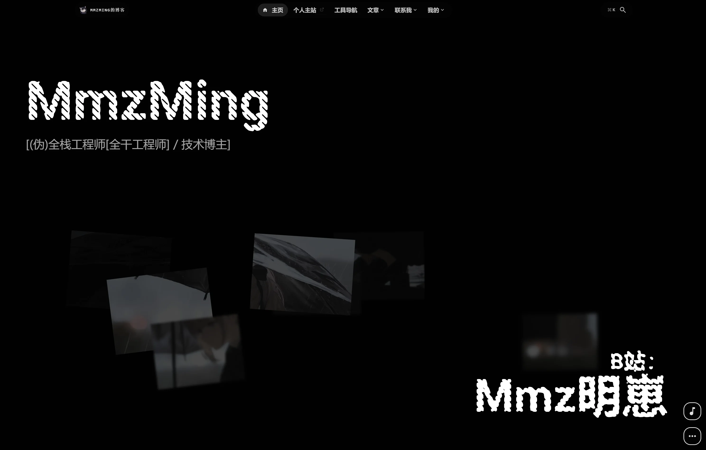
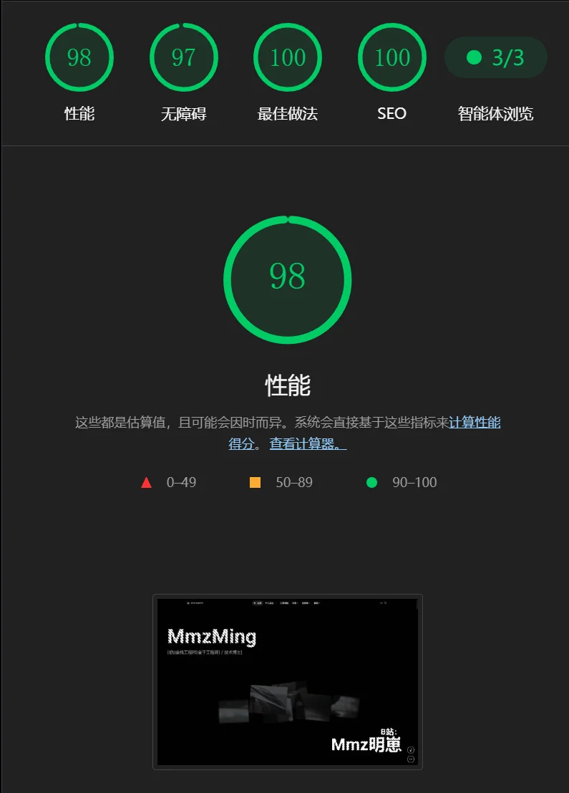

# Firefly-Mod

> 基于 [Firefly](https://github.com/CuteLeaf/Firefly) 的个人博客魔改版 `V2.8.1`

PC端

性能测试

## 项目概述

Firefly-Mod 是个性化魔改版本，已独立演进。

基于 Firefly 魔改新增以下特性：

- 重构整体UI，黑白简约风格，组件可交互为主，删除背景图片。
- 首页更偏向于展示个人能力爱好，不展示最新文章，删除侧边栏。
- 构建期生成 LLM Wiki，为 AI、搜索引擎和阅读器提供稳定的 JSON / Markdown 入口。
- QQ 群聊风格留言板，直接复用 Waline 登录、审核与评论数据，不依赖项目 Worker 或 KV。
- 新增日历页面，展示文章发布时间。
- 关于页面，注重交互。
- 删除动漫这些影响构建速度的功能。
- 分类页使用 D3.js 力导向布局与 Canvas 绘制标签关系图谱：构建时根据文章标签生成节点与共现边，客户端支持缩放、拖拽、悬停和键盘跳转。
- 封面图构建期优化：列表与文章页统一收口封面解析，本地封面经 Astro 图片服务转码并生成多格式 `srcset`，配合 LQIP 占位渐变（每张图仅 18 字节）消除图片加载闪白。

## 常用命令

| 用途 | 命令 |
|------|------|
| 安装依赖 | `pnpm install` |
| 开发服务器 | `pnpm dev` |
| 构建 | `pnpm build` |
| 预览构建产物 | `pnpm preview` |
| Astro 类型检查 | `pnpm check` |
| TypeScript 类型检查 | `pnpm type-check` |
| 格式化代码 | `pnpm format` |
| Lint + 自动修复 | `pnpm lint` |
| 新建博客文章 | `pnpm new-post <filename>` |
| 重新生成图标 | `pnpm icons` |
| 重新生成 LQIP 占位数据 | `pnpm lqips` |
| 推送文章 URL | `pnpm indexnow --diff --dry-run` |

## LLM Wiki（静态）

项目不在构建阶段运行 Embedding 或 Vectorize。`pnpm build` 会从公开文章集合生成机器入口：

- `dist/llms.txt`：站点级入口和精选文章。
- `dist/wiki/index.json`：文章目录、摘要、章节和每篇文章的资源地址。
- `dist/wiki/articles/{slug}.json`：单篇文章的元数据、章节和原始正文。
- `dist/wiki/articles/{slug}.md`：带规范元数据的纯 Markdown 文章。

草稿、密码文章以及设置了 `wikiExclude: true` 的历史文章不会进入 Wiki，但仍可正常生成站内文章页。文章更新后重新构建即可同步机器入口。

## 封面图与 LQIP

文章 frontmatter 的 `image` 字段按三种形态处理：

- 相对路径（`./assets/cover.webp`）：`src` 下的本地资源，构建期经 Astro 图片服务按 `siteConfig.ts` 的 `imageOptimization` 配置转码，产出多格式 `srcset` 与宽高，且不做放大（候选宽度截断到源图宽度）。
- `/` 开头：`public` 下的资源，Astro 不做优化，原样引用。
- `http(s)` / `data:`：远程图，原样引用，命中 `imageOptimization.noReferrerDomains` 时补 `referrerpolicy="no-referrer"`。

`pnpm build` 会先运行 LQIP 生成脚本（`scripts/generate-lqips.ts`）：把 `src` 与 `public` 下的每张图片缩到 2x2 取角点颜色，压成 18 字符 hex 存入 `src/constants/lqips.json`，渲染时解码成 CSS 斜向渐变作为占位背景，不产生额外请求。脚本是增量的：已有条目直接复用，只处理新增图片并清理已删除图片的残留条目，新增或替换图片后重新构建即可，也可单独运行 `pnpm lqips`。

## 配置系统

所有配置集中在 `src/config/`，通过 `@/config`（barrel 文件 `index.ts` 统一导出）导入。

| 配置文件 | 职责 |
|----------|------|
| `siteConfig.ts` | 核心配置：语言、主题色、页面开关、文章列表布局、分页、分析、图片优化、字体 |
| `sidebarConfig.ts` | 侧边栏布局与组件配置 |
| `navBarConfig.ts` | 导航栏链接配置（根据页面开关动态生成） |
| `homeConfig.ts` | 首页与用户资料配置：头像、昵称、签名、社交链接、首页图片、技能图标、作品百叶窗 |
| `commentConfig.ts` | 评论系统配置（Waline/Twikoo/Giscus/Artalk/Disqus） |
| `musicConfig.ts` | 音乐播放器配置（Meting API / 本地音乐） |
| `pioConfig.ts` | Live2D / Spine 看板娘配置 |
| `fontConfig.ts` | 自定义字体配置 |
| `galleryConfig.ts` | 相册配置 |
| `friendsConfig.ts` | 友链配置 |
| `sponsorConfig.ts` | 赞助页配置 |
| `calendarConfig.ts` | 日历小组件配置 |
| `announcementConfig.ts` | 公告栏配置 |
| `licenseConfig.ts` | 文章许可证配置 |
| `footerConfig.ts` | 页脚配置 |
| `coverImageConfig.ts` | 封面图配置 |
| `expressiveCodeConfig.ts` | 代码块渲染配置 |
| `plantumlConfig.ts` | PlantUML 配置 |
| `collectionsApiConfig.ts` | 收藏 API 配置 |
| `llmsConfig.ts` | `/llms.txt` 和 LLM Wiki 的机器入口配置 |

## CI/CD 工作流

| 工作流 | 触发条件 | 说明 |
|--------|----------|------|
| `ci.yml` | push/PR 到 master | Astro 类型检查 + Biome Lint 代码质量检查 |
| `friend-link-checker.yml` | Issue 创建/评论 | 通过 Issue 自动处理友链申请，提取信息并提交 PR |

注意：建议在 GitHub 仓库设置中关闭邮箱订阅，避免 CI 工作流频繁触发邮件通知。

## GEO和SEO

这里几个文件是你要到对应站点开站点收录的，目的是让AI或者搜索工具搜索到你的站点信息

`public\baidu_verify_codeva-PmiKD9Nizp.html`:百度站长工具，普通搜索用的
`public\ByteDanceVerify.html`：头条站长工具，豆包搜索用的
`public\fd2c679cb5104763ac4c4655a147083b.txt`：Bing的index

## 部署清单

粗略编写了一下部署清单，包括以下内容：
如有缺失，请按项目实际需求补充配置。

| 检查项 | 说明 |
|--------|------|
| 托管平台 | 可部署到 Cloudflare Pages、Vercel、Netlify、Nginx 等静态托管平台 |
| 评论服务 | 若启用评论，需自行部署对应后端（Waline / Twikoo / Artalk 等） |
| 留言板 | 留言板固定使用 Waline `/guestbook/` 频道；启用前需在 `src/config/commentConfig.ts` 中配置 Waline（只适配这个，若需要其他评论需要自行对接API） |
| 统计服务 | 站点访问统计通过 Umami 获取（在 `siteConfig.ts` 中配置 `analytics.umamiAnalytics`） |
| 图片上传（可选） | 留言板默认将不超过 128 KB 的图片内嵌到 Waline 留言；如需上传不超过 5 MB 的图片，可在 `commentConfig.waline.imageUploadURL` 中配置兼容的自建上传接口。文章图片仍建议使用独立图床 |

## 静态部署方案

构建产物 `dist/` 可直接部署到 Cloudflare Pages、Vercel、Netlify、Nginx 等静态托管平台，不需要 Cloudflare Worker、Wrangler、Vectorize、Embedding 或 Durable Object 资源。

## Live2D 版权声明

Live2D 模型作者为 B 站用户 [木果阿木果](https://space.bilibili.com/886695)，使用需遵守以下规则：

- 使用前必须征得作者同意
- 必须标明作者信息和来源地址
- 模型设计版权归属库洛
- 模型可用于鸣潮相关视频和直播（需标注来源）
- 禁止商用盈利，禁止二次上传转载引流

## 灵感项目

- [fuwari](https://github.com/saicaca/fuwari)
- [hexo-theme-shoka](https://github.com/amehime/hexo-theme-shoka)
- [astro-koharu](https://github.com/cosZone/astro-koharu)
- [Mizuki](https://github.com/matsuzaka-yuki/Mizuki)

## 许可协议

最初 Fork 自 [saicaca/fuwari](https://github.com/saicaca/fuwari)。

**版权声明：**

- Copyright (c) 2024 [saicaca](https://github.com/saicaca) - [fuwari](https://github.com/saicaca/fuwari)
- Copyright (c) 2025 [CuteLeaf](https://github.com/CuteLeaf) - [Firefly](https://github.com/CuteLeaf/Firefly)

根据 MIT 开源协议，可自由使用、修改、分发代码，但需保留上述版权声明。
