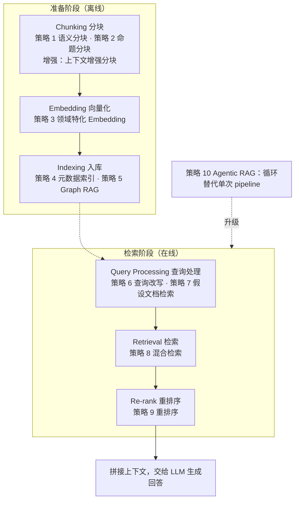
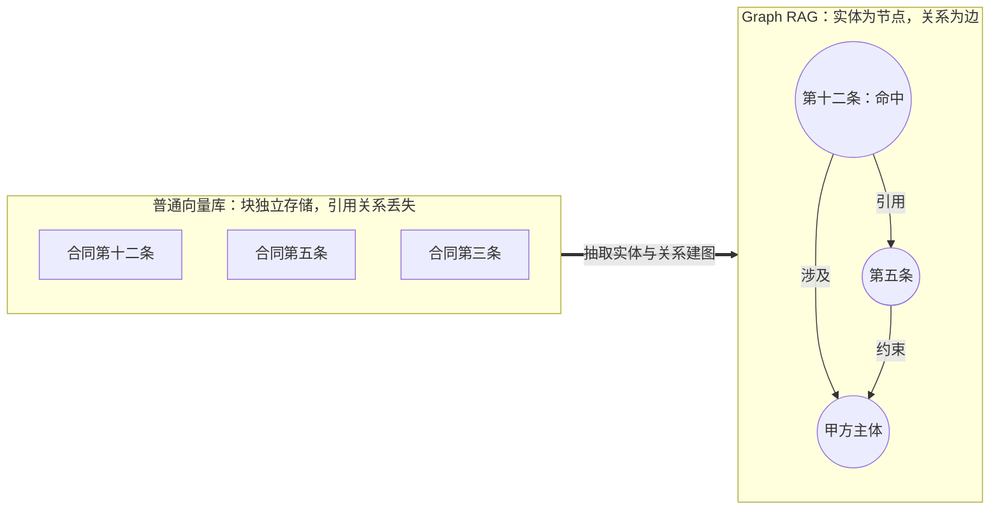
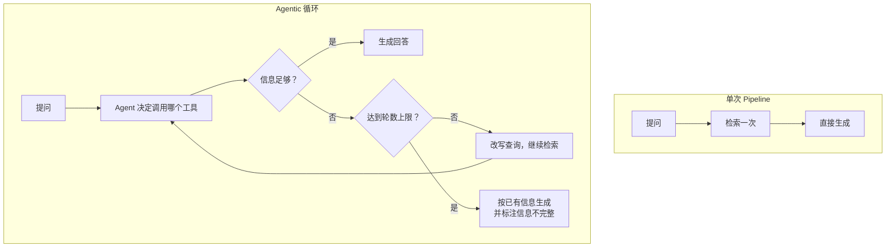
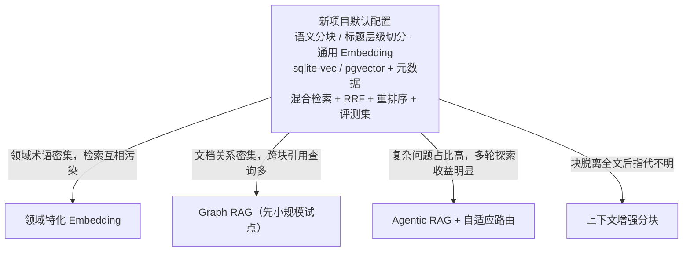

> [!NOTE] 提示
> 本文按"准备阶段 → 检索阶段 → 范式升级"的主线整理 10 种 RAG（Retrieval-Augmented Generation，检索增强生成）策略，覆盖分块、嵌入、索引、查询处理、混合检索、重排序与 Agentic RAG。每种策略给出适用条件、已知局限与代价，有论文来源的标注出处。读者可按"阶段 → 策略 → 代价"的顺序查阅。

## 一、引子：RAG 死了吗

大模型无法直接回答个人笔记、企业内部资料相关的问题——这些内容不在训练数据里，接入外部知识是刚需。RAG 的思路是：先检索相关片段，再交给模型生成回答。

2024 年以来，百万 token 级上下文窗口的模型逐步普及，"把资料全塞进上下文，RAG 已死"的说法随之出现。这个判断在三个约束下站不住：

**1. 成本。** 输入 token 按量计费。一份 10 万 token 的文档全量输入，对比 2000 token 的相关片段，单次请求的输入成本差 50 倍；每次提问都携带整个文档库时，倍数随库规模继续放大。检索方案的成本只与"本次召回多少片段"相关，与文档库总量无关——这是两种方案的根本差别。提示缓存（prompt caching）能摊薄重复前缀的开销，但只在文档集固定、复用率高时生效，对"每次命中不同片段"的场景无效。

**2. 延迟。** 首 token 延迟（TTFT）随输入长度增长：输入越长，prefill 阶段的计算量越大，模型开始输出越慢。交互式问答对这一延迟敏感。

**3. 准确性。** 长上下文不是无损容器。Liu et al. 的《Lost in the Middle》（TACL 2024）实验显示：关键信息位于上下文开头或结尾时模型表现最好，位于中部时准确率明显下降，整条曲线呈 U 形。塞入的资料越多，关键信息落在中部被淹没的概率越大。

结论：在成本、延迟、准确性的三重约束下，"只检索必要内容"仍然优于"全部塞进上下文"。长上下文抬高的是 RAG 的容错下限（召回不够精准时还有兜底空间），不取消 RAG 本身。问题只剩"怎么做好"。

## 二、RAG 总体流程

RAG 分两大阶段。准备阶段离线执行（建库时一次，或随文档更新执行），检索阶段在每次提问时执行。十种策略在流程上的落位：


各策略解决的问题：

| 环节 | 策略 | 解决的问题 |
|---|---|---|
| 分块 | 策略 1 语义分块、策略 2 命题分块 | 固定长度切分破坏语义 |
| 嵌入 | 策略 3 领域特化 Embedding | 通用模型分不开专业术语 |
| 索引 | 策略 4 元数据索引、策略 5 Graph RAG | 结构化过滤、跨块关系丢失 |
| 查询处理 | 策略 6 查询改写、策略 7 假设文档检索 | 查询与文档表达不一致 |
| 检索 | 策略 8 混合检索、策略 9 重排序 | 纯向量检索区分不了相似关键词 |
| 范式 | 策略 10 Agentic RAG | 单次检索召回不足 |

自适应路由（Adaptive Routing）是调度层，负责在上述策略间动态分流，不计入十种。固定长度分块、通用 Embedding、纯向量检索是各环节的基线选项，作为对照在下文一并说明。

## 三、准备阶段：策略 1-5

### 策略 1：语义分块（Semantic Chunking）

基线是固定长度切分：每 N 个 token 切一刀，配一段 overlap（常见取值为 chunk 512-1024 token、overlap 10%-20%）。实现简单，问题是切口落在句子中间时会产生"碎块"——半句话既难以被 embedding 准确表达，也难以被 LLM 利用。

语义分块的做法：逐句向量化，相邻句子相似度高于阈值则合并进同一块，低于阈值则在句间断开。阈值一般不写死，而是按分布取——百分位（如相似度落差排在最末 5% 的位置断开）、标准差倍数或四分位距，避免文档长度与题材差异导致固定阈值失效。判定时通常还会把前后各 1-2 句纳入缓冲窗口，降低单句噪声的影响。

局限有两条。

**第一，分块依据只有向量相似度。** 两句向量距离远、逻辑上强关联（例如结论句与相隔较远的依据句）时，语义分块仍会拆开。它提升的是"边界质量"，不解决"关联内容分散"。

**第二，收益未必覆盖成本。** Qu et al.《Is Semantic Chunking Worth the Computational Cost?》（arXiv 2410.13070，2024）在多个检索与问答数据集上对比后认为：语义分块相对固定长度切分没有稳定一致的增益，而预处理开销（每句一次向量化，而非每块一次）是确定发生的。

结论：结构化文档优先按标题层级切分，这是成本最低且边界最可靠的方案；无结构长文本再考虑语义分块，并且要用自己的评测集验证增益是否真实存在。

### 分块增强：上下文增强（Contextual Retrieval）

针对"关联内容分散"这条局限，Anthropic 在 2024 年 9 月给出的做法是：入库前用 LLM 为每个块生成一段前缀，说明它在全文中的位置与指代（"本段出自 2023 年 Q2 财报，讨论的是 ACME 公司的营收情况"），把前缀拼在块正文之前再做向量化与关键词索引。

官方公布的数据（top-20 召回失败率，基线 5.7%）：仅做上下文嵌入降至 3.7%（相对下降 35%）；叠加上下文 BM25 降至 2.9%（49%）；再加重排序降至 1.9%（67%）。

代价与命题分块同源：全库每个块各需一次 LLM 调用。前缀生成只依赖原文，可以用提示缓存把重复读取整篇文档的开销压下来。这项技术不占十种策略的编号，它属于分块环节的增强手段，与语义分块、命题分块可叠加使用。
### 策略 2：命题分块（Proposition Chunking）

出自《Dense X Retrieval: What Retrieval Granularity Should We Use?》（Chen et al., EMNLP 2024）。论文提出了新的检索单元——命题（proposition）：原子化、自包含、封装单一事实的自然语言陈述。

流程：先按任意方式粗切，再把每个粗块拆解为命题，每个命题独立索引。论文没有靠提示词硬拆，而是训练了专用的拆解模型（Propositionizer），在 Wikipedia 语料上批量生成命题级索引。

拆分示例。原句：

> 《民法典》第五百八十六条规定，定金合同自实际交付定金时成立，定金数额不得超过主合同标的额的百分之二十。

拆为两条命题：

> - 定金合同自实际交付定金时成立。
> - 定金数额不得超过主合同标的额的 20%。

两条命题都补齐了主语，并去掉了"《民法典》第五百八十六条规定"这类需要跨句解析的引导成分。自包含是命题的硬要求：拆完仍带着"该条""前述"这类悬空指代的，等于没拆。

收益：检索粒度从"段落"细化到"事实"，命中更精确。论文结论是命题级检索单元在下游问答任务上达到或优于段落级。

已知问题：命题足够精确，但太短，单条命题往往不足以支撑生成。通行解法是"小块检索、大块生成"（small-to-big / parent document retrieval）——用命题做索引与匹配，命中后按父块 ID 回溯它所属的原始段落，把段落而非命题交给 LLM。索引粒度与生成粒度解耦，两边各取所长。

代价：预处理引入全量 LLM 调用，成本随文档库规模上涨。适合准确性要求高、文档库相对稳定的场景（法规、合同、手册），不适合频繁变更的海量语料。

### 策略 3：领域特化 Embedding

通用 embedding 模型的代表：

- OpenAI text-embedding-3 系列（small / large），支持 `dimensions` 参数按 Matryoshka 表示学习截断维度，用精度换存储与检索速度
- 智源 BGE 系列，旗舰 bge-m3：100+ 语言、8192 token 上下文，单模型同时输出稠密 / 稀疏 / 多向量三种表示
- 阿里 Qwen3-Embedding：0.6B / 4B / 8B 三档，最小档即支持 32k 上下文，发布时位居 MTEB 多语言榜开源权重模型第一

通用模型的问题是对专业术语的分辨率不足。法律场景的典型例子："定金"（担保性质，适用定金罚则，违约方可能丧失定金）与"订金"（预付款性质，原则上可退）在法律上是两回事，但两个词在通用模型的向量空间里距离很近，检索结果互相污染。

策略：术语密集的领域选用领域特化模型（如法律检索的 voyage-law-2），或在领域语料上微调通用底座。判断标准是"术语是否密集，且术语间差异是否细微"——满足则领域模型优先；通用语料下通用模型够用，省掉选型与维护成本。

**这项决策必须在建库前定。** 向量维度与语义空间由模型绑定，换 embedding 模型等于全库重新向量化并重建索引，开销与首次建库同级。不要按"先上通用模型，不行再换"的思路推进——真到要换时，代价是重跑一次全量索引。同理，MTEB 名次不能直接当选型依据：榜单任务分布未必匹配自己的语料，落地前用自己的评测集跑一遍召回对比。
### 策略 4：结构化索引与元数据过滤

存储选型按规模分两档：

| 规模 | 方案 | 索引形态 |
|---|---|---|
| 小型项目（单机、嵌入式） | SQLite + sqlite-vec | 暴力扫描，万级到十万级块可接受，支持元数据列与分区键 |
| 中大型项目 | PostgreSQL + pgvector | HNSW（查询快、召回高，建索引慢且吃内存）或 IVFFlat（建索引快、占用小，召回依赖 `lists` 与 `probes` 调参） |

选型注意：旧教程里常见的 sqlite-vss 已被作者停止维护（基于 Faiss 的 C++ 绑定存在集成问题），2024 年起由纯 C 实现、零外部依赖的 sqlite-vec 接替。新项目直接用 sqlite-vec。

每条记录存三样东西：向量、原文、元数据（日期、来源、类型、版本、父块 ID 等）。元数据支撑过滤式检索——"只搜 2024 年之后、来源为 A 系统的合同条款"这类需求靠元数据过滤实现，向量相似度做不到。

**元数据过滤与 ANN 索引存在冲突，这是本环节最容易踩的坑。** 近似最近邻索引按向量距离组织数据，不认识 `WHERE` 条件。过滤条件命中率低时，两种执行顺序都会出问题：

- **后过滤**（先走 ANN 取 top k，再按条件筛）：筛完可能剩下不足 k 条，极端情况返回空结果，且这种"召回缺失"在接口层看不出异常
- **前过滤**（先按条件全表筛，再暴力比距离）：条件宽松时退化为全表扫描，延迟随库规模线性上涨

pgvector 0.8.0 引入迭代索引扫描（iterative index scan）缓解前者——结果不足时自动继续遍历索引，由 `hnsw.iterative_scan` / `ivfflat.iterative_scan` 与 `hnsw.max_scan_tuples` 等参数控制。上线前要用真实的过滤条件分布压一遍召回率，不要只测无过滤的场景。

已知局限：向量库以块为单位独立存储，块之间的引用关系丢失。合同第十二条引用第五条时，普通向量库不保留这条跨块引用，检索命中第十二条也无法自动带上第五条。这个局限引出策略 5。

### 策略 5：Graph RAG（图结构检索）

思路：在块之外，用 LLM 从文档中抽取实体（条款、人物、概念）与关系（引用、因果、从属），存成图结构。节点是实体，边是关系。

检索路径：先定位命中实体，再沿边扩展关联节点，召回一个相关上下文簇。跨块引用关系在图里天然保留——查第十二条时能顺着边走到第五条。



图的价值不止局部检索。微软的 GraphRAG（Edge et al., 2024，《From Local to Global》）在图上做社区检测（Leiden 算法），对聚出的社区逐层生成摘要，据此回答全局性问题（"这批文档的核心主题是什么"）。这类问题向量检索答不了：它只能召回与查询局部相似的块，而全局主题不存在于任何单个块里。因此 GraphRAG 区分两种检索模式——局部搜索从命中实体出发扩展邻域，全局搜索走社区摘要做 map-reduce 式汇总。
代价评估：

- **风险**：Graph RAG 的构建与维护成本高。
- **影响**：实体关系抽取需要 LLM 全量处理文档库，开销与命题分块同级或更高（每个块通常不止一次调用）；抽取质量受限于 LLM，错误的实体消歧与关系会污染检索结果；文档更新会触发局部乃至全图的社区重算，维护负担持续存在。
- **应对**：仅在关系密集、跨块引用是核心查询模式的文档（合同、规范、结构化知识库）上采用；先在单个文档集上试点，用评测集量出与"向量 + 元数据"基线的召回差距，确认收益后再全量铺开。若只需要全局摘要能力、不要求完整图谱，可评估微软后续的 LazyGraphRAG——它把大部分 LLM 开销从建库期推迟到查询期，官方给出的索引成本约为完整 GraphRAG 的 0.1%。

> [!CAUTION] 定位
> Graph RAG 属于高收益高风险策略。默认场景用策略 4 的向量库 + 元数据；确认跨块关系查询或全局摘要是刚需后，再引入图结构。

## 四、检索阶段：策略 6-9

### 策略 6：查询改写（Query Transformation）

用户原始 query 的常见问题：口语化、缺主语、一词多义、复合问题。改写的三个方向：

- **具体化**：结合对话历史，把"这个怎么配"补成完整、明确的问题。多轮对话场景下这一步不是可选项——带指代的 query 直接向量化，几乎必然召回错误内容
- **拆解**：复合问题拆成子问题分别检索后合并；也可以反向做抽象，用 step-back prompting（Zheng et al., ICLR 2024）先退一步问出上位概念，再检索原理性材料
- **扩展**：生成多个查询变体各自检索，结果用 RRF 融合（即 RAG-Fusion），提升召回覆盖

代价：每次提问增加一轮 LLM 调用，延迟与成本同步上涨；多查询扩展还会把检索次数放大 3-5 倍。时延敏感的场景只保留多轮对话的指代消解，其余预算留给重排序。

### 策略 7：假设文档检索（HyDE）

出自《Precise Zero-Shot Dense Retrieval without Relevance Labels》（Gao et al., ACL 2023）。

方法：先让 LLM 针对问题生成一篇假设答案——不要求事实正确，只要"像一篇真正的回答"；再用假设答案的向量去检索，替代原始 query 的向量。论文的具体做法是生成多篇假设文档，把它们的向量与原 query 向量一起取平均，用平均向量检索，以此摊薄单篇幻觉的影响。

原理：query 与目标文档之间存在表达鸿沟——问题短、口语化，文档长、书面化，两者在向量空间中的分布本就不重合。假设答案与真实文档同为"文档"，分布更接近，检索更准。论文结论：HyDE 的零样本检索效果优于当时的无监督稠密检索器 Contriever。

- **风险**：冷门领域 LLM 缺乏背景知识，生成的假设文档偏离事实并把检索方向带偏。
- **影响**：召回内容与问题完全不相关，且从最终答案表面不易察觉——模型会基于错误上下文流畅作答。
- **应对**：冷门或专有领域慎用；启用时与混合检索的关键词通道并行，保留原始 query 的检索结果做兜底；在评测集上分别记录"用 HyDE"与"不用 HyDE"的召回率，按语料实测决定是否开启。
### 策略 8：混合检索（Hybrid Search）

纯向量检索的盲区：语义匹配强，精确区分弱。"1 型糖尿病"与"2 型糖尿病"在向量空间距离很近，语义检索可能把两者混着返回——对医学检索，这是事实性错误。

混合检索同时跑两路：

- **稠密向量检索**：负责语义相关，能命中同义表达与改述
- **稀疏检索**：负责精确 token 匹配，硬性区分"1 型 / 2 型"这类词面差异。这里要分清两个概念——BM25 是打分函数（按词频、逆文档频率与文档长度归一化计算得分），倒排索引是支撑它的数据结构，两者不是并列关系

两路的分数不能直接相加：余弦相似度落在 [-1, 1]，BM25 无上界，量纲不同。加权融合要先做分数归一化，而归一化对分数分布敏感、跨查询不稳定。RRF（Reciprocal Rank Fusion）绕开了这个问题——它只用排名，不用分数：

$$
\text{score}(d) = \sum_{r \in R} \frac{1}{k + \text{rank}_r(d)}
$$

$R$ 是各路检索器的集合，$\text{rank}_r(d)$ 是文档 $d$ 在第 $r$ 路结果中的排名，$k$ 是平滑常数（原论文取 60，用于抑制头部排名之间的权重落差）。无需调参、无需归一化，这是 RRF 成为默认融合方案的原因。确实需要给不同通道加权时，再换加权融合并自行处理归一化。

工程上有两条路：主流存储都已提供混合检索能力（pgvector 配合 PostgreSQL 全文检索、Elasticsearch / OpenSearch、Qdrant、Milvus）；也可以用 bge-m3 这类单模型同时产出稠密与稀疏表示，省掉维护两套索引的负担。

收益最大的语料是专有名词、编号、术语密集的类型（法规条文号、零件型号、药品名）。

### 策略 9：重排序（Re-ranking）

初筛与精排用不同架构的模型：

| 架构 | 编码方式 | 速度 | 精度 | 职责 |
|---|---|---|---|---|
| 双编码器（bi-encoder） | query 与文档分别编码，文档向量可离线预计算 | 快，支持 ANN 索引 | 一般 | 初筛：从全库召回 top 100 |
| 迟交互（late interaction，ColBERT 类） | 文档按 token 预计算多向量，查询时做 token 级匹配 | 中，需额外存储 | 较高 | 初筛或中间层，也可直接充当重排 |
| 交叉编码器（cross-encoder） | query 与候选拼成一对，联合编码打分 | 慢，无法预计算 | 高 | 精排：把 top 100 排成 top 5 |

交叉编码器对每一对（query, 候选）都要完整前向计算，全库跑一遍成本不可接受。工程惯例是"先召后排"：bi-encoder 或混合检索做初筛，cross-encoder 只对几十条候选精排，把费用与延迟锁在候选层。ColBERT（Khattab & Zaharia, SIGIR 2020）代表的迟交互是两者之间的折中：文档侧仍可预计算，匹配保留 token 粒度，代价是每篇文档存一组向量、存储明显放大。bge-m3 的多向量模式属于这一路。

模型选择：商用 API 的代表是 Cohere Rerank；自托管常用 BGE-Reranker 或 Jina Reranker 系列。另有让 LLM 对候选列表整体排序的做法（listwise，如 RankGPT），精度上限更高，但延迟与成本随候选数量线性上涨，通常只用于离线评测或候选极少的场景。

参数上真正影响效果的是两个数：初筛候选数（决定召回上限，取小了重排无从挑选）与重排后送入 LLM 的条数。后者不是越多越好——受 Lost in the Middle 的位置效应影响，塞 20 条往往不如精准的 5 条。这两个数要在评测集上一起调。
## 五、范式升级：策略 10 与组合策略

单次 pipeline 的隐含假设是"一次检索就能召回全部所需信息"。实际的查资料过程不是这样：查到一半发现缺一块，换个关键词再查。复杂问题的信息召回是循环式探索，不是一次性决策。

### 策略 10：Agentic RAG

把单次 pipeline 换成循环，由 agent 决定每一轮做什么：



Agent 的工具箱不限于语义检索：关键词检索、执行代码、读取原文、查元数据都可以作为工具挂载，多轮调用直至信息足以支撑回答。工具描述的质量直接决定调用准确率——写清楚每个工具的适用场景与参数含义，比增加工具数量有效。

优势有两点。其一，召回质量与覆盖面：多轮探索能补上单次检索遗漏的信息。其二，工程复杂度下降——传统 pipeline 需要硬编码策略分支（什么时候改写、什么时候拆问题），Agentic 模式把这些决策交给 agent 判断，主流程只剩一个循环。

代价与必要防护：

- **风险**：agent 循环不收敛，反复用近似的 query 检索同一批内容。
- **影响**：单次问答的 token 消耗与延迟随轮数线性上涨，极端情况下打满上下文窗口后失败；成本不可预测，无法做容量规划。
- **应对**：硬性设置最大轮数上限（工程上常取 5-8 轮）与单次问答的 token 预算，超限则用已有信息强制生成并标注"信息可能不完整"；每轮把已检索过的 query 与块 ID 记入状态，重复命中时直接终止；对多轮累积的上下文做去重与压缩，只保留被引用的片段。

简单问题跑 agent 循环不经济——查一个 API 用法不需要探索三轮。这个问题由下面的自适应路由解决。

### 组合策略：自适应路由（Adaptive Routing）

解决"简单问题被过度处理"：入口处用轻量分类器评估问题难度，简单问题走传统 pipeline（混合检索 + 重排序），复杂问题升级为 Agentic RAG。

论文出处：Adaptive-RAG（Jeong et al., NAACL 2024）。原始设计是三档路由——简单问题不检索、由 LLM 直接回答；中等复杂度单步检索；复杂问题多步迭代检索。分类器不依赖人工标注，而是用各档位的实际问答结果做弱监督训练（哪一档最先答对，样本就归到那一档）。工程上常简化为两档：简单走 pipeline，复杂走 agent 循环。

- **风险**：分类器误判，把复杂问题判成简单。
- **影响**：复杂问题走单次检索，召回不足直接导致答案错误；路由决策发生在检索之前，后续环节没有纠正机会。
- **应对**：分类阈值向"判复杂"一侧倾斜（误判为复杂只是多花成本，误判为简单会答错）；生成后加一道自检，答案置信度低或引用不足时回退到 agent 路径。
## 六、十种策略速览与选型

| # | 策略 | 环节 | 解决的问题 | 主要代价 |
|---|---|---|---|---|
| 1 | 语义分块 | 准备 | 固定切分破坏语义 | 逐句向量化，且增益不稳定 |
| 2 | 命题分块 | 准备 | 检索粒度粗 | LLM 全量处理，成本高 |
| 3 | 领域特化 Embedding | 准备 | 专业术语分不开 | 选型与维护成本，换模型需全库重建 |
| 4 | 元数据索引 | 准备 | 无法结构化过滤 | 过滤与 ANN 索引冲突，跨块关系丢失 |
| 5 | Graph RAG | 准备 | 跨块引用与全局主题问题 | 构建与更新昂贵 |
| 6 | 查询改写 | 检索 | query 表达质量差 | 多一轮 LLM 调用，检索次数放大 |
| 7 | 假设文档检索 | 检索 | query 与文档向量分布不一致 | 冷门领域可能带偏检索 |
| 8 | 混合检索 | 检索 | 相似关键词分不清 | 维护两套索引，或换单模型方案 |
| 9 | 重排序 | 检索 | 初筛排序粗糙 | 交叉编码器计算贵 |
| 10 | Agentic RAG | 范式 | 单次召回不足 | 多轮调用，成本与延迟不可预测 |
| — | 上下文增强分块 | 准备（增强） | 块脱离全文后指代不明 | 每块一次 LLM 调用 |
| — | 自适应路由 | 调度 | 简单问题被过度处理 | 分类器存在误判 |

新项目默认配置，按顺序落地：

1. **分块**：结构化文档按标题层级切分，无结构长文本用语义分块；chunk 目标 512-1024 token，overlap 10%-20%
2. **Embedding**：通用模型起步（text-embedding-3 / bge-m3 / Qwen3-Embedding），但必须在建库前定下来
3. **存储**：sqlite-vec 或 pgvector，第一天就把元数据做全（日期、来源、版本、父块 ID）
4. **检索**：混合检索 + RRF + 重排序，这组在成本与收益上性价比最高
5. **评测**：与第 4 步同步搭起来，不要等策略调完再补
6. **查询处理**：多轮对话的指代消解先上；改写与 HyDE 等延迟预算允许后再加

第 4 步是整套里最值得先做对的部分。骨架如下，省略了检索器与重排模型的具体实现：

```python
def rrf_fuse(rankings: list[list[str]], k: int = 60) -> list[str]:
    """按 RRF 融合多路检索结果，输入为各路的有序 chunk_id 列表。"""
    scores: dict[str, float] = {}
    for ranking in rankings:
        for rank, chunk_id in enumerate(ranking, start=1):
            scores[chunk_id] = scores.get(chunk_id, 0.0) + 1.0 / (k + rank)
    return sorted(scores, key=lambda cid: scores[cid], reverse=True)


def retrieve(query: str, *, filters: dict, top_k: int = 5) -> list[str]:
    # 1. 两路初筛，候选数取远大于 top_k 的值，给重排留出挑选空间
    dense_hits = dense_search(query, filters=filters, limit=100)
    sparse_hits = bm25_search(query, filters=filters, limit=100)

    # 2. RRF 融合，只用排名，不做分数归一化
    candidates = rrf_fuse([dense_hits, sparse_hits])[:60]

    # 3. 交叉编码器精排，计算成本锁在候选层
    reranked = cross_encoder_rerank(query, candidates)[:top_k]

    # 4. 命中的是命题或小块时，回溯父段落再交给 LLM（small-to-big）
    return [load_parent_text(cid) for cid in reranked]
```

三个数字需要在评测集上一起调：初筛 `limit`（决定召回上限）、送进重排的候选数（决定重排成本）、最终 `top_k`（受位置效应约束）。
升级触发条件：

- **文档关系密集、跨块引用或全局摘要类查询多**：评估 Graph RAG，先小规模试点
- **复杂问题占比高、多轮探索的收益在评测集上可见**：Agentic RAG，配合自适应路由与轮数上限控制成本
- **领域术语密集、通用模型检索互相污染**：换领域特化 Embedding，同时加强关键词通道与布尔约束
- **带过滤条件的召回率明显低于无过滤**：调 ANN 索引参数或改用前过滤，见策略 4



## 七、质量与工程考量

成本与延迟：

- 只召回必要内容，控制输入上下文长度——第一节的成本与延迟论证在这里落地
- 重排放在初筛之后，只对候选层计算
- 时延敏感路径不引入额外的 LLM 预处理：查询改写与 HyDE 各要一轮调用，直接加在 TTFT 上
- Agentic 路径必须有轮数与 token 上限，否则单次问答成本不可预测

准确性与上下文稀释：

- 分块质量是地基，chunk 语义不完整时，后面的策略都救不回来
- 混合检索 + 重排提升相关性；对召回结果做去重（不同块可能包含同一事实），减少上下文噪音
- 注意 Lost in the Middle 的位置效应：重要内容不要埋在长上下文中部，重排后的顺序要真的用上
- 要求模型给出引用来源，答案与召回块能对齐，幻觉才能被发现

评测。检索层与生成层要分开测量，否则出问题定位不到环节：

| 层 | 指标 | 说明 |
|---|---|---|
| 检索 | Recall@k | 期望文档是否出现在 top k，衡量召回上限 |
| 检索 | nDCG@k / MRR | 期望文档排得够不够前，衡量排序质量与重排收益 |
| 生成 | 忠实度（faithfulness） | 答案是否只依据召回内容，用于定位幻觉 |
| 生成 | 答案相关性 | 答案是否回答了问题，与检索质量解耦 |

固定一批问题与期望召回的文档做评测集，每次调整策略跑一遍。规模不必大，50-100 条覆盖典型查询类型即可起效；关键是每次只动一个变量，否则无法归因。检索指标能用脚本自动算，生成指标可用 RAGAS 一类框架做 LLM-as-judge，但要抽样人工校准判分标准。没有评测集的策略调优是在赌方向。

维护与迭代：

- 元数据从第一天做全（日期、来源、版本、父块 ID），后续的过滤、增量更新、small-to-big 回溯都依赖它
- 增量更新按内容哈希判断块是否变化，只重算变化的块；Graph RAG 的更新流程单独设计，增量还是全图重算直接决定维护成本
- 把 embedding 模型与分块参数写进索引的元信息，换配置时能识别出哪些块属于旧版本
## 八、结语

RAG 回答的是"如何召回信息"这一个问题。十种策略分布在准备与检索两个阶段，没有一种通吃：分块决定粒度，Embedding 决定分辨率，索引决定结构，查询处理与重排决定精度，Agentic 决定深度。

其中只有两件事值得无条件先做：混合检索加重排序（收益稳定、成本锁在候选层），以及在动手调策略之前先有评测集。其余都是带触发条件的加法——语义分块的增益争议、HyDE 在冷门领域的反作用、Graph RAG 的维护成本，都得靠自己的语料实测才知道，不要因为某个策略看起来更先进就默认启用。

检索只是 agent 的地基。往上还有 memory 设计、行为评估、数据闭环，那是另一套问题。

## 九、参考资料

- [Gao et al. Precise Zero-Shot Dense Retrieval without Relevance Labels（HyDE，arXiv 2212.10496，ACL 2023）](https://arxiv.org/abs/2212.10496)
- [Chen et al. Dense X Retrieval: What Retrieval Granularity Should We Use?（arXiv 2312.06648，EMNLP 2024）](https://arxiv.org/abs/2312.06648)
- [Edge et al. From Local to Global: A Graph RAG Approach to Query-Focused Summarization（arXiv 2404.16130，2024）](https://arxiv.org/abs/2404.16130)
- [Jeong et al. Adaptive-RAG: Learning to Adapt Retrieval-Augmented Large Language Models through Question Complexity（NAACL 2024）](https://aclanthology.org/2024.naacl-long.389/)
- [Liu et al. Lost in the Middle: How Language Models Use Long Contexts（arXiv 2307.03172，TACL 2024）](https://arxiv.org/abs/2307.03172)
- [Qu et al. Is Semantic Chunking Worth the Computational Cost?（arXiv 2410.13070，2024）](https://arxiv.org/abs/2410.13070)
- [Khattab & Zaharia. ColBERT: Efficient and Effective Passage Search via Contextualized Late Interaction over BERT（arXiv 2004.12832，SIGIR 2020）](https://arxiv.org/abs/2004.12832)
- [Zheng et al. Take a Step Back: Evoking Reasoning via Abstraction in Large Language Models（arXiv 2310.06117，ICLR 2024）](https://arxiv.org/abs/2310.06117)
- [Cormack et al. Reciprocal Rank Fusion Outperforms Condorcet and Individual Rank Learning Methods（SIGIR 2009，RRF 原始论文）](https://dl.acm.org/doi/10.1145/1571941.1572114)
- [Anthropic：Introducing Contextual Retrieval（2024-09）](https://www.anthropic.com/news/contextual-retrieval)
- [Microsoft Research：LazyGraphRAG — Setting a New Standard for Quality and Cost](https://www.microsoft.com/en-us/research/blog/lazygraphrag-setting-a-new-standard-for-quality-and-cost/)
- [pgvector（GitHub，含 HNSW / IVFFlat 与迭代索引扫描说明）](https://github.com/pgvector/pgvector)
- [sqlite-vec（GitHub，sqlite-vss 的继任者）](https://github.com/asg017/sqlite-vec)
- [Voyage AI：Domain-Specific Embeddings — Legal Edition（voyage-law-2）](https://blog.voyageai.com/2024/04/15/domain-specific-embeddings-and-retrieval-legal-edition-voyage-law-2/)
- [Ragas 文档（检索与生成侧评测指标）](https://docs.ragas.io/)
- [MTEB Leaderboard（Hugging Face）](https://huggingface.co/spaces/mteb/leaderboard)
