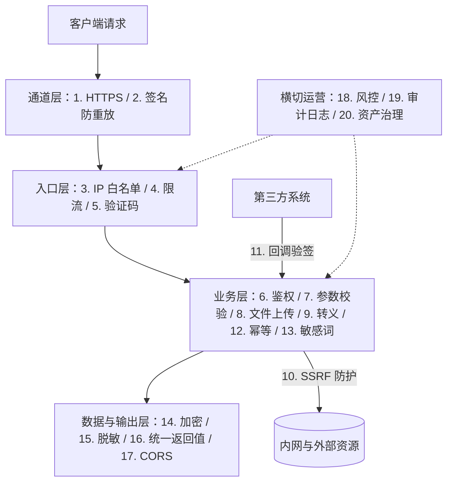
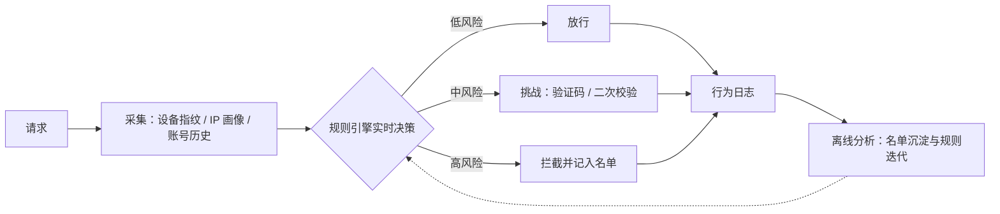

> [!NOTE] 提示
> 接口安全不是单项措施，而是一张按请求链路展开的措施清单。本文按传输通道、入口、业务逻辑、数据与输出、横切运营整理了 20 个技巧，每个统一按「防什么 / 怎么做 / 边界在哪」三段拆解并附 Spring Boot 代码示例。威胁分类以 OWASP API Security Top 10（2023）为准。

## 引子

一个典型的上线场景：电商小程序发版，团队把 HTTPS 配好、前端表单校验做完，接口联调通过就上了线。两周后接连出三件事：安全公司渗透测试用改 `orderId` 的方式遍历出了全站订单数据；短信验证码接口被脚本刷掉 3000 条费用；评论区被塞满了赌博广告。三个问题对应三件没做的事：对象级鉴权、频控加验证码、敏感词过滤。

这个组合很典型。团队不是没听过这些词，而是没有把「安全」当成一张可以逐项勾选的工程清单去落地。OWASP 把「改个 ID 就能看别人数据」这类漏洞排在 API Security Top 10（2023）的第一位（API1:2023 BOLA）；Salt Security 的统计里，与对象级鉴权相关的攻击约占全部 API 攻击的 40%（来源：Salt Security，2023 年度攻击趋势口径）。

## 核心摘要

- 20 个技巧按请求链路分布在五个位置：传输通道（HTTPS、签名防重放）、请求入口（IP 白名单、限流、验证码）、业务逻辑（鉴权、参数校验、文件上传、转义、SSRF、回调验签、幂等、敏感词）、数据与输出（加密、脱敏、统一返回值、CORS），以及横切的运营项（风控、审计日志、资产治理）。任何单项都能被绕过，安全来自按层组合。
- 每项按「防什么 / 怎么做 / 边界在哪」三段展开。判断一项措施是否落地的标准是：能指到具体的代码或配置，能说清它防不了什么。
- 最容易漏的是请求完整性四项：签名防重放、幂等、SSRF 防护、回调验签。HTTPS 防第三方窃听，防不了持有合法通道的人重放请求；重试和重复点击不是攻击，同样能造成重复扣款。
- 验证码策略、敏感词库、风控规则、证书这四类措施属于持续运营项，配置完不再迭代等于逐渐失效。
- 代码示例基于 Spring Boot 3.x + Redis；结论性数据标注了来源。

## 背景知识：攻击面与防御分层

接口面对的攻击与风险可以归成十类，每一类对应一个或多个技巧。先看全景再看单项，落地的优先级会清晰很多：

| 攻击与风险 | 典型手法 | 主要对策（本文序号） |
|---------|---------|---------------------|
| 传输窃听与篡改 | 中间人、运营商劫持、改参数、重放 | HTTPS（1）、签名防重放（2） |
| 注入与恶意文件 | SQL 注入、XSS、WebShell | 参数校验（7）、转义（9）、文件上传（8） |
| 越权与跨域滥用 | 改 ID 取数、调管理接口、跨域带凭证 | 权限控制（6）、CORS（17） |
| 重复执行 | 抓包重发、超时重试、双击提交 | 签名防重放（2）、幂等（12） |
| 服务端与回调伪造 | SSRF 打内网、伪造支付回调 | SSRF 防护（10）、回调验签（11） |
| 自动化滥用 | 撞库、短信轰炸、CC、爬虫 | 验证码（5）、限流（4）、IP 白名单（3） |
| 信息与数据泄露 | 堆栈外泄、拖库、返回值带敏感字段 | 统一返回值（16）、加密（14）、脱敏（15） |
| 内容合规 | 违禁词、诈骗导流 | 敏感词（13） |
| 批量牟利 | 羊毛党、批量注册、恶意退款 | 风控（18） |
| 暴露面失控与无法追溯 | 影子接口、调试端点泄露、操作无据可查 | 资产治理（20）、审计日志（19） |

把 20 个技巧按请求链路近似归位，就是一张分层防御图（SSRF 防护管出站请求、回调验签管第三方入站，图中单独标注）。风控、审计日志与资产治理贯穿各层：



OWASP API Security Top 10（2023）是这份清单的权威参照：API1 BOLA（对象级越权）、API2 身份认证缺陷、API3 对象属性级越权、API4 资源无限制消耗、API5 功能级越权、API6 敏感业务流无限制访问、API7 SSRF、API8 安全配置错误、API9 资产管理不当、API10 不安全地调用第三方 API。20 个技巧对 10 类威胁全覆盖：API1 与 API5 对应权限控制（6），API2 对应验证码（5）与签名（2），API3 对应脱敏（15），API4 对应限流（4），API6 对应风控（18），API7 对应 SSRF 防护（10），API8 对应统一返回值（16）与 CORS（17），API9 对应资产治理（20），API10 对应回调验签（11）。

## 20 个技巧逐一展开

以下按一次请求的旅程排序：请求先过通道与入口，再进业务逻辑，然后落数据、出响应，运营型措施全程横切。每个技巧统一按三段介绍：**防什么**（对应的攻击与事故）、**怎么做**（生产级实现与代码）、**边界在哪**（它防不了什么、常见的错误用法）。

### 1. 使用 HTTPS 协议

**防什么**：传输层的三类攻击：窃听（同一 WiFi 抓包直接拿走账号密码与 token）、篡改（运营商链路注入脚本或广告）、仿冒（假域名钓鱼站）。明文 HTTP 下三者都是低成本攻击，HTTPS 的 TLS 层用证书认证服务端身份、用对称加密保护数据、用 MAC 保证完整性。

**怎么做**：全站 HTTPS，只给登录页加是常见的历史错误，登录后的每个请求都带着凭证。协议版本 TLS 1.2 起步、优先 TLS 1.3（握手从 2-RTT 降到 1-RTT，GeoTrust 的部署统计显示其采用率约 86%）；禁用 TLS 1.0 / 1.1 与 RC4、3DES 等弱套件；开启 HSTS 让浏览器此后强制走 HTTPS；证书续期走 ACME 自动化。CA/Browser Forum 已通过决议，证书有效期将在 2029 年 3 月前分阶段缩短到 47 天，手工续期很快会变得不可维护（来源：SSL.com 对该决议的解读）。

```nginx
server {
    listen 443 ssl;
    http2 on;
    ssl_protocols TLSv1.2 TLSv1.3;
    add_header Strict-Transport-Security "max-age=31536000; includeSubDomains" always;
    # HSTS 先用短 max-age（如一周）观察，稳定后再加长并考虑提交 preload 列表
}

server {
    listen 80;
    return 301 https://$host$request_uri;   # HTTP 全站重定向
}
```

**边界在哪**：TLS 1.3 的 0-RTT（early data）为优化握手而设计，但有重放风险，开启前确认网关对非幂等接口做了防重放（见技巧 2）。HTTPS 只保护传输通道，数据落进数据库、日志、缓存之后的泄露它管不到，那是数据加密（技巧 14）的领域。证书到期监控要独立于自动化存在，自动化失灵时有告警兜底。

### 2. 接口签名与防重放

**防什么**：HTTPS 防第三方窃听，防不了持有合法通道的人：token 被抓包后原样重发，参数被代理或中间人篡改后重发。无登录态的开放 API（靠 appKey / secret 通信）对这类攻击没有其他防线，完全依赖签名机制。业界通行方案是三件套（来源：阿里云开发者社区等一线实践，窗口取值 1~5 min）：

1. **timestamp**：请求带时间戳，服务端拒绝与当前时间偏差超过窗口（一般 5 min）的请求，压缩重放可用期；
2. **nonce**：每次请求生成随机串，服务端 Redis `SETNX` 判重，TTL 与窗口一致，过期自动清理，命中即重放；
3. **sign**：业务参数与 timestamp、nonce 按约定规则排序拼接，用 HMAC-SHA256 以 appSecret 计算签名，任一参数被篡改则验签失败。

```java
public class ApiSignInterceptor implements HandlerInterceptor {

    private final StringRedisTemplate redis;
    private final Signatures signatures;   // 拼串与 HMAC 封装，appKey -> secret 走配置中心

    @Override
    public boolean preHandle(HttpServletRequest req, HttpServletResponse resp, Object handler)
            throws IOException {
        String appKey = req.getHeader("X-App-Key");
        String timestamp = req.getHeader("X-Timestamp");
        String nonce = req.getHeader("X-Nonce");
        String sign = req.getHeader("X-Sign");
        if (appKey == null || timestamp == null || nonce == null || sign == null) {
            resp.sendError(401);
            return false;
        }
        // 1. 时间窗口
        long skew = Math.abs(System.currentTimeMillis() - Long.parseLong(timestamp));
        if (skew > Duration.ofMinutes(5).toMillis()) {
            resp.sendError(401);
            return false;
        }
        // 2. nonce 判重：SETNX 原子操作，TTL 与窗口一致
        Boolean firstSeen = redis.opsForValue()
                .setIfAbsent("nonce:" + nonce, "1", Duration.ofMinutes(5));
        if (Boolean.FALSE.equals(firstSeen)) {
            resp.sendError(401);   // 重放请求
            return false;
        }
        // 3. 验签：与服务端同规则拼串后 HMAC-SHA256，常量时间比较
        String expected = signatures.compute(appKey, timestamp, nonce, req);
        if (!MessageDigest.isEqual(
                expected.getBytes(StandardCharsets.UTF_8),
                sign.getBytes(StandardCharsets.UTF_8))) {
            resp.sendError(401);
            return false;
        }
        return true;
    }
}
```

**边界在哪**：nonce 与 timestamp 必须参与签名，否则可以被单独篡改；secret 不上传输链路；拼串规则（参数排序、空值处理、body 如何参与、字符编码）要写成双方共用的规范或测试向量，否则「验签对不上」的联调排查成本极高。签名只保证请求来自合法客户端且未被篡改，不保证业务不重复执行，重复执行由幂等（技巧 12）兜住。

### 3. 加 IP 白名单

**防什么**：管理后台、内部运维接口、支付回调、OpenAPI 合作伙伴入口。这类接口的使用方固定且数量少，IP 白名单是最便宜的准入控制，能直接挡住扫描器的大面积试探，把暴露面从「公网任何人」收敛到「几个已知地址」。

**怎么做**：接入层配置优先于应用层实现，被拒请求不消耗应用资源；应用层用 HandlerInterceptor 兜底；云上部署时把名单下沉到安全组，网络层直接隔离。

```nginx
location /admin/ {
    allow 10.0.0.0/8;      # 内网网段
    allow 203.0.113.7;     # 合作伙伴出口
    deny all;
}
```

```java
public class IpWhitelistInterceptor implements HandlerInterceptor {

    private final Set<String> whitelist;

    @Override
    public boolean preHandle(HttpServletRequest req, HttpServletResponse resp, Object handler)
            throws IOException {
        if (!whitelist.contains(resolveClientIp(req))) {
            resp.sendError(403);
            return false;
        }
        return true;
    }
}
```

**边界在哪**：最大的坑在取客户端 IP。`X-Forwarded-For` 是客户端可以任意伪造的请求头，直接取第一个值，白名单等于虚设。正确做法是从可信代理链反推：只有可信代理（SLB、自建 Nginx）追加的段才有效，Nginx 用 `real_ip` 模块（`set_real_ip_from` 声明可信代理 + `real_ip_header X-Forwarded-For`）先剥离可信代理再取值。白名单只适合入口固定的场景，直接面向 C 端用户的接口用不了它。

### 4. 限流

**防什么**：OWASP API4:2023（资源无限制消耗）。CC 攻击、爬虫、突发流量、漏洞利用脚本（比如遍历 ID 取数）都会在短时间内制造超额请求。没有限流的接口，一次恶意并发就能打满连接池、线程池和数据库，安全问题在这里与稳定性问题重叠。

**怎么做**：按部署位置分四层，越靠前成本越低：接入层 Nginx `limit_req`、网关层（Spring Cloud Gateway 的 RequestRateLimiter，内置 Redis 令牌桶）、应用内（Resilience4j / Guava RateLimiter）、跨实例的分布式限流（Redis + Lua）。算法按流量形态选：

| 算法 | 行为 | 适用场景 | 注意点 |
|------|------|---------|--------|
| 固定窗口 | 每个时间窗内最多 N 个 | 粗粒度配额 | 窗口交界处可能瞬时放行 2N |
| 滑动窗口 | 任意滚动窗口内最多 N 个 | 精确计数 | Redis ZSet 实现，注意内存与清理 |
| 令牌桶 | 平均速率 + 允许突发 | 削峰，容忍短突刺 | 主流网关的默认选型 |
| 漏桶 | 恒定速率整流 | 保护处理能力弱的下游 | 引入排队延迟 |

分布式滑动窗口的 Lua 实现，计数与清理必须原子执行，否则并发下计数失真：

```lua
-- KEYS[1]=限流键  ARGV: 当前时间ms, 窗口ms, 上限, 本次请求唯一值
local key = KEYS[1]
local now = tonumber(ARGV[1])
local window = tonumber(ARGV[2])
local limit = tonumber(ARGV[3])
redis.call('ZREMRANGEBYSCORE', key, 0, now - window)   -- 清理窗口外记录
if tonumber(redis.call('ZCARD', key)) < limit then
    redis.call('ZADD', key, now, ARGV[4])
    redis.call('PEXPIRE', key, window)
    return 1
end
return 0
```

限流维度按接口敏感度组合：入口按 IP 粗筛，业务接口按 userId 精确限，配合设备指纹维度。被限流时返回 429 加 Retry-After 头，客户端实现指数退避重试。

**边界在哪**：阈值来自压测数据，不是拍脑袋。纯 IP 维度在移动网络 NAT 出口会误伤真实用户（一个出口 IP 背后可能是成百上千人）；全局阈值不分层时，一个失控的定时任务能把业务请求全部挤掉。限流命中数本身要进监控，突增即是攻击或故障信号。

### 5. 加验证码

**防什么**：自动化滥用：撞库（用泄露的账号密码批量试登录）、短信轰炸、恶意注册、刷票刷券。这类流量的特征是高频加机器行为，验证码的作用是把攻击成本从「写个脚本」抬高到「过人机挑战」，属于成本对抗而非绝对阻断。

**怎么做**：按风险触发，不要所有接口都上。登录连续失败 N 次后要求图形或滑块验证码；短信验证码必须同时有发送频控、有效期、一次性销毁、错误次数上限四件事。以短信验证码为例：

```java
public void sendSmsCode(String phone) {
    // 60s 发送间隔，SETNX 原子判重
    Boolean allowed = redis.opsForValue()
            .setIfAbsent("sms:rate:" + phone, "1", Duration.ofSeconds(60));
    if (Boolean.FALSE.equals(allowed)) {
        throw new BizException(ErrorCode.SMS_TOO_FREQUENT);
    }
    String code = String.format("%06d", secureRandom.nextInt(1_000_000));
    redis.opsForValue().set("sms:code:" + phone, code, Duration.ofMinutes(5));
    smsClient.send(phone, code);
}

public boolean verifySmsCode(String phone, String input) {
    String saved = redis.opsForValue().get("sms:code:" + phone);
    if (saved == null) {
        return false;
    }
    boolean match = MessageDigest.isEqual(
            saved.getBytes(StandardCharsets.UTF_8),
            input.getBytes(StandardCharsets.UTF_8));   // 常量时间比较，防时序侧信道
    if (match) {
        redis.delete("sms:code:" + phone);              // 一次性：成功即销毁
        return true;
    }
    // 连错 5 次作废验证码。6 位数字共 100 万种组合，
    // 每个码最多给 5 次尝试，穷举命中率被压到 0.0005% 量级
    if (redis.opsForValue().increment("sms:try:" + phone) >= 5) {
        redis.delete("sms:code:" + phone);
    }
    return false;
}
```

**边界在哪**：打码平台和接码平台都能绕过验证码，它只是拉高成本；验证码服务自身要限流，否则它自己就是被刷对象（短信轰炸事故里最常见的就是验证码发送接口被并发调用）。行为验证码（滑块）依赖第三方 SDK，接入前评估其故障对登录主链路的影响，准备降级开关。

### 6. 做权限控制

**防什么**：OWASP API Top 10 的第一名。登录态校验通过，但没有校验「这个对象是不是你的」，改请求里的 ID 就能横向读取他人数据，即 BOLA（API1:2023）；普通用户直接调用管理员接口，即功能级越权（API5:2023）。这类漏洞在攻击统计中占比约 40%（来源：Salt Security），因为利用成本极低而普遍存在。

**怎么做**：把认证和鉴权分开。认证回答「你是谁」（JWT、Session，本站《Token 存储与 JWT 设计》有专门讨论），鉴权回答「你能不能动它」。鉴权分两层，两层都要做：

```java
// 功能级：RBAC，能否调用这个接口
@PreAuthorize("hasRole('ADMIN')")
@DeleteMapping("/admin/users/{id}")
public Result<Void> disableUser(@PathVariable Long id) { ... }
```

```java
// 对象级：这条数据归不归你。归属条件进 WHERE，而不是查出来再比对
public Order getMyOrder(Long orderId, Long currentUserId) {
    // SELECT * FROM orders WHERE id = #{orderId} AND user_id = #{userId}
    return orderMapper.selectByIdAndUserId(orderId, currentUserId);
}
```

对象级校验的正确姿势是把 `userId` 放进查询条件：从数据层杜绝取错对象，也避免「查出实体再 if 比对」在缓存、并发场景下漏判。聚合接口（订单详情带收货地址）要对每个关联对象分别校验归属。

**边界在哪**：前端隐藏菜单、禁用按钮只是体验，不是安全，接口本身必须独立鉴权。网关统一鉴权后，内网服务间调用形成信任边界外的「裸奔区」，要明确哪些内部接口允许被谁调用。UUID 当对象 ID 能抬高遍历成本，但它是概率性缓解，不能替代归属校验。

### 7. 参数校验

**防什么**：来自客户端的一切输入都不可信。不校验的后果分两类：安全类，SQL 注入的入口几乎都是未校验的参数；稳定性类，`pageSize=100000` 触发全表扫描，负数金额让下单接口算出负总价。前端校验只优化体验，服务端校验是唯一的安全边界。

**怎么做**：Spring Boot 引入 `spring-boot-starter-validation`，DTO 上挂约束注解，Controller 参数加 `@Valid`。枚举、排序方向、排序字段这类取值可穷举的参数，用白名单正则约束而不是黑名单过滤：

```java
public record PageQuery(
        @Min(1) @Max(100) Integer pageSize,          // 分页上限，防止全表拖取
        @NotBlank @Size(max = 32) String keyword,
        @Pattern(regexp = "created_at|amount") String orderBy,  // 排序字段白名单
        @Pattern(regexp = "asc|desc") String orderDir) {
}

@PostMapping("/api/orders/search")
public Result<List<OrderVO>> search(@Valid @RequestBody PageQuery query) {
    return Result.ok(orderService.search(query));
}
```

跨字段规则（开始时间早于结束时间）写自定义校验器，或在服务层显式校验并抛业务异常。

**边界在哪**：Bean Validation 靠 AOP 代理生效，Service 内部自调用时注解不生效，和 @Async 的自调用失效是同一个机制问题，入口层校验不能依赖「Service 上也加了注解」获得安全感。白名单优于黑名单：黑名单永远枚举不完绕过姿势（大小写、编码、注释符）。校验失败的错误信息不要回显原始输入，防止反射型 XSS。

### 8. 文件上传校验

**防什么**：WebShell 落盘后被解析执行、恶意文件借站点分发、压缩包炸弹打满磁盘、路径穿越写到任意目录。

**怎么做**：扩展名与 Content-Type 都是客户端可伪造的声明，不能作为信任依据。校验顺序：白名单扩展名、文件头 magic number（Apache Tika 可做类型探测）、大小上限；落盘重命名，不带用户原始文件名，防路径穿越；存储与 Web 根隔离或走对象存储加独立域名，即使存进 WebShell 也无法被解析执行；图片类服务端重编码一次，可剥掉大多数注入载荷；解压类功能限制解压后总大小与条目数，防 zip bomb。

**边界在哪**：所有校验必须在服务端做，前端限制只是体验；对象存储的公开读权限按最小化配置；用户间共享文件的场景按需接病毒扫描（如 ClamAV）。

### 9. 做转义

**防什么**：注入载荷的落地环节。存储型 XSS：昵称里夹带 `<script>`，入库后所有看到该昵称的页面都执行恶意代码；SQL 注入：参数拼接进 SQL 后改变语句语义。转义（输出编码）与过滤（输入清洗）是两件事，按输出上下文选择处理方式。

**怎么做**：三类场景分别处理。富文本入库前用白名单过滤器，只保留允许的标签与属性；SQL 一律预编译参数化；前端渲染依赖框架默认转义，显式关闭转义的出口要单独审计。

```java
// 富文本白名单过滤：OWASP Java HTML Sanitizer
private static final PolicyFactory RICH_TEXT = Sanitizers.FORMATTING
        .and(Sanitizers.LINKS)
        .and(Sanitizers.BLOCKS);

public String cleanRichText(String dirtyHtml) {
    return RICH_TEXT.sanitize(dirtyHtml);   // script/事件属性/伪协议一律剥离
}
```

```xml
<!-- 安全：#{} 走 PreparedStatement 预编译，参数只当数据 -->
<select id="findByStatus">WHERE status = #{status}</select>
<!-- 危险：${} 是字符串替换，status = ' OR '1'='1 直接成立 -->
<select id="badExample">WHERE status = '${status}'</select>
```

MyBatis 的 `${}` 只允许用在白名单校验过的表名、排序字段等元数据位置（结合技巧 7 的 `@Pattern` 白名单）。

**边界在哪**：转义与输出上下文绑定，HTML 正文、HTML 属性、JS 字符串、URL、SQL 各有各的规则，不存在「一个万能 encode 函数」。富文本过滤要在入库与服务端渲染两条路径都做；只靠 React / Vue 的默认转义覆盖不了 `javascript:` 伪协议、SVG 内嵌事件这类向量，`dangerouslySetInnerHTML` 和 `v-html` 是审计重点。

### 10. SSRF 防护

**防什么**：接口一旦接收 URL 参数并发起服务端请求（导入远程图片、文档转存、webhook 转发），攻击者就能把 URL 指向内网：云主机的元数据服务 `http://169.254.169.254/`（可窃取云凭证）、`http://127.0.0.1` 上的管理端点、内网数据库端口。这类攻击即 SSRF（OWASP API7:2023），特点是请求方是你的服务器，防火墙对它完全放行。

**怎么做**（分三层）：域名白名单优先；必须放开的场景解析 DNS 后校验 IP，拒绝私网、环回、链路本地地址；禁止重定向，或对每一跳重新校验。

```java
void assertPublicUrl(URI uri) throws UnknownHostException {
    for (InetAddress addr : InetAddress.getAllByName(uri.getHost())) {
        // 解析成 IP 再判断，防伪造域名指向内网 IP 的手法
        if (addr.isSiteLocalAddress() || addr.isLoopbackAddress()
                || addr.isLinkLocalAddress() || addr.isAnyLocalAddress()) {
            throw new BizException(ErrorCode.INVALID_URL);
        }
    }
}
```

**边界在哪**：DNS rebinding 能绕过上面的校验（校验时解析到公网 IP，实际请求时同一域名被解析到内网），需要在连接层固定住已校验的 IP；重定向会把第一层校验整个绕掉，每一跳都要复验；只检查字符串形式的 IP 字面量不够，域名必须解析后再判。

### 11. 第三方回调验签

**防什么**：方向与技巧 2 相反：签名防重放是你签给调用方验，回调验签是你验调用方的签名。支付回调、OAuth 回调、Webhook 入口如果不验来源，「收到回调就当真」意味着攻击者伪造一条「支付成功」通知就能让服务端发货。OWASP API10:2023（不安全地消费第三方 API）针对的就是对第三方响应的过度信任。

**怎么做**：回调按官方 SDK 的验签逻辑校验（如微信支付 V3 的平台证书验签、支付宝的 RSA2 验签）；订单状态与金额以本地数据库为准，回调报文只作触发信号；回调处理幂等（技巧 12），同一笔的多次通知只生效一次；处理失败返回非 2xx 让对方重试，而不是吞掉异常返回 200。

**边界在哪**：回调可能丢失，主动查单与定时对账是兜底，不能把回调当唯一依据；验签证书与 SDK 从官方渠道获取并保持更新；回调接口也是公网入口，同样要过限流。

### 12. 幂等设计

**防什么**：重放攻击防的是攻击者，幂等防的是「自己人」：用户双击提交、网络超时重试、MQ 重复投递。这些都不是攻击，后果却相同：扣款扣两次、订单建两条、优惠券发两份。

**怎么做**：写操作必须有幂等键。客户端生成唯一 key（如 UUID）随请求提交，服务端判重后返回首次结果而不是再执行一次：

```java
Boolean first = redis.opsForValue()
        .setIfAbsent("idem:" + idempotentKey, orderId, Duration.ofHours(24));
if (Boolean.FALSE.equals(first)) {
    return orderMapper.selectByIdempotentKey(idempotentKey);   // 重复请求，返回首次结果
}
// 数据库唯一约束兜底：幂等键列加唯一索引，Redis 失效时不退化成重复执行
```

支付、下单、提现接口的幂等不是优化项，是上线门槛。

**边界在哪**：幂等键的生成责任在调用方，自己重试就自己带键；判重窗口要覆盖业务的重试周期，支付场景常取 24 h；查询与按 ID 删除天然幂等，不需要键，强制范围是创建类写操作。

### 13. 校验敏感词

**防什么**：UGC 内容合规。昵称、评论、简介、私信里的违禁内容、诈骗导流、违禁品引流，属于监管红线（《网络信息内容生态治理规定》对平台内容治理有明确要求）。这类事故的处理结果不是修 Bug，而是整改约谈。

**怎么做**：词库加匹配算法。词库小直接字符串匹配；正式场景用 DFA 或 AC 自动机，一次扫描文本同时匹配全部词条，复杂度与文本长度线性相关。Java 生态直接用 sensitive-word（houbb/sensitive-word），内置繁简、全半角、拼音等变体处理：

```java
SensitiveWordBs bs = SensitiveWordBs.newInstance().init();

List<String> hits = bs.findAll(comment.getContent());  // 命中的敏感词列表
String masked = bs.replace(comment.getContent(), '*'); // 替换打码
```

命中后的处理策略分档配置：高危词直接拦截，中危词打码或替换，低危词进人工审核队列。按敏感等级区分，避免一刀切误伤正常内容。

**边界在哪**：对抗是持续的：拆字（「微 信」）、谐音、拼音、emoji 夹杂都在绕过静态词库，需要归一化预处理加词库定期更新，词库维护要有流程（谁有权限加词、多久复审）。误杀有业务成本，电商评价这类重要场景命中后先进审核队列而不是直接拒绝。

### 14. 数据加密

**防什么**：存储与传输之外的第三个泄露面：拖库、日志泄露、内部人员越权读取。数据库被拖走时，明文手机号、身份证、密码全部裸奔。这也是《个人信息保护法》与等级保护测评的实际检查项。

**怎么做**：先给数据分类，再按用途选算法。这一步最容易选错：

| 数据类型 | 目标 | 算法选型 | 要点 |
|---------|------|---------|------|
| 登录密码 | 不可逆验证 | BCrypt / Argon2 慢哈希 | 自带盐；禁用 MD5、裸 SHA-256 |
| 手机号、银行卡（需要还原展示） | 可逆加密 | AES-256-GCM | 12 字节随机 IV，IV 与密文同存，密钥走 KMS |
| 客户端到服务端的敏感字段 | 端到端保护 | 混合加密：随机 AES 密钥加密数据，RSA 公钥加密 AES 密钥 | 支付、金融场景常见 |
| 政务、金融合规行业 | 国密算法 | SM2 / SM3 / SM4 | 按监管要求替换对应环节 |

```java
// 密码：BCrypt 自带盐。cost 每加 1 耗时翻倍，10~12 是常用区间
PasswordEncoder encoder = new BCryptPasswordEncoder(12);
String hash = encoder.encode(rawPassword);
boolean match = encoder.matches(rawPassword, hash);

// 敏感字段：AES-GCM 认证加密，IV 随机且不复用
byte[] iv = new byte[12];
secureRandom.nextBytes(iv);
Cipher cipher = Cipher.getInstance("AES/GCM/NoPadding");
cipher.init(Cipher.ENCRYPT_MODE, keySpec, new GCMParameterSpec(128, iv));
byte[] cipherText = cipher.doFinal(plain.getBytes(StandardCharsets.UTF_8));
// 落库：iv + cipherText 拼接存储
```

**边界在哪**：两个高频混淆：Base64 是编码不是加密，MD5 是摘要不是加密，真实事故里两者常被当成加密使用。加密字段进索引后模糊查询会退化，需要确定性加密或旁路索引，两者各有安全权衡，设计时想清楚查询需求再定。密钥管理是真正的重点：密钥不进代码仓库、不进日志，走 KMS 或配置中心并准备轮换预案。展示层的部分隐藏（`138****5678`）叫脱敏，和加密是两件事，见技巧 15。

### 15. 输出脱敏

**防什么**：返回的 DTO 带出 `passwordHash`、secret 这类内部字段，实体类直接序列化返回是最常见的事故源头（OWASP API3:2023 BOPLA 的典型场景）；手机号、身份证在展示层全量暴露，违反个人信息处理的最小必要原则。

**怎么做**：DTO 与实体隔离，返回值只含允许暴露的字段。需要展示的敏感字段按规范打码：手机号 `138****5678`，身份证保留前 6 后 4，具体规则按公司安全规范执行。实现上用自定义 Jackson 组合注解（`@JacksonAnnotationsInside` 加 `@JsonSerialize` 指定序列化器）标注在字段上，序列化期统一处理，避免每个接口手写拼接。

**边界在哪**：脱敏是展示层手段，不替代存储加密（技巧 14）；导出文件、日志等旁路输出要过同一套规则，只堵接口这一条路等于没堵；同一字段在全站的打码程度要一致，规则收口在一处管理。

### 16. 统一封装返回值

**防什么**：异常信息泄露。没有全局兜底的接口，出错时会把堆栈、SQL 语句、表结构、框架版本直接吐给客户端。攻击者构造非法参数看报错就能推断内部结构，这属于 OWASP API8:2023（安全配置错误）里成本最低的侦察手段。

**怎么做**：`Result<T>` 三段式（code / message / data）加 `@RestControllerAdvice` 全局异常兜底。原则是分层：完整堆栈进服务端日志，对外只给错误码加稳定文案。

```java
public record Result<T>(int code, String message, T data) {
    public static <T> Result<T> ok(T data) {
        return new Result<>(0, "ok", data);
    }
    public static <T> Result<T> fail(int code, String message) {
        return new Result<>(code, message, null);
    }
}

@Slf4j
@RestControllerAdvice
public class GlobalExceptionHandler {

    @ExceptionHandler(MethodArgumentNotValidException.class)
    public Result<Void> handleValidation(MethodArgumentNotValidException e) {
        String detail = e.getBindingResult().getFieldErrors().stream()
                .map(f -> f.getField() + ": " + f.getDefaultMessage())
                .collect(Collectors.joining("; "));
        return Result.fail(400, "参数错误: " + detail);
    }

    @ExceptionHandler(Exception.class)
    public Result<Void> handleUnknown(Exception e) {
        log.error("unhandled exception", e);          // 完整堆栈只进服务端日志
        return Result.fail(500, "系统繁忙，请稍后重试"); // 对外固定文案，不带任何内部细节
    }
}
```

**边界在哪**：错误码设计要能支撑客户端分支处理与客服排查，全部吞成「系统繁忙」会把排障成本转嫁给所有人。业务 code 与 HTTP 状态码分层使用：401 未认证、403 无权限、429 限流，网关和浏览器对这些语义有原生行为（如 429 配合 Retry-After）。

### 17. CORS 与安全响应头

**防什么**：跨域滥用，恶意网站借用户浏览器携带凭证调用你的接口；点击劫持把管理界面嵌进钓鱼页。

**怎么做**：跨域配置用精确域名白名单。`Access-Control-Allow-Origin: *` 与 `Allow-Credentials: true` 是互斥组合，浏览器会直接拒绝带凭证的跨域响应，配出这种组合说明理解有偏差。管理后台叠加 `X-Frame-Options: DENY` 与 `Content-Security-Policy`，分别防点击劫持与注入类攻击的兜底。

**边界在哪**：CORS 是浏览器强制的约束，curl、App、服务间调用根本不理会它；它防的是「别的网站借用户浏览器发请求」，服务端鉴权（技巧 6）不能因为配了 CORS 就放松。

### 18. 做风险控制

**防什么**：限流、验证码这类入口技巧处理的是「单次请求」层面的滥用，挡不住「有组织的批量滥用」：羊毛党批量领券、撞库盗号、恶意退款、批量注册。特征是每个请求单独看都合法，组合起来才有害。OWASP API6:2023（敏感业务流无限制访问）描述的就是这个问题：API 无法凭单次请求区分正常流量与自动化滥用，必须引入上下文与历史行为。

**怎么做**：三段式建设。事前采集（设备指纹、IP 画像、账号历史行为），事中决策（规则引擎实时判断频率、聚集度、行为序列，输出放行 / 挑战 / 限流 / 拦截），事后运营（离线回溯分析、名单沉淀、规则迭代）。规则先行，模型（无监督聚集、行为序列）做增量补充：



举一条真实形态的规则：同一设备指纹 24 小时内参与秒杀超过 3 次、IP 归属地非常用省市、下单到支付间隔小于 1 s，三条命中两条即触发挑战。阈值用历史数据回放校准，不用拍脑袋数字。

**边界在哪**：风控是持续运营，黑产对抗在升级，规则不迭代会在几个月内失效。误杀有直接业务成本，挑战与申诉通道必须存在。采集设备信息涉及个人信息处理，要过隐私合规（告知与授权）。对中小团队，先上名单体系加十几条核心规则，再考虑采购风控服务，投入产出比更合理。

### 19. 审计日志

**防什么**：安全事件的价值大半在事后追溯。没有审计日志，应急响应等于盲猜：谁在什么时候改了权限、这笔退款谁审批的、数据被哪个账号批量导出，全部无据可查。

**怎么做**：登录、授权变更、资金操作、批量数据导出四类操作必须留痕：谁、何时、从哪个 IP 与设备、做了什么、结果如何。审计日志只追加不修改（append-only），与业务库隔离存储，保留期限按合规要求。

**边界在哪**：审计日志自身是敏感数据，访问权限要收敛，字段同样要过脱敏（技巧 15），不能成为明文手机号的第二个泄露源；写入走异步，避免拖慢业务主链路；量级大时走专门的日志管道，不与业务表混存。

### 20. 接口资产治理

**防什么**：OWASP API9:2023（资产管理不当）：下线功能的接口还活着、旧版本接口没关、测试接口误入生产。影子接口绕过了新版本上做的全部安全加固，攻击者乐于翻旧版本文档。

**怎么做**：接口版本有明确生命周期与下线机制；网关注册与 API 文档对齐；定期从网关访问日志反查「有流量但不在文档里」的路径；Swagger、Druid 监控页、Spring Boot Actuator 这类调试与管理端点严禁暴露到公网，它们泄露的配置与环境信息是真实高频的事故入口。

**边界在哪**：盘点是周期性工作，一次性清理解决不了再生问题；多团队环境要有接口负责人制度，长期无主接口按高危处理。

## 落地检查清单

按一次请求的旅程排序，新项目可以按这个顺序逐项接入：

- [ ] 全站 HTTPS：TLS 1.2+，禁弱套件，HSTS 已配置，证书自动续期加到期监控
- [ ] 开放 API 有签名验签：sign + timestamp + nonce
- [ ] 内部与回调接口 IP 白名单或网络隔离，客户端 IP 从可信代理链解析
- [ ] 公网接口网关限流，写接口按用户维度限流，429 带 Retry-After
- [ ] 登录、短信、注册链路有验证码与频控，验证码一次性销毁
- [ ] 所有对象查询带归属条件（BOLA），管理接口有 RBAC，聚合接口逐对象校验
- [ ] 所有入参经 Bean Validation，排序、枚举类字段走白名单
- [ ] 文件上传有白名单 + 文件头校验 + 隔离存储
- [ ] MyBatis 全量 `#{}`，`${}` 仅限白名单校验过的元数据
- [ ] 接收 URL 并出网的功能有 SSRF 校验（白名单 + 解析后拒绝内网段）
- [ ] 第三方回调入口有验签、幂等与本地对账
- [ ] 支付、下单等写接口有幂等键
- [ ] UGC 入口接敏感词过滤加人工审核队列
- [ ] 密码用 BCrypt / Argon2，敏感字段 AES-GCM 加密，密钥走 KMS
- [ ] 返回 DTO 与实体隔离，敏感字段脱敏注解统一处理
- [ ] 统一返回值加全局异常处理器，对外不吐堆栈与 SQL 信息
- [ ] CORS 精确域名白名单，未与凭证通配组合
- [ ] 秒杀、红包、注册等敏态业务流有风控规则与挑战通道
- [ ] 审计日志覆盖登录、权限变更、资金操作
- [ ] Swagger / Actuator / Druid 等调试端点不对公网暴露

## 总结

20 个技巧本身不稀缺，稀缺的是对每项「防什么、做到哪、防不了什么」的判断。三个核心结论：第一，安全来自分层组合，任何单项都能被绕过，HTTPS 防不了重放，验证码防不了真人，白名单防不了内网；第二，最容易漏的集中在请求完整性上：签名防重放、幂等、SSRF 防护、回调验签，写操作与出网场景属于上线门槛；第三，验证码策略、敏感词库、风控规则、证书这四类是持续运营项，配置完不迭代等于逐渐裸奔。学习清单的价值是备忘，工程落地的价值是检查清单里每一项都能指到具体的代码与配置。

## 参考资料

- [OWASP API Security Top 10（2023）：API1 BOLA](https://owasp.org/API-Security/editions/2023/en/0xa1-broken-object-level-authorization/)
- [OWASP API Security Project](https://owasp.org/www-project-api-security/)
- [Salt Security：BOLA 相关攻击约占全部 API 攻击的 40%](https://salt.security/blog/api1-2023-broken-object-level-authentication)
- [SSL Labs：SSL and TLS Deployment Best Practices](https://github.com/ssllabs/research/wiki/ssl-and-tls-deployment-best-practices)
- [UK NCSC：Using TLS to protect data（含 TLS 1.3 0-RTT 重放风险提示）](https://www.ncsc.gov.uk/guidance/using-tls-to-protect-data)
- [SSL.com：证书有效期 2029 年起缩短至 47 天的决议解读](https://www.ssl.com/article/preparing-for-47-day-ssl-tls-certificates/)
- [阿里云开发者社区：Java 防重放攻击实战：从原理到落地](https://developer.aliyun.com/article/1696465)
- [掘金：万字解析三大限流算法：滑动窗口、令牌桶、漏桶](https://juejin.cn/post/7507386170181042195)
- [JavaGuide：数据脱敏方案总结](https://javaguide.cn/system-design/security/data-desensitization.html)
- [houbb/sensitive-word：Java 敏感词处理库](https://github.com/houbb/sensitive-word)
- 本站相关文章：《Token 存储与 JWT 设计》《OAuth2 第三方登录》

---

> [!NOTE] 提示
> 如果这篇文章对你有帮助，欢迎点赞收藏。有问题欢迎评论区交流。
