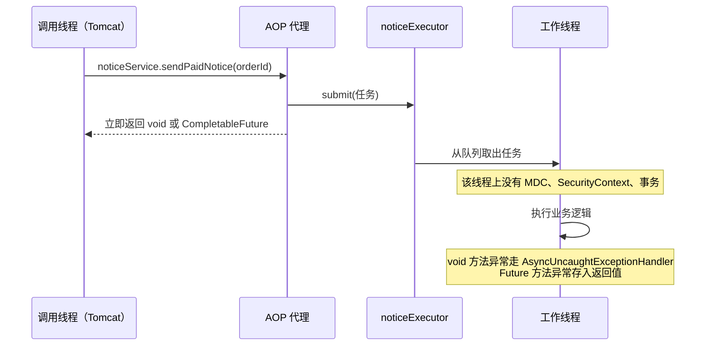
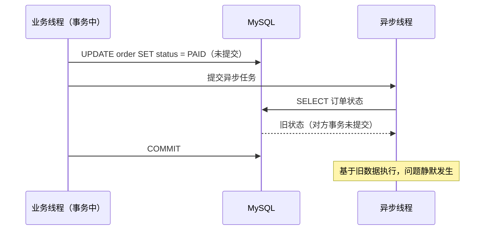

> [!NOTE] 提示
> @Async 的注解只负责声明「我想异步」，实际行为完全由代理机制和执行器配置决定。本文按六个问题整理最佳实践：该不该用、在哪个线程池跑、异常谁兜底、上下文怎么带过去、和事务怎么衔接、哪些调用会静默失效。结论以 Spring Framework 6.x / Spring Boot 3.x 官方文档为准（Java 17+），版本差异单独标注，文末附方案对比与上线检查清单。

## 引子

一个常见场景：订单支付成功后要做三件事，发短信、发优惠券、刷新报表统计。每件事平均耗时 200ms，串行执行让支付接口从 80ms 涨到 680ms。改动只需一行：方法上加 `@Async`。上线之后问题接连出现：有的接口响应时间没变、日志丢了 traceId、发版重启时队列里没执行完的任务直接消失、凌晨队列堆积把堆内存吃满触发 OOM。

这四类问题没有一个是 @Async 的 Bug，根因相同：注解只声明了意图，没有回答「在哪个线程池跑、失败了谁兜底、上下文还在不在、任务丢了能不能接受」。本文把这些问题的答案整理成一套可执行的实践。

## 核心摘要

- 适用边界：@Async 是进程内的异步工具，任务不落盘、不可恢复，停机即丢。允许丢失的副动作才用它，不允许丢失的任务走 MQ 或任务表。
- 线程池：Spring Boot 默认执行器为核心 8 线程加无界队列，队列堆积以堆内存为上限，maxPoolSize 永远不会触发。业务代码必须显式定义 `ThreadPoolTaskExecutor`，设置有界队列和显式拒绝策略。
- 异常：void 方法的异常默认仅打一行日志，必须配置 `AsyncUncaughtExceptionHandler`；`CompletableFuture` 方法的异常藏在返回值里，必须显式消费。声明非 Future 返回类型的方法，代理直接返回 null。
- 上下文：MDC、SecurityContext、RequestContext 都基于 ThreadLocal，跨线程必丢，用 `TaskDecorator` 复制并在 finally 中清理。
- 事务：事务上下文不跨线程。调用方事务提交前触发的异步任务读到旧数据，事务后置动作用 `AFTER_COMMIT` 事件衔接。
- 失效场景：未加 `@EnableAsync`、同类内部调用、非 public 方法、生命周期回调中调用，这四种情况 @Async 静默失效，无任何报错。

## 一、先判断该不该用

@Async 解决的问题只有一个：把「提交任务」和「执行任务」解耦，让调用线程不等结果。判断标准是两个问题：任务丢了有没有业务后果，需不需要拿到结果。

| 方案 | 定位 | 任务可恢复性 | 与事务的衔接 | 典型场景 |
|------|------|-------------|-------------|---------|
| @Async | 进程内异步执行 | 停机或崩溃即丢 | 需 AFTER_COMMIT 手动衔接 | 发通知、刷缓存、记审计日志 |
| CompletableFuture + 自定义线程池 | 进程内并行编排，需要结果 | 停机或崩溃即丢 | 同上 | 接口内聚合多个下游查询 |
| @TransactionalEventListener | 进程内领域事件 | 停机或崩溃即丢 | 天然 AFTER_COMMIT | 领域事件驱动的进程内副动作 |
| MQ（RocketMQ / Kafka） | 跨进程可靠投递 | 持久化，可重试 | 事务消息或本地消息表 | 不允许丢失、需要削峰与重试的任务 |

结论：@Async 适合「丢了可以接受、失败可以补偿」的副动作。短信、积分、报表这类有资金或履约含义的任务，直接上 MQ。进程内方案的一切优雅，都以「任务可以丢」为前提。

## 二、背景：@Async 的执行机制

### 2.1 代理与执行链

@Async 由 AOP 代理实现。调用方拿到的是代理对象，代理把方法体包装成任务提交给执行器，然后立即返回。真正的业务逻辑在工作线程上执行：



这张图标注了后文所有问题的来源：工作线程是池里复用的裸线程，调用线程上的一切线程绑定资源都不会跟过去。

### 2.2 启用前提：@EnableAsync

Spring Boot 自动配置了 `applicationTaskExecutor` 这个 Bean，但不会自动开启 @Async 注解处理。配置类上没有 `@EnableAsync` 时，所有 @Async 方法按普通同步方法执行，无任何报错。这是「加了注解没生效」的第一嫌疑。

```java
@Configuration
@EnableAsync
public class AsyncConfig {
}
```

### 2.3 默认执行器的解析链

方法上没有指定执行器时，Spring 按以下顺序解析，命中即停：

1. `@Async("beanName")` 显式指定的执行器 Bean（名字或 qualifier）；
2. `AsyncConfigurer.getAsyncExecutor()` 返回的执行器；
3. 容器中唯一的 `TaskExecutor` Bean，若有多个则找名为 `taskExecutor` 的；
4. Spring Boot 自动配置的 `applicationTaskExecutor`；
5. 都没有时，new 一个 `SimpleAsyncTaskExecutor` 兜底：每个任务新建一个线程，仅启动时打印一条 warn 日志。

这条链的第 5 级在生产环境等于无界并发。常见触发方式：项目里定义了多个执行器 Bean，既没有命名为 `taskExecutor`，方法上也没写限定符，此时 Spring 找不到「唯一」执行器，静默落到 SimpleAsyncTaskExecutor。表现是线程名不带池前缀、`jstack` 里线程数随流量无上限增长。

### 2.4 默认配置为什么不能用

Spring Boot 自动配置的 `applicationTaskExecutor` 是 `ThreadPoolTaskExecutor`，默认值（来源：Spring Boot 官方文档 Task Execution 章节）：

| 参数 | 默认值 | 后果 |
|------|--------|------|
| corePoolSize | 8 | 常驻 8 个工作线程 |
| queueCapacity | Integer.MAX_VALUE | 队列无界 |
| maxPoolSize | Integer.MAX_VALUE | 形同虚设 |
| keepAlive | 60s | 非核心线程空闲 60s 回收 |
| threadNamePrefix | `task-` | 多业务共用时日志无法区分来源 |

关键在队列无界这一条。`ThreadPoolExecutor` 只有在队列装满之后才会扩容线程到 maxPoolSize，无界队列意味着这个条件永远不成立，容量上限就是堆内存。

按 5000 次/s 峰值通知、单任务消费能力 1000 次/s 估算：队列每秒净增 4000 个任务对象，每个任务连同步方法捕获的对象引用按 2KB 保守计算，每小时净增约 28GB 引用数据，远早于任何告警到达堆上限。结果是 OOM，且队列里所有未执行任务一并丢失。

`spring.task.execution.*` 可以调整这个默认池，但它仍是全站共享的单池。业务系统的惯例是：不调整默认池，为业务显式定义执行器，让默认池只兜底框架自身行为。

## 三、实践一：显式定义执行器，按业务分池

```java
@Configuration
@EnableAsync
public class AsyncConfig implements AsyncConfigurer {

    public static final String NOTICE_EXECUTOR = "noticeExecutor";
    public static final String REPORT_EXECUTOR = "reportExecutor";

    @Bean(NOTICE_EXECUTOR)
    public ThreadPoolTaskExecutor noticeExecutor() {
        ThreadPoolTaskExecutor executor = new ThreadPoolTaskExecutor();
        // IO 密集型：起步按 线程数 = 核数 * (1 + 等待时间/计算时间) 估算，以压测为准
        executor.setCorePoolSize(4);
        executor.setMaxPoolSize(8);
        // 有界队列是底线，容量 = 预期可容忍的积压量
        executor.setQueueCapacity(200);
        executor.setKeepAliveSeconds(60);
        // 线程名前缀用于日志与 jstack 定位，按业务命名
        executor.setThreadNamePrefix("notice-");
        executor.setRejectedExecutionHandler(new ThreadPoolExecutor.CallerRunsPolicy());
        // 优雅停机：等待队列中任务执行完再关池
        executor.setWaitForTasksToCompleteOnShutdown(true);
        executor.setAwaitTerminationSeconds(30);
        executor.setTaskDecorator(new ContextCopyTaskDecorator());
        executor.initialize();
        return executor;
    }

    @Bean(REPORT_EXECUTOR)
    public ThreadPoolTaskExecutor reportExecutor() {
        ThreadPoolTaskExecutor executor = new ThreadPoolTaskExecutor();
        // CPU 密集型：核数 + 1 起步
        executor.setCorePoolSize(Runtime.getRuntime().availableProcessors() + 1);
        executor.setMaxPoolSize(Runtime.getRuntime().availableProcessors() + 1);
        executor.setQueueCapacity(100);
        executor.setThreadNamePrefix("report-");
        executor.setRejectedExecutionHandler(new ThreadPoolExecutor.CallerRunsPolicy());
        executor.setWaitForTasksToCompleteOnShutdown(true);
        executor.setAwaitTerminationSeconds(30);
        executor.setTaskDecorator(new ContextCopyTaskDecorator());
        executor.initialize();
        return executor;
    }

    /** 未指定执行器的 @Async 方法的默认池 */
    @Override
    public Executor getAsyncExecutor() {
        return noticeExecutor();
    }

    /** void 方法未捕获异常的统一兜底 */
    @Override
    public AsyncUncaughtExceptionHandler getAsyncUncaughtExceptionHandler() {
        return (ex, method, params) ->
                LoggerFactory.getLogger("ASYNC_UNCAUGHT")
                        .error("async method failed, method={}, params={}",
                                method.getDeclaringClass().getSimpleName() + "#" + method.getName(),
                                Arrays.toString(params), ex);
    }
}
```

三个要点：

1. **分池隔离**。通知类慢任务和报表类 CPU 任务用不同的池，一个池被打满不拖垮另一个业务。所有 @Async 方法显式写 `@Async("noticeExecutor")` 这样的限定符，不依赖解析链的隐式行为。
2. **池大小不拍脑袋**。CPU 密集取核数 + 1，IO 密集按等待/计算比放大，最终以压测为准，并受下游容量约束（数据库连接池、下游接口限流）。估算公式与监控闭环在本站《Java 线程池配置指南》中有完整展开，本文不重复。
3. **优雅停机**。`setWaitForTasksToCompleteOnShutdown(true)` 让关闭时先执行完队列中任务，`setAwaitTerminationSeconds(30)` 给等待加上限，防止个别任务卡住阻塞整个停机流程。

### 拒绝策略怎么选

队列满且线程达到 maxPoolSize 时触发拒绝策略，这是池「表达饱和」的唯一方式，必须显式选择而不是接受默认：

| 策略 | 行为 | 适用场景 | 代价 |
|------|------|---------|------|
| AbortPolicy（JDK 默认） | 抛 `TaskRejectedException` | 调用方能感知失败并补偿 | 从 HTTP 线程调用时接口直接 500 |
| CallerRunsPolicy | 调用线程自己执行任务 | 通知类「宁慢勿丢」 | 异步退化为同步，接口 P99 随饱和劣化 |
| DiscardPolicy / DiscardOldest | 静默丢弃 | 仅限可丢且可对账的任务 | 故障无感知，排查困难 |
| 自定义 Handler | 记日志、打点、降级 | 生产环境推荐 | 需要少量自研代码 |

CallerRunsPolicy 有一个必须知道的副作用：饱和时 @Async 调用会在调用线程同步执行，相当于自动降级。对背压这是好事，但意味着队列饱和期间接口响应时间会跟着任务时长走，容量规划时要按「maxPoolSize + queueCapacity」整体计算承接能力。

## 四、实践二：异常必须闭环

@Async 方法有三种返回形态，异常行为完全不同：

```java
// 形态一：void。异常不会传给调用方，默认行为是打一行日志后丢弃。
// 必须通过 AsyncConfig 里的 AsyncUncaughtExceptionHandler 兜底。
@Async("noticeExecutor")
public void sendPaidNotice(Long orderId) {
    smsClient.send(orderService.loadPhone(orderId), "支付成功");
}

// 形态二：CompletableFuture。异常被捕获进返回值，调用方不消费就等于丢失。
@Async("reportExecutor")
public CompletableFuture<OrderStats> loadStats(Long orderId) {
    return CompletableFuture.completedFuture(reportService.stats(orderId));
}

// 形态三：非 Future 返回类型。代理立即返回 null，方法体在后台照常执行。
// 编译器不报错，运行期不报错，是最隐蔽的一类错误。
@Async("reportExecutor")
public OrderStats loadStatsWrong(Long orderId) {   // 调用方拿到 null
    return reportService.stats(orderId);
}
```

官方文档对规则的定义（Spring Framework 文档 Asynchronous Methods 章节）：返回值方法必须声明 Future 类型，void 方法的异常无法传递，需要注册 AsyncUncaughtExceptionHandler 处理。对应到工程动作：

1. **void 方法**：在 AsyncConfigurer 中统一配置 handler（见上文 AsyncConfig），按方法名和参数记录错误日志并告警。依赖默认行为等于依赖「有人恰好看了日志」。
2. **CompletableFuture 方法**：调用链上必须有人消费异常，`exceptionally`、`handle` 或 `whenComplete` 三选一：

```java
noticeService.loadStats(orderId)
        .whenComplete((stats, ex) -> {
            if (ex != null) {
                log.error("load stats failed, orderId={}", orderId, ex);
            }
        });
```

3. **返回值写法约束**：团队规约中直接禁止第三种形态。方法要么 void，要么 CompletableFuture，其余写法视为 Bug。

## 五、实践三：上下文传递用 TaskDecorator

MDC（traceId）、SecurityContext（登录用户）、RequestContextHolder（请求属性）都基于 ThreadLocal。图 2.1 里已经标注：工作线程上这些全部为空。表现为异步日志没有 traceId、异步任务里拿不到当前用户、异步代码里调用 RequestContextHolder 直接抛异常。

解法是 `TaskDecorator`：提交任务时在调用线程捕获上下文副本，包装任务在工作线程恢复，执行完清理。清理这一步不能省，池线程长期复用，残留上下文会污染下一个任务：

```java
public class ContextCopyTaskDecorator implements TaskDecorator {

    @Override
    public Runnable decorate(Runnable runnable) {
        // 在调用线程捕获快照
        Map<String, String> mdc = MDC.getCopyOfContextMap();
        SecurityContext securityContext = SecurityContextHolder.getContext();
        return () -> {
            try {
                if (mdc != null) {
                    MDC.setContextMap(mdc);
                }
                if (securityContext != null) {
                    SecurityContextHolder.setContext(securityContext);
                }
                runnable.run();
            } finally {
                // 池线程复用，必须清理，否则上下文残留污染下一个任务
                MDC.clear();
                SecurityContextHolder.clearContext();
            }
        };
    }
}
```

两个补充：

1. 把 SecurityContext 带进异步线程意味着任务以用户身份执行，权限校验和审计要意识到这一点。只想要 traceId 的场景，只复制 MDC 就够。
2. Spring Security 也提供了现成包装 `DelegatingSecurityContextAsyncTaskExecutor`，把执行器包一层即可传递安全上下文，适合不想要自定义 Decorator 的项目。

## 六、实践四：与事务的边界

事务绑定在数据库连接上，连接绑定在线程上，这三者都不跨线程。由此产生三条规则。

**规则一：异步方法没有调用方的事务。** @Async 方法在工作线程上执行时没有任何事务；它自己声明的 `@Transactional` 会开启一个新事务。不能指望异步代码「加入」调用方的事务。

**规则二：调用方提交前触发异步任务，存在脏读竞态。** 以 MySQL InnoDB 为例，未提交的修改对其他事务不可见：



正确做法是把「事务内」和「事务提交后」分开：事务内只发布事件，事务提交后由监听器触发异步动作。Spring 事件机制原生支持这个时序：

```java
// 事务内：只发事件，不做任何异步动作
@Service
public class OrderService {

    private final ApplicationEventPublisher publisher;

    @Transactional
    public void paySuccess(Long orderId) {
        orderMapper.updateStatusPaid(orderId);
        publisher.publishEvent(new OrderPaidEvent(orderId));
    }
}

// 事务提交后触发；监听器方法内的 @Async 调用把执行挪到工作线程
@Component
public class OrderPaidListener {

    private final NoticeService noticeService;

    @TransactionalEventListener(phase = TransactionPhase.AFTER_COMMIT)
    public void onPaid(OrderPaidEvent event) {
        noticeService.sendPaidNotice(event.orderId());
    }
}
```

**规则三：跨线程只传 ID，不传实体。** 传实体有两个坑：实体可能引用未提交的数据；延迟加载的关联属性在工作线程上访问时抛 `LazyInitializationException`，因为打开它的数据库会话留在调用线程。传 orderId 这类标量，让异步方法自己查一遍，代码边界也干净。

一个容易漏掉的细节：AFTER_COMMIT 阶段原事务已经提交，监听器内如果直接写库且事务传播级别是 REQUIRED，写操作会挂到已完成的资源上，改动不会真正提交。异步方法在新线程上执行，天然拿不到原事务资源，`@Transactional` 会正常开新事务，所以「监听器只做转发、写库动作放进 @Async 方法」的分工正好绕开这个坑。

## 七、实践五：让失效场景显形

@Async 的失效全部是静默的：方法照常执行，只是变回同步。汇总成一张表：

| 失效场景 | 表现 | 修复方式 |
|---------|------|---------|
| 配置类未加 @EnableAsync | 所有 @Async 同步执行 | 加注解，启动时验证线程名前缀 |
| 同类内部调用 `this.sendNotice()` | 该调用同步执行 | 拆分到独立 Bean，或自注入代理 |
| 方法不是 public | 该方法同步执行 | 改为 public |
| 对象由 `new` 创建而非容器管理 | 该方法同步执行 | 交给 Spring 管理，注入使用 |
| @PostConstruct 中调用 @Async 方法 | 官方明确不支持 | 用独立的初始化 Bean 触发 |

自调用失效的根因：@Async 靠代理拦截，`this.method()` 绕过代理直接调到目标对象。修复方案对比：

| 方案 | 做法 | 评价 |
|------|------|------|
| 拆分到独立 Bean（推荐） | 把异步方法挪到 NoticeService 之类的专职 Bean，注入后调用 | 结构最清晰，顺带解决职责问题 |
| 自注入代理 | `ObjectProvider<OrderService>` 注入自身，调用 `provider.getObject().sendNotice()` | 可行，但结构别扭，仅用于不便拆分的历史代码 |
| AopContext.currentProxy() | 开启 `exposeProxy = true` 后强转获取代理 | 代码侵入性强，Spring 官方不推荐 |
| AspectJ 织入模式 | 编译期或加载期织入，能拦截内部调用 | 能根治，但要在构建期引入 AspectJ 编译插件并维护织入配置，一般不值得 |

一个低成本的自查手段：开发环境把异步方法首行日志带上线程名，验证输出的是池前缀（如 `notice-1`）还是调用线程名（如 `http-nio-8080-exec-3`），后者即失效。这类问题在压测或日预案演练中最容易暴露：表现是「明明异步了，接口却没变快」。

## 八、实战演示：订单支付后的异步通知

把前文实践组装成完整链路。事件定义、配置、监听器、异步服务：

```java
/** 领域事件：只携带 ID 等标量 */
public record OrderPaidEvent(Long orderId) {
}
```

```java
@Configuration
@EnableAsync
public class AsyncConfig implements AsyncConfigurer {

    public static final String NOTICE_EXECUTOR = "noticeExecutor";

    @Bean(NOTICE_EXECUTOR)
    public ThreadPoolTaskExecutor noticeExecutor() {
        ThreadPoolTaskExecutor executor = new ThreadPoolTaskExecutor();
        executor.setCorePoolSize(4);
        executor.setMaxPoolSize(8);
        executor.setQueueCapacity(200);
        executor.setKeepAliveSeconds(60);
        executor.setThreadNamePrefix("notice-");
        executor.setRejectedExecutionHandler(new ThreadPoolExecutor.CallerRunsPolicy());
        executor.setWaitForTasksToCompleteOnShutdown(true);
        executor.setAwaitTerminationSeconds(30);
        executor.setTaskDecorator(new ContextCopyTaskDecorator());
        executor.initialize();
        return executor;
    }

    @Override
    public Executor getAsyncExecutor() {
        return noticeExecutor();
    }

    @Override
    public AsyncUncaughtExceptionHandler getAsyncUncaughtExceptionHandler() {
        return (ex, method, params) ->
                LoggerFactory.getLogger("ASYNC_UNCAUGHT")
                        .error("async failed, method={}, params={}", method.getName(),
                                Arrays.toString(params), ex);
    }
}
```

```java
@Service
public class NoticeService {

    private static final Logger log = LoggerFactory.getLogger(NoticeService.class);

    private final OrderMapper orderMapper;
    private final SmsClient smsClient;

    public NoticeService(OrderMapper orderMapper, SmsClient smsClient) {
        this.orderMapper = orderMapper;
        this.smsClient = smsClient;
    }

    /** 新线程上执行，@Transactional 开新事务，读写都基于已提交的数据 */
    @Async(AsyncConfig.NOTICE_EXECUTOR)
    @Transactional
    public void sendPaidNotice(Long orderId) {
        Order order = orderMapper.selectById(orderId);
        if (order == null) {
            log.warn("order not found, skip notice, orderId={}", orderId);
            return;
        }
        smsClient.send(order.getPhone(), "订单 " + order.getOrderNo() + " 支付成功");
    }
}
```

```java
@Component
public class OrderPaidListener {

    private static final Logger log = LoggerFactory.getLogger(OrderPaidListener.class);

    private final NoticeService noticeService;

    public OrderPaidListener(NoticeService noticeService) {
        this.noticeService = noticeService;
    }

    /** 事务提交后才触发；本方法只转发，不写库 */
    @TransactionalEventListener(phase = TransactionPhase.AFTER_COMMIT)
    public void onPaid(OrderPaidEvent event) {
        try {
            noticeService.sendPaidNotice(event.orderId());
        } catch (Exception ex) {
            // AFTER_COMMIT 阶段原事务已提交，这里的失败只能靠日志与补偿
            log.error("dispatch paid notice failed, orderId={}", event.orderId(), ex);
        }
    }
}
```

验证清单：日志里 `sendPaidNotice` 的线程名是 `notice-N`，traceId 与调用方一致（TaskDecorator 生效）；停服发版时启动日志出现执行器关闭前的等待动作（优雅停机生效）；把队列容量临时调成 1 并压测，可观察 CallerRunsPolicy 的同步退化行为。

## 九、踩坑点与注意事项

### 坑 1：TaskRejectedException 打到用户脸上

AbortPolicy 下，队列满且线程到顶时抛 `TaskRejectedException`。如果调用方是 HTTP 线程，用户收到 500。容量规划按 maxPoolSize + queueCapacity 计算，超量部分要么被 CallerRunsPolicy 背压吸收，要么走降级路径，不要把默认 AbortPolicy 暴露给用户请求路径。

### 坑 2：同池嵌套阻塞导致死锁

```java
@Async("reportExecutor")
public CompletableFuture<Report> buildReport() {
    // 危险：阻塞等待的 detailTask 也路由到 reportExecutor
    return detailTask().get();   // 池满时两败俱伤
}
```

外层任务占满池线程后阻塞等待内层任务，内层任务排在队列里永远轮不到执行，池整体死锁。规则：池内任务不得阻塞等待路由到同一个池的任务。要么用 `thenCompose` 做非阻塞编排，要么内外层分池。

### 坑 3：发版重启丢任务

@Async 的队列在内存里。发版、扩容、崩溃都会丢掉队列中未执行的任务。上线检查清单里「不允许丢失的任务已改走 MQ 或任务表」针对的就是这个问题。@Async 的正确预期是：丢了可以接受，或者丢了可以靠对账兜住。

### 坑 4：开启虚拟线程后行为变化

Java 21 + `spring.threads.virtual.enabled=true` 时，`applicationTaskExecutor` 自动变为基于虚拟线程的 `SimpleAsyncTaskExecutor`（来源：Spring Boot 官方文档）。行为差异有三点：每个任务新建一个虚拟线程，没有池化和队列，天然无背压；上文所有关于有界队列和拒绝策略的配置对它不生效，并发上限需要用 `spring.task.execution.simple.concurrency-limit` 单独设置；上下文传递依旧需要 TaskDecorator（Spring 6.1 起 SimpleAsyncTaskExecutor 同样支持）。另外 Spring Boot 3.5 引入了 `spring.task.execution.mode=force`，把自动配置执行器的使用范围扩大到更多集成点，升级时注意行为变化。虚拟线程本身的适用边界与编排方式，见本站《虚拟线程与异步编排》。

### 坑 5：只配不监控

Spring Boot 会为容器中的 `ThreadPoolTaskExecutor` Bean 自动注册 Micrometer 指标（`executor.queued`、`executor.active`、`executor.pool.size`、`executor.completed` 等）。重点告警项是 `executor.queued` 持续增长：它是积压的直接信号，通常比 OOM 早几个小时出现。线程名前缀在这里也发挥作用，出问题时按前缀从 `jstack` 输出里快速圈定线程栈。

## 十、上线检查清单

- [ ] 配置类已加 `@EnableAsync`
- [ ] 每个业务 @Async 方法显式指定了具名执行器
- [ ] 执行器使用有界队列，容量按「maxPoolSize + queueCapacity」做过容量规划
- [ ] 拒绝策略显式选择，且饱和路径有日志或指标
- [ ] `AsyncUncaughtExceptionHandler` 已配置，void 方法异常可告警
- [ ] 所有 CompletableFuture 调用链有 `exceptionally` / `whenComplete` 消费异常
- [ ] 无非 Future 返回类型的 @Async 方法（用 ArchUnit 或 Code Review 规约固化）
- [ ] TaskDecorator 复制 MDC 与 SecurityContext，且 finally 中清理
- [ ] 事务后置动作走 `AFTER_COMMIT` 事件，跨线程只传 ID
- [ ] `setWaitForTasksToCompleteOnShutdown` 与 `setAwaitTerminationSeconds` 已设置
- [ ] `executor.queued` 已接入监控并配置告警阈值
- [ ] 不允许丢失的任务已改走 MQ 或任务表，未停留在 @Async

## 总结

@Async 的价值是把「提交任务」和「执行任务」解耦，代价是把线程池治理、异常闭环、上下文一致性、任务持久性四个问题交给开发者，而注解本身对这四个问题只字未提。默认配置（8 核心线程加无界队列）够跑 Demo，够不着生产。判断一个项目的 @Async 用得对不对，看三处就够：执行器是否显式且分池，void 异常是否有统一兜底，不丢任务的需求是否已经移出了进程内方案。@Async 和 MQ 的分工边界是本文最重要的判断：前者处理「丢了无所谓」，后者处理「丢了有后果」，用错位置的修复成本远高于一开始就选对。

## 参考资料

- [Spring Framework 官方文档：Asynchronous Methods（@Async 与 @EnableAsync 完整规则）](https://docs.spring.io/spring-framework/reference/integration/scheduling.html)
- [Spring Boot 官方文档：Task Execution and Scheduling（默认执行器与 spring.task.* 配置）](https://docs.spring.io/spring-boot/reference/features/task-execution-and-scheduling.html)
- [AsyncUncaughtExceptionHandler Javadoc](https://docs.spring.io/spring-framework/docs/current/javadoc-api/org/springframework/aop/interceptor/AsyncUncaughtExceptionHandler.html)
- [Stack Overflow：Why does self-invocation not work for Spring proxies](https://stackoverflow.com/questions/56614354/why-does-self-invocation-not-work-for-spring-proxies-e-g-with-aop)
- [Baeldung：Guide to RejectedExecutionHandler（有界队列与拒绝策略）](https://www.baeldung.com/java-rejectedexecutionhandler)
- [Stack Overflow：Controlling async processing rate with virtual threads](https://stackoverflow.com/questions/78112964/controlling-async-processing-rate-in-spring-boot-with-virtual-threads)
- [GitHub Issue spring-boot#48285：TaskExecutor 的 MDC 自动传播议题](https://github.com/spring-projects/spring-boot/issues/48285)
- 本站相关文章：《Java 线程池配置指南》（池参数与监控闭环）、《虚拟线程与异步编排》（虚拟线程适用边界）

---

> [!NOTE] 提示
> 如果这篇文章对你有帮助，欢迎点赞收藏。有问题欢迎评论区交流。
