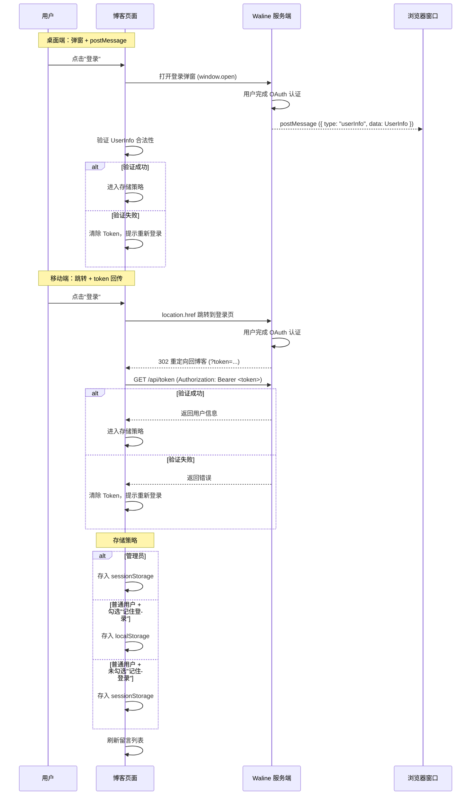

> [!NOTE] 提示
> 本文记录基于 Firefly 主题进行二次开发的实现取舍，覆盖首页动效、音乐可视化、标签图谱、留言板、Cloudflare 集成和部署流程。项目目标是保留 Astro 内容系统，同时将交互功能拆分为可独立维护的模块。

## 选型背景

项目最初定位为个人主页，后续增加了文章、评论、搜索和统计能力，因此选择继续在 Astro 内容系统上演进。没有迁移到 Fuwari 的主要原因是现有文章、组件和部署配置已经围绕 Astro 组织，迁移成本高于继续维护。

截至本文发布时，项目本地构建时间约为 24 s；性能结果取决于图片数量、网络环境和部署平台，不能直接作为所有环境的基准。后续重构的主要成本来自交互组件、Swup 生命周期和外部服务配置之间的耦合。

**项目地址**

[https://github.com/MmzMing/my-blog](https://github.com/MmzMing/my-blog)

项目属于二次开发，代码和配置以仓库当前版本为准。

## 一、重点

### 1、首页

1. Hero 区域采用 Galgame 风格
2. 站点地图一览
3. 作品展示和博客主要方向

| 技术栈 | 版本 | 作用 |
| --- | --- | --- |
| GSAP | `3.15.0` | 处理进入动画、碎片拼合和数字过渡 |
| GSAP ScrollTrigger | `3.15.0` | 根据滚动位置驱动首页 Hero 与展示层动画 |
| SVG Filter | 浏览器原生 API | 提供首页标题的轻量熔化文字效果 |
| Canvas 2D API | 浏览器原生 API | 绘制首页雨滴等轻量动态效果 |
| `@swup/astro` | `1.8.0` | 提供页面缓存、预加载和页面切换；切换后重新初始化动态组件 |
| Tailwind CSS | `4.2.4` | 提供通用布局、排版和响应式样式 |

### 2、音乐

3D棋盘可视化音乐。

该功能参考并复刻了开源音乐地图项目的交互思路。

实现参考了 [sonic-topography](https://github.com/yin-yizhen/sonic-topography)，并根据本站布局和数据结构进行了改造。复用代码或素材前应确认原项目许可证和署名要求。

| 技术栈 | 版本 | 作用 |
| --- | --- | --- |
| HTMLAudioElement | 浏览器原生 API | 控制播放、暂停、进度和音量 |
| Three.js | `0.184.0` | 构建音乐可视化的 3D 场景、相机与实例化网格 |
| WebGL | 浏览器原生 API | 渲染音乐可视化的 3D 画面 |
| Web Audio API | 浏览器原生 API | 使用 AudioContext 与分析节点读取频谱数据并驱动可视化 |

### 3、分类标签

分类页现在只保留标签关系图谱：标签是节点，同一篇文章中同时出现的标签会连成边，边越粗表示共现次数越多。

| 技术栈 | 版本 | 作用 |
| --- | --- | --- |
| Astro Content Collections | `6.4.6` | 在构建时校验文章元数据并生成归档、分类和标签数据 |
| Markdown Frontmatter | Markdown 标准能力 | 维护 `category`、`tags` 和发布日期 |
| URLSearchParams | 浏览器原生 API | 读取标签和分类筛选参数 |
| （核心）D3.js | `7.9.0` | 使用 `d3-force` 计算力导向布局，使用 `d3-zoom` 处理缩放与拖拽 |
| Canvas 2D API | 浏览器原生 API | 绘制节点、连线、标签和悬停高亮，避免大量 SVG 节点带来的渲染压力 |
| ResizeObserver、IntersectionObserver、MutationObserver | 浏览器原生 API | 在容器尺寸、可见性和主题变化时分别调整图谱尺寸、暂停动画和刷新配色 |

实现上，构建阶段会遍历所有文章的 `tags`：每个标签生成一个节点，并记录它关联的文章；同一篇文章内的任意两个标签生成一条共现边，边的权重就是它们共同出现的次数。客户端按连通关系给节点分组，再交给 D3 力导向模拟进行排布；Canvas 根据模拟结果逐帧绘制图谱。节点大小由文章数量决定，边的透明度和粗细由共现权重决定。用户可以缩放、拖拽节点、悬停查看关联文章，点击或按回车跳转到对应标签页；同时支持键盘选择、减少动态效果偏好和亮暗主题切换。

### 4、留言

转变UI为聊天室，并复用 Waline 的登录、审核、表情和访问量能力。原本做了个翻卡牌的，因为这个在KV上面天天给我报警告，后面就取消了。

| 技术栈 | 版本 | 作用 |
| --- | --- | --- |
| Waline Client | `3.15.2` | 初始化普通文章评论区与访问量统计 |
| （核心）`@waline/api` | `1.1.2` | 调用留言读取、登录、发布、编辑和删除接口 |
| Lucide Svelte | `0.468.0` | 提供刷新、状态和操作图标 |
| Fetch API、Web Storage API | 浏览器原生 API | 校验登录回调 Token，并保存草稿、资料和登录状态 |

Waline 服务独立部署，博客只保存服务地址和客户端配置；项目 Worker 不保存评论内容，也不维护留言数据库或登录系统。

留言板调用的接口如下。读取接口每 `30 s` 轮询一次；页面不可见或浏览器离线时停止发起无效请求。

管理员 Token 仅保存到 `sessionStorage`；普通用户根据"记住登录"选项保存到 `sessionStorage` 或 `localStorage`。任何读取、发布、修改或删除请求返回鉴权错误时，页面都会清除本地 Token 并要求重新登录。

#### 4.1 接口列表

以下为 `@waline/api` 中留言板实际调用的 CRUD 接口。

```ts
// GET /api/comment?path=...&pageSize=...&page=...&lang=...&sortBy=...
// Headers: (token 存在时) Authorization: Bearer <token>
// 读取留言列表（分页，首次加载 + 轮询 + 加载历史）
getComment({
  serverURL: string,     // Waline 服务端地址
  lang: string,          // 语言
  path: string,          // 页面路径（留言板固定为 /guestbook/）
  page: number,          // 页码，从 1 开始
  pageSize: number,      // 每页条数
  sortBy: string,        // 排序方式（如 "insertedAt_desc"）
  token?: string,        // 登录令牌（可选，管理员可看到待审核留言）
  signal?: AbortSignal,  // 取消请求信号
})
// Response: { count: number, page: number, pageSize: number, totalPages: number, data: WalineRootComment[] }

// --------------------------------------------------------------------------

// POST /api/comment?lang=<string>
// Headers: Content-Type: application/json
//         (token 存在时) Authorization: Bearer <token>
// Body: { nick, mail?, link?, comment, ua, url, pid?, rid?, at? }
// 发布留言
addComment({
  serverURL: string,
  lang: string,
  token?: string,           // 登录令牌（登录用户可选，匿名时不需要）
  comment: {                // WalineCommentData
    nick: string,           // 昵称
    mail?: string,          // 邮箱
    link?: string,          // 网站地址
    comment: string,        // 留言内容（含回复标记 HTML 注释）
    ua: string,             // User Agent
    url: string,            // 页面路径
    pid?: number,           // 父评论 ID（回复时）
    rid?: number,           // 根评论 ID（回复时）
    at?: string,            // @用户 ID（回复时）
  },
})
// Response: { errno: number, errmsg?: string, data?: WalineComment }

// --------------------------------------------------------------------------

// PUT /api/comment/<objectId>?lang=<string>
// Headers: Content-Type: application/json
//          Authorization: Bearer <token>
// Body: { comment?, status?, sticky?, like? }
// 编辑留言（仅本人或管理员可编辑）
updateComment({
  serverURL: string,
  lang: string,
  token: string,            // 登录令牌（必需）
  objectId: number,         // 留言 objectId
  comment?: {               // UpdateWalineCommentData
    comment?: string,       // 修改后的内容
    status?: "approved" | "waiting" | "spam",  // 审核状态（管理员）
    sticky?: 0 | 1,         // 置顶状态（管理员）
    like?: boolean,         // 点赞/取消点赞
  },
})
// Response: { errno: number, errmsg?: string, data: WalineComment }

// --------------------------------------------------------------------------

// DELETE /api/comment/<objectId>?lang=<string>
// Headers: Authorization: Bearer <token>
// 删除留言（仅本人或管理员可删除）
deleteComment({
  serverURL: string,
  lang: string,
  token: string,            // 登录令牌（必需）
  objectId: number,         // 留言 objectId
})
// Response: { errno: number, errmsg: string, data: "" }

// --------------------------------------------------------------------------

// GET /api/token?lang=<string>
// Headers: Authorization: Bearer <token>
// 登录回调 Token 校验（Waline OAuth 重定向回博客后验证身份）
fetch(`${serverURL}/api/token?lang=${lang}`, {
  headers: { Authorization: `Bearer ${token}` },
})
// Response: { errno: number, errmsg?: string, data?: UserInfo }
```

#### 4.2 登录流程



### 5、关于

关于页内容使用 MDX 编写，正文里直接内嵌 Astro 组件（资料卡、技术栈卡片、时间线、社交链接和聊天气泡），排版交给框架的 Markdown 渲染管线，无需手动处理换行。页面底部附带一张更新日志图谱：构建时解析 `log.md` 的变更记录，生成按类型着色的日志卡片，并用 SVG 连线标注条目之间的关联页面。

| 技术栈 | 版本 | 作用 |
| --- | --- | --- |
| MDX | Markdown 标准能力 + 组件语法 | 维护个人资料文本并内嵌交互组件，内容更新不需要修改页面逻辑 |
| Astro 组件 | `6.4.6` | 资料卡、技术栈、时间线、社交链接等区块均为 `.astro` 组件，构建时静态渲染 |
| SVG | 浏览器标准 | 绘制更新日志图谱中条目之间的关联连线与箭头 |
| Pointer Events | 浏览器原生 API | 处理日志卡片的悬停高亮与展开交互 |
| Tailwind CSS | `4.2.4` | 提供排版和响应式样式 |
| TypeScript | `5.9.2` | 约束日志解析工具和组件 Props 的类型 |

### 6、日历

日历以全局小组件形式提供，聚合文章发布日期、法定节假日、内置节日和生日/纪念日，在固定的 `6 × 7` 月视图中展示公历和农历信息，并提供近期事件与当天详情。

| 技术栈 | 版本 | 作用 |
| --- | --- | --- |
| `lunar-typescript` | `1.8.6` | 将公历与农历日期互转，生成农历日期和农历生日、节日事件 |
| Fetch API | 浏览器原生 API | 日历小组件在浏览器端获取文章元数据和节假日静态 JSON 数据 |
| CSS Grid | 浏览器标准 | 使用 `6 × 7` 网格稳定渲染每月 42 个日期单元格 |

#### 6.1 接口列表

以下两个内部 API 在构建时预渲染为静态 JSON；日历小组件在浏览器端运行时 fetch 这两份数据。其中 `/api/holidays.json` 在构建时会调用第三方节假日 API 获取数据。

```ts
// --------------------------------------------------------------------------

// GET /api/allPostMeta.json
// Headers: 无
// 调用方：日历小组件客户端脚本（浏览器运行时 fetch）
// 构建时由 Astro Content Collections 生成并预渲染为静态 JSON，包含所有文章的元数据
fetch("/api/allPostMeta.json")
// Response: Array<{ id: string, title: string, published: number, category?: string, password?: boolean }>

// --------------------------------------------------------------------------

// GET /api/holidays.json
// Headers: 无
// 调用方：日历小组件客户端脚本（浏览器运行时 fetch）
// 构建时内部调用第三方 API 获取节假日数据后合并内置节日，预渲染为静态 JSON
fetch("/api/holidays.json")
// Response: Array<{ date: string, name: string, isOfficial?: boolean, isWorkday?: boolean, icon?: string, source: "api" | "builtin", rest?: number }>

// --------------------------------------------------------------------------

// GET https://timor.tech/api/holiday/year/<year>
// Headers: Accept: application/json
// 调用方：/api/holidays.json 内部（构建时由 holidayApi 配置驱动）
// 获取中国法定节假日、调休补班日
// 配置路径：src/config/calendarConfig.ts → holidayApi.url
fetch("https://timor.tech/api/holiday/year/2026")
// Response: { code: number, holiday: Record<string, { holiday: boolean, name: string, rest?: number }> }
```

两个内部 API 只在 `astro build` 时执行并输出为静态 JSON，生产环境由静态资源直接返回，浏览器端 fetch 到的是静态文件。文章或节假日更新后需要重新构建才能反映到日历上。

### 7、归档

归档页按年、月和文章组织时间线，支持分类和标签筛选，并显示年度文章进度。文章列表与统计在构建时根据文章元数据生成；由于静态构建无法读取查询参数，分类和标签筛选在客户端执行，不依赖额外的动态接口。

| 技术栈 | 版本 | 作用 |
| --- | --- | --- |
| Intl.DateTimeFormat | 浏览器原生 API | 构建时按站点时区归组年月，用于年度/月度文章统计 |
| URLSearchParams | 浏览器原生 API | 客户端读取 `?tag` / `?category` / `?uncategorized` 筛选参数 |
| Svelte | `5.55.5` | 统计卡片组件，配合 `requestAnimationFrame` 做数字过渡动画（尊重减少动态效果偏好） |

### 8、其他

1. 取消了侧边栏，首页和文章页将主要导航集中到顶部与移动端 Dock。
2. 修改了整体 UI 风格，保留亮色与暗色两种主题，不再维护背景图和多套背景配置。
3. 添加了日历功能，按文章发布日期展示内容；节假日数据在构建时从第三方 API 拉取并合并内置节日，运行时只读静态 JSON。
4. 删除了追番功能，避免相关数据请求和资源处理进入构建流程。
5. 使用 Pagefind `1.5.2` 构建本地全文索引；使用 Cloudflare Vectorize、Workers AI 和 Durable Objects 提供可选的 AI 语义搜索与限流。
6. 使用 Cloudflare Workers 运行时承担可选的 AI 搜索和随机封面代理等动态接口；静态文章、图片和 Pagefind 索引仍由静态资源服务返回。


## 二、用到的AI模型

- MIMO V2.5/PRO（送的百亿补贴）
- claude opus 4.64.74.8fable 5
- GPT 5.5/5.6
- antigravity的gemini 3.1/3.5
- TRAE上的 GLM/豆包/KIMI/QWEN/DeepSeek（都是拿来测试性能好在工作上确定是否实用）

本次试用成本约为 30 元。不同平台的模型、上下文管理和工具链存在差异，不能仅凭一次试用归因于模型或平台。实际接入时应使用小任务验证代码质量，并通过测试和审查控制回归风险。

## 三、优点与UI复制

纯静态，部署快，维护简单，成本低（只需要域名的费用）。

外部 UI 参考可以加速原型制作，但接入前需要统一交互规范、无障碍要求和许可证边界，避免把不兼容的组件直接拼接到站点中。


::github{repo="MmzMing/my-blog"}