> [!NOTE] 提示
> 本文将 Umami 部署到 Vercel，将 PostgreSQL 数据库部署到 Neon，再通过 Share API 在博客首页展示 UV/PV。方案适用于低流量个人站点；免费额度、休眠策略和函数限制会随服务商政策变化，部署前应重新核对当前定价。

## 一、架构

```
博客用户
    │
    ▼
Cloudflare CDN (博客静态站)
    │  加载 script.js
    ▼
Vercel (Umami Next.js 应用)
    │  读写数据
    ▼
Neon (Serverless PostgreSQL)
```

| 服务 | 免费额度 | Umami 实际消耗 | 够用 |
|---|---|---|---|
| **Vercel Hobby** | 100 万次函数调用/月，100 GB-Hours | 个人博客约 1-5 万次/月 | ✅ |
| **Neon Free** | 0.5 GB 存储/项目，100 CU-hours/项目 | Umami 数据约 50-200 MB/年 | ✅ |

Cloudflare D1 基于 SQLite，Umami 仅支持 PostgreSQL，无法兼容。

---

## 二、部署步骤

1、拉仓库
2、vercel部署
3、vercel打通neon，更改域名，重新部署
4、登录Umami更改密码，调整地址，开通网址
5、复制配置项到config

### 1、Fork Umami 仓库

访问 [github.com/umami-software/umami](https://github.com/umami-software/umami)，点击 **Fork**，保持默认设置。
### 2、vercel部署

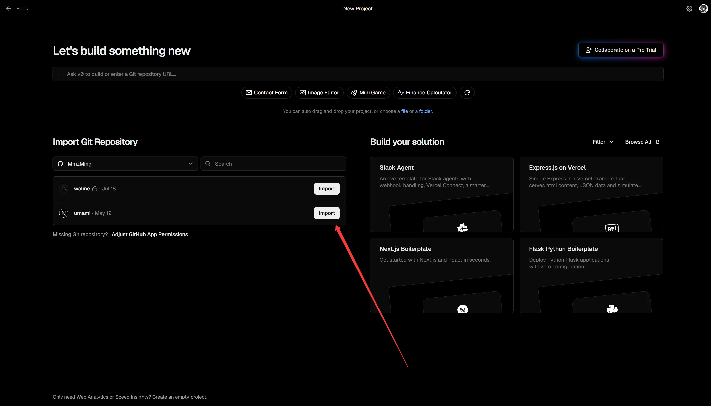

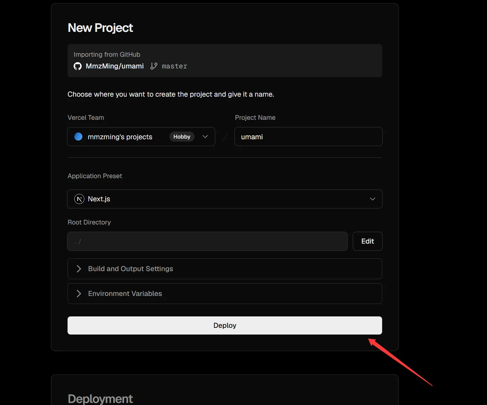

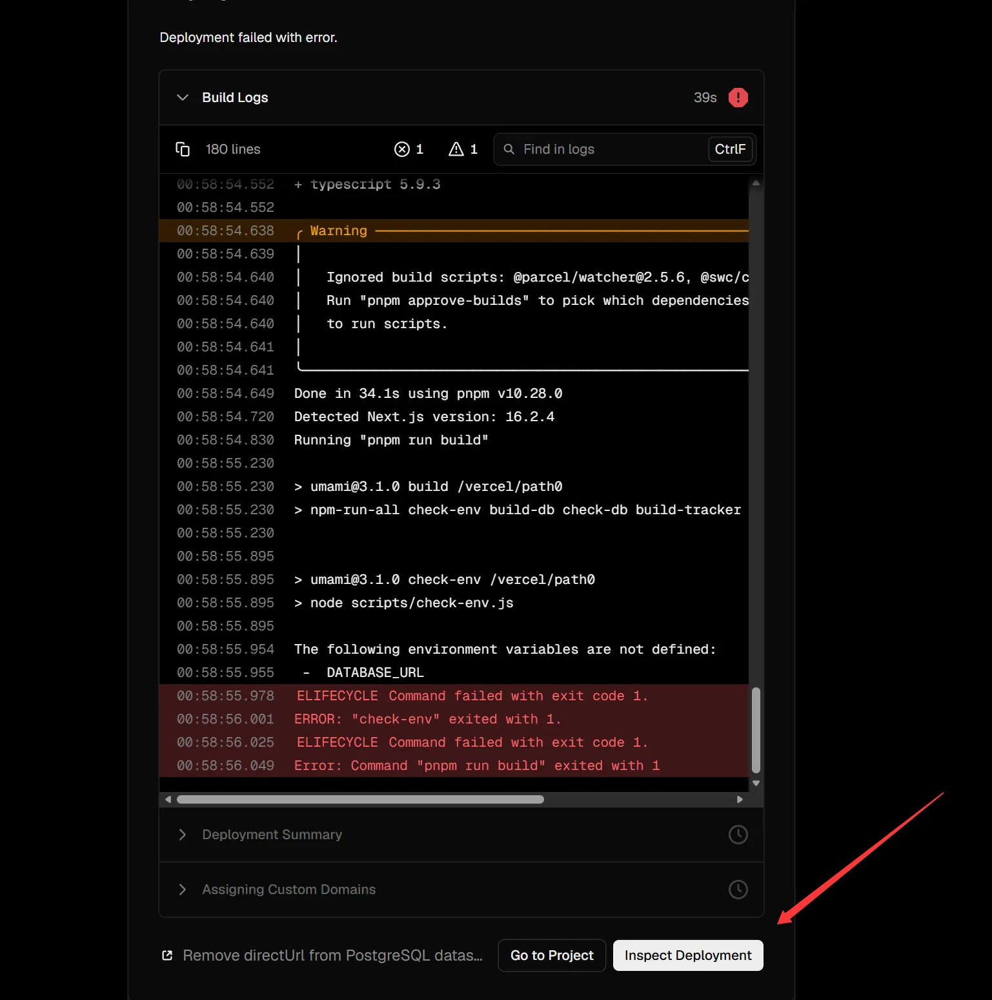

### 3、vercel打通neon，更改域名，重新部署

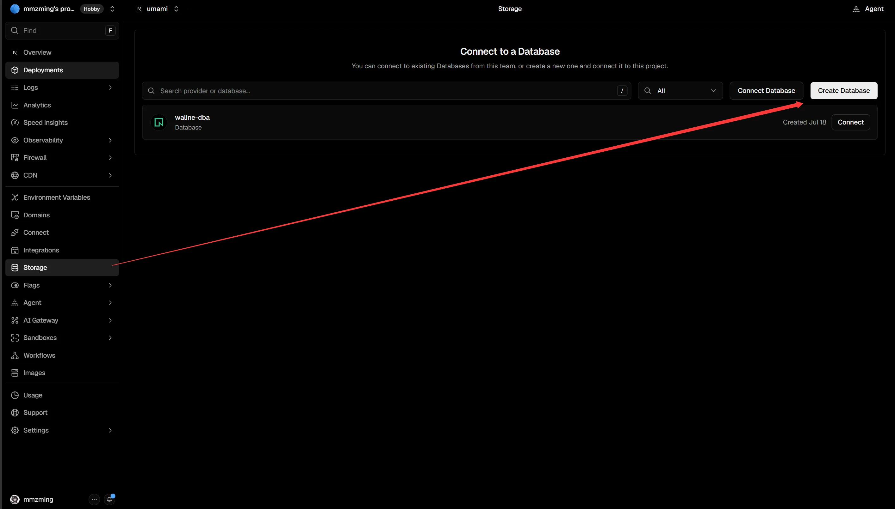

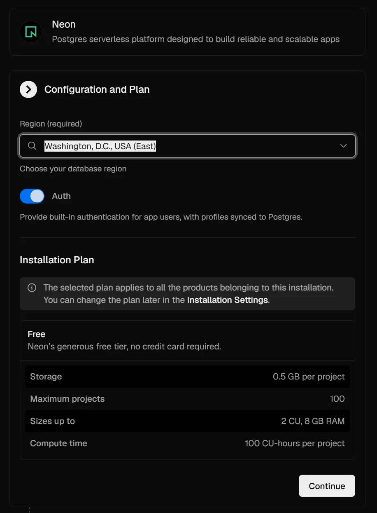

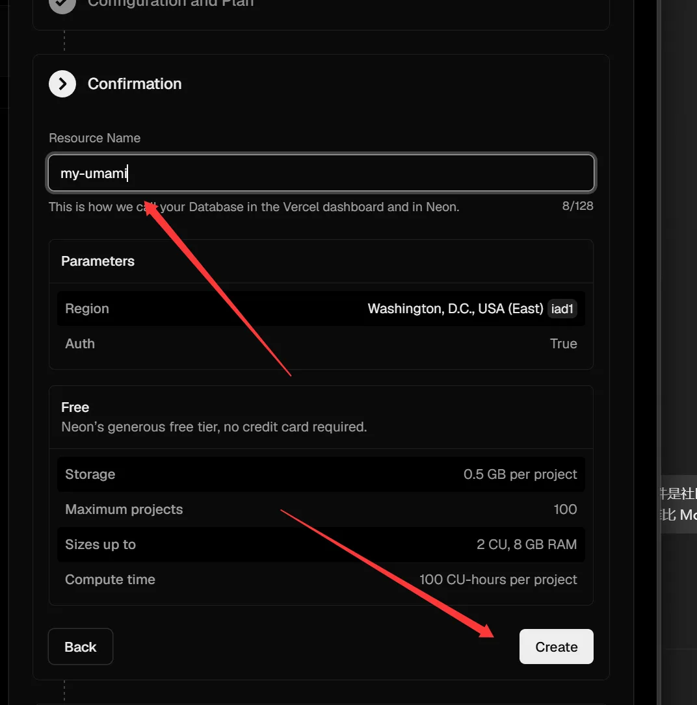

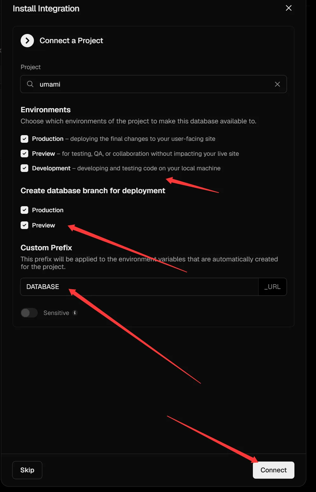

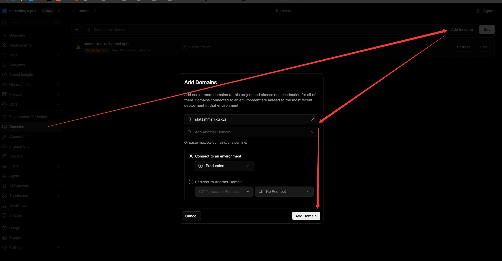

> [!CAUTION] 注意
> 这里需要到你的域名DNS配置CNAME，我这里已经配置好了，等下这里会提示报错信息，你直接按照他要求做就行

Vercel 会报错。去 Cloudflare DNS 添加记录：

| Type  | Name     | Target   | Proxy status |
| ----- | -------- | -------- | ------------ |
| CNAME | 你需要更改的地方 | 你需要更改的地方 | **关闭（灰色云朵）** |

> ⚠️ Proxy 必须关闭。Vercel 自带 CDN，开 Cloudflare Proxy 会冲突导致 SSL 问题。

等待域名验证通过，Vercel 自动配置 SSL 证书

Vercel 显示黄色警告时点进去授权，Cloudflare 的 Target 会被自动更新

验证成功


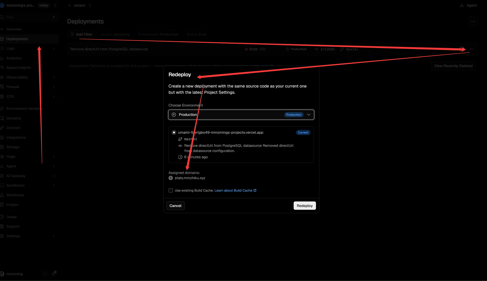

> [!CAUTION] 注意
> 这里重新部署一般都会正常，等待 2-3 分钟，需要注意的是你选择的是否你的域名，如果不正常则是你前面步骤有问题

### 4、登录Umami更改密码，调整地址，开通网址

- 访问你的域名
- 默认凭据：用户名 `admin`，密码 `umami`

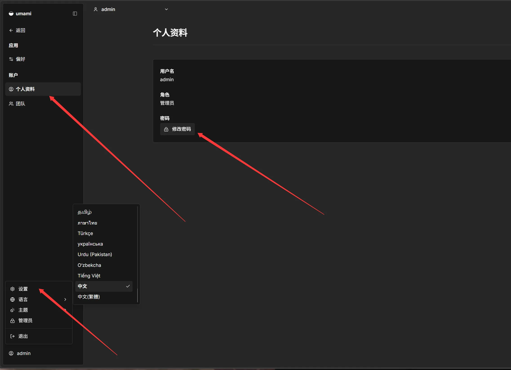

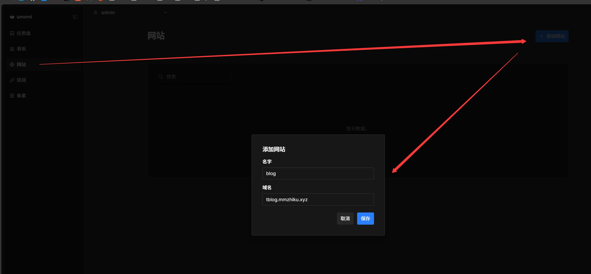

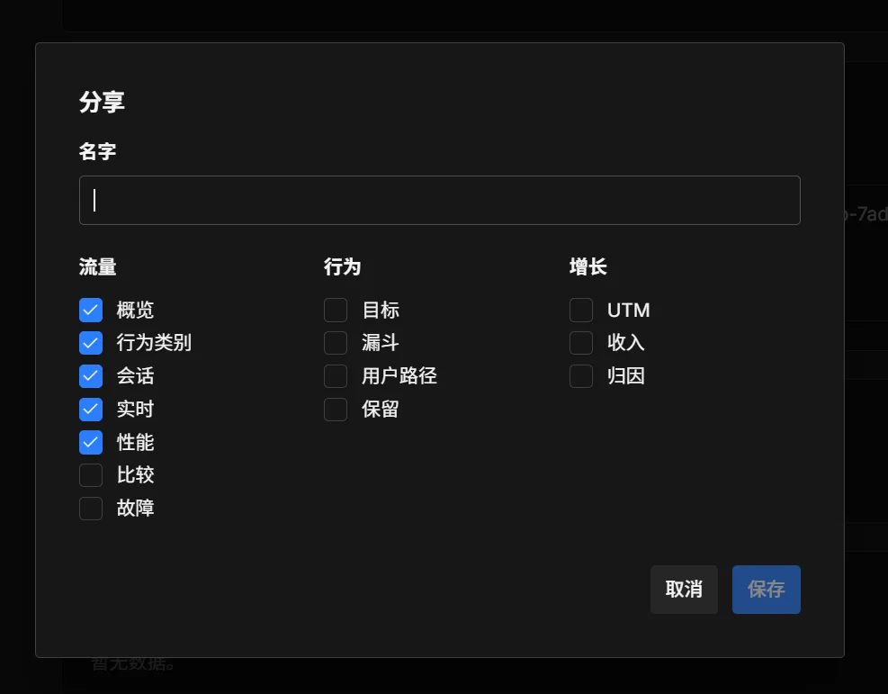

> [!CAUTION] 注意
> 保存后复制生成的分享链接，格式：`https://stats.yourdomain.com/share/xxxxxxxxx`
> xxxxxxxxx相当于你的shareid
> 还有复制你的跟踪代码 data-website-id="xxxxxxxxxxxxxxxxxxx"

### 5、复制配置项到config


复制你的跟踪代码 data-website-id="xxxxxxxxxxxxxxxxxxx"

可选参数：

| 参数 | 说明 |
|---|---|
| `data-auto-track="false"` | 禁用自动追踪，需手动调用 `umami.track()` |
| `data-do-not-track="true"` | 尊重浏览器 DNT 设置 |
| `data-domains="example.com"` | 仅在指定域名下追踪 |

本博客已内置 Umami 组件，修改 `src/config/siteConfig.ts`：

- 上方链接的shareid
- 上方复制的data-website-id

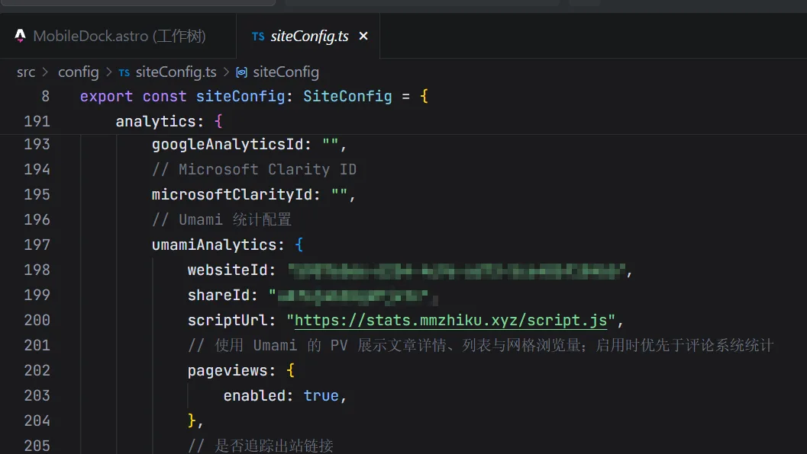


### 6、完结撒花

---

## 三、本项目获取 UV/PV 的实现原理

> 通过 Umami 的 Share API，无需服务端鉴权即可在博客首页展示访问数据。


实现位于 `src/components/layout/HomeDataLayer.astro`，核心流程：

1. 从 `siteConfig.analytics.umamiAnalytics` 取出 `scriptUrl`（推导出 base url）和 `shareId`
2. 通过 `shareId` 调用 `GET /api/share/{shareId}` 获取 `websiteId` 和 `token`（1 小时缓存）
3. 用 `token` 调用 `GET /api/websites/{websiteId}/stats?startAt=0&endAt={now}`，请求头携带：
   ```
   x-umami-share-token: {token}
   x-umami-share-context: 1
   ```
4. 返回 JSON 中 `uv`/`visitors` 即访客数，`pv`/`pageviews` 即浏览量
5. 渲染到首页"站点访问"卡片

```typescript
// 核心调用逻辑（简化版）
const shareRes = await fetch(`${statsBaseUrl}/api/share/${shareId}`);
const share = await shareRes.json();
const websiteId = share.websiteId || share.entityId;
const token = share.token || shareId;

const statsRes = await fetch(
  `${statsBaseUrl}/api/websites/${websiteId}/stats?startAt=0&endAt=${Date.now()}`,
  {
    headers: {
      "x-umami-share-token": token,
      "x-umami-share-context": "1",
      "Content-Type": "application/json",
    },
  },
);
const data = await statsRes.json();
// data.uv / data.visitors → UV
// data.pv / data.pageviews → PV
```

> 不需要在本项目后端配置 Umami 的 API Token。Share URL 是 Umami 提供的公开访问入口，前端可直接调用。


---

## 四、设置数据自动清理

Umami 后台 → Settings → Websites → 你的网站 → **Data retention**，建议设为 **1 年**，避免超出 Neon 0.5 GB 免费额度。

---

## 五、更新 Umami 版本

进入 Fork 的 GitHub 仓库 → **Sync fork → Update branch**，Vercel 自动检测变更并重新部署。

---

> [!NOTE] 提示
> 如果这篇文章对你有帮助，欢迎点赞收藏。有问题欢迎评论区交流。