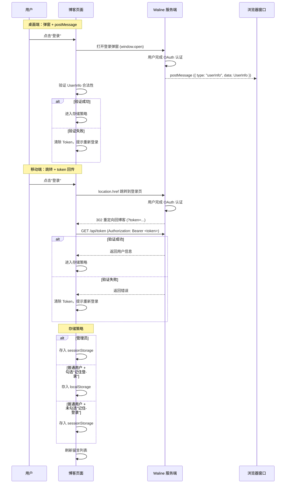

这是一个二开项目，基于 Firefly 主题进行修改。

Q1: 为什么不直接用[fuwari](https://github.com/saicaca/fuwari)啊，为啥要用[Astro](https://astro.build/)啊

你敢信吗？我一开始的目标根本不是做博客，而是做一个个人主页。后来偶然发现博客也能零成本部署，就稀里糊涂地入坑了 Firefly。不是说 Firefly 不好，只是我一路改着改着，变成了“二开再二开”。

虽然 Astro 这套架构对我来说不算特别合适，后续重构确实费时费力，但目前来看整体运行得还不错：灯塔测试基本全绿，平均构建时间也控制在 40 秒以内，网页访问速度也很快，暂时没发现明显问题。要是大家还有什么建议，欢迎在评论区直接锐评，我很乐意听。

**项目地址**

[https://github.com/MmzMing/my-blog](https://github.com/MmzMing/my-blog)

项目属于二开，感兴趣可以点个star

# 一、重点

## 1、首页

1. hero区域旮旯game风格
2. 站点地图一览
3. 作品展示和博客主要方向

| 技术栈 | 版本 | 作用 |
| --- | --- | --- |
| GSAP | `3.15.0` | 处理进入动画和数字过渡 |
| GSAP ScrollTrigger | `3.15.0` | 根据滚动位置驱动首页展示层动画 |
| `@vfx-js/core` | `1.1.0` | 提供标题文字特效与粒子表现 |
| Canvas 2D API | 浏览器原生 API | 绘制首页雨滴等轻量动态效果 |
| `@swup/astro` | `1.8.0` | 提供页面缓存、预加载和页面切换；切换后重新初始化动态组件 |
| Tailwind CSS | `4.2.4` | 提供通用布局、排版和响应式样式 |

## 2、音乐

3D棋盘可视化音乐。

这个是豆包桑做出来的，你敢信。

没开玩笑，主要是豆包搜索到这个音乐地图项目[sonic-topography](https://github.com/yin-yizhen/sonic-topography),然后复刻到我网站了

| 技术栈 | 版本 | 作用 |
| --- | --- | --- |
| HTMLAudioElement | 浏览器原生 API | 控制播放、暂停、进度和音量 |
| Three.js | `0.184.0` | 构建音乐可视化的 3D 场景、相机与实例化网格 |
| WebGL | 浏览器原生 API | 渲染音乐可视化的 3D 画面 |
| Web Audio API | 浏览器原生 API | 使用 AudioContext 与分析节点读取频谱数据并驱动可视化 |

## 3、分类标签

分类页现在只保留标签关系图谱：标签是节点，同一篇文章中同时出现的标签会连成边，边越粗表示共现次数越多。

| 技术栈 | 版本 | 作用 |
| --- | --- | --- |
| Astro Content Collections | `6.4.6` | 在构建时校验文章元数据并生成归档、分类和标签数据 |
| Markdown Frontmatter | Markdown 标准能力 | 维护 `category`、`tags` 和发布日期 |
| URLSearchParams | 浏览器原生 API | 读取标签和分类筛选参数 |
| （核心）D3.js | `7.9.0` | 使用 `d3-force` 计算力导向布局，使用 `d3-zoom` 处理缩放与拖拽 |
| Canvas 2D API | 浏览器原生 API | 绘制节点、连线、标签和悬停高亮，避免大量 SVG 节点带来的渲染压力 |
| ResizeObserver、IntersectionObserver、MutationObserver | 浏览器原生 API | 在容器尺寸、可见性和主题变化时分别调整图谱尺寸、暂停动画和刷新配色 |

实现上，构建阶段会遍历所有文章的 `tags`：每个标签生成一个节点，并记录它关联的文章；同一篇文章内的任意两个标签生成一条共现边，边的权重就是它们共同出现的次数。客户端按连通关系给节点分组，再交给 D3 力导向模拟进行排布；Canvas 根据模拟结果逐帧绘制图谱。节点大小由文章数量决定，边的透明度和粗细由共现权重决定。用户可以缩放、拖拽节点、悬停查看关联文章，点击或按回车跳转到对应标签页；同时支持键盘选择、减少动态效果偏好和亮暗主题切换。

## 4、留言

转变UI为聊天室，并复用 Waline 的登录、审核、表情和访问量能力。原本做了个翻卡牌的，因为这个在KV上面天天给我报警告，后面就取消了。

| 技术栈 | 版本 | 作用 |
| --- | --- | --- |
| Waline Client | `3.15.2` | 初始化普通文章评论区与访问量统计 |
| （核心）`@waline/api` | `1.1.2` | 调用留言读取、登录、发布、编辑和删除接口 |
| Lucide Svelte | `0.468.0` | 提供刷新、状态和操作图标 |
| Fetch API、Web Storage API | 浏览器原生 API | 校验登录回调 Token，并保存草稿、资料和登录状态 |

Waline 服务独立部署，博客只保存服务地址和客户端配置；项目 Worker 不保存评论内容，也不维护留言数据库或登录系统。

留言板调用的接口如下。读取接口每 `30 s` 轮询一次；页面不可见或浏览器离线时停止发起无效请求。

管理员 Token 仅保存到 `sessionStorage`；普通用户根据"记住登录"选项保存到 `sessionStorage` 或 `localStorage`。任何读取、发布、修改或删除请求返回鉴权错误时，页面都会清除本地 Token 并要求重新登录。

### 4.1 接口列表

以下为 `@waline/api` 中留言板实际调用的 CRUD 接口。

```ts
// GET /api/comment?path=...&pageSize=...&page=...&lang=...&sortBy=...
// Headers: (token 存在时) Authorization: Bearer <token>
// 读取留言列表（分页，首次加载 + 轮询 + 加载历史）
getComment({
  serverURL: string,     // Waline 服务端地址
  lang: string,          // 语言
  path: string,          // 页面路径（留言板固定为 /guestbook/）
  page: number,          // 页码，从 1 开始
  pageSize: number,      // 每页条数
  sortBy: string,        // 排序方式（如 "insertedAt_desc"）
  token?: string,        // 登录令牌（可选，管理员可看到待审核留言）
  signal?: AbortSignal,  // 取消请求信号
})
// Response: { count: number, page: number, pageSize: number, totalPages: number, data: WalineRootComment[] }

// --------------------------------------------------------------------------

// POST /api/comment?lang=<string>
// Headers: Content-Type: application/json
//         (token 存在时) Authorization: Bearer <token>
// Body: { nick, mail?, link?, comment, ua, url, pid?, rid?, at? }
// 发布留言
addComment({
  serverURL: string,
  lang: string,
  token?: string,           // 登录令牌（登录用户可选，匿名时不需要）
  comment: {                // WalineCommentData
    nick: string,           // 昵称
    mail?: string,          // 邮箱
    link?: string,          // 网站地址
    comment: string,        // 留言内容（含回复标记 HTML 注释）
    ua: string,             // User Agent
    url: string,            // 页面路径
    pid?: number,           // 父评论 ID（回复时）
    rid?: number,           // 根评论 ID（回复时）
    at?: string,            // @用户 ID（回复时）
  },
})
// Response: { errno: number, errmsg?: string, data?: WalineComment }

// --------------------------------------------------------------------------

// PUT /api/comment/<objectId>?lang=<string>
// Headers: Content-Type: application/json
//          Authorization: Bearer <token>
// Body: { comment?, status?, sticky?, like? }
// 编辑留言（仅本人或管理员可编辑）
updateComment({
  serverURL: string,
  lang: string,
  token: string,            // 登录令牌（必需）
  objectId: number,         // 留言 objectId
  comment?: {               // UpdateWalineCommentData
    comment?: string,       // 修改后的内容
    status?: "approved" | "waiting" | "spam",  // 审核状态（管理员）
    sticky?: 0 | 1,         // 置顶状态（管理员）
    like?: boolean,         // 点赞/取消点赞
  },
})
// Response: { errno: number, errmsg?: string, data: WalineComment }

// --------------------------------------------------------------------------

// DELETE /api/comment/<objectId>?lang=<string>
// Headers: Authorization: Bearer <token>
// 删除留言（仅本人或管理员可删除）
deleteComment({
  serverURL: string,
  lang: string,
  token: string,            // 登录令牌（必需）
  objectId: number,         // 留言 objectId
})
// Response: { errno: number, errmsg: string, data: "" }

// --------------------------------------------------------------------------

// GET /api/token?lang=<string>
// Headers: Authorization: Bearer <token>
// 登录回调 Token 校验（Waline OAuth 重定向回博客后验证身份）
fetch(`${serverURL}/api/token?lang=${lang}`, {
  headers: { Authorization: `Bearer ${token}` },
})
// Response: { errno: number, errmsg?: string, data?: UserInfo }
```

### 4.2 登录流程



## 5、关于

Markdown编写，canvas绘制弹跳球，pretext处理Markdown文本。pretext是神，性能非常好。

| 技术栈 | 版本 | 作用 |
| --- | --- | --- |
| Markdown | Markdown 标准能力 | 维护个人资料文本，内容更新不需要修改页面逻辑 |
| Svelte | `5.55.5` | 提供局部交互 |
| Tailwind CSS | `4.2.4` | 提供排版和响应式样式 |
| TypeScript | `5.9.2` | 约束站点标题、导航、主题、统计和页面开关配置 |
| Canvas 2D API、Pointer Events | 浏览器原生 API | 绘制可拖拽的资料画布并处理指针交互 |
| （核心）`@chenglou/pretext` | `0.0.7` | 按可用宽度计算 Markdown 文本的换行与排版 |

## 6、日历

日历聚合文章发布日期、节假日、生日和自定义日程，在固定的 `6 × 7` 月视图中展示公历和农历信息，并提供近期事件与当天详情。

| 技术栈 | 版本 | 作用 |
| --- | --- | --- |
| `lunar-typescript` | `1.8.6` | 将公历与农历日期互转，生成农历日期和农历生日、节日事件 |
| Fetch API | 浏览器原生 API | 获取文章元数据和节假日 JSON 数据，用于日历小组件或页面初始数据 |
| CSS Grid | 浏览器标准 | 使用 `6 × 7` 网格稳定渲染每月 42 个日期单元格 |

### 6.1 接口列表

页面在 SSR 阶段（构建时）调用以下两个内部 API 获取数据。其中 `/api/holidays.json` 内部还会调用第三方节假日 API 获取数据。

```ts
// --------------------------------------------------------------------------

// GET /api/allPostMeta.json
// Headers: 无
// 调用方：/calendar/ 页面（SSR 阶段 fetch）
// 构建时由 Astro Content Collections 生成，包含所有文章的元数据
fetch(new URL("/api/allPostMeta.json", Astro.url))
// Response: Array<{ id: string, title: string, published: number, category?: string, password?: boolean }>

// --------------------------------------------------------------------------

// GET /api/holidays.json
// Headers: 无
// 调用方：/calendar/ 页面（SSR 阶段 fetch）
// 构建时内部调用第三方 API 获取节假日数据后合并内置节日，输出 JSON
fetch(new URL("/api/holidays.json", Astro.url))
// Response: Array<{ date: string, name: string, isOfficial?: boolean, isWorkday?: boolean, icon?: string, source: "api" | "builtin", rest?: number }>

// --------------------------------------------------------------------------

// GET https://timor.tech/api/holiday/year/<year>
// Headers: Accept: application/json
// 调用方：/api/holidays.json 内部（构建时由 holidayApi 配置驱动，仅 SSR 阶段）
// 获取中国法定节假日、调休补班日
// 配置路径：src/config/calendarConfig.ts → holidayApi.url
fetch("https://timor.tech/api/holiday/year/2026")
// Response: { code: number, holiday: Record<string, { holiday: boolean, name: string, rest?: number }> }
```

两个内部 API 在 `astro build` 时被调用并输出为静态 JSON，生产环境由静态资源直接返回。文章或节假日更新后需要重新构建才能反映到日历上。

## 7、归档

归档页按年、月和文章组织时间线，支持分类和标签筛选，并显示年度文章进度。所有统计均在构建时根据文章元数据生成，不依赖额外的动态接口。

| 技术栈 | 版本 | 作用 |
| --- | --- | --- |
| SVG | 浏览器标准 | 绘制年份、月份与文章节点之间的高亮连接线 |
| Intl.DateTimeFormat | 浏览器原生 API | 按站点时区计算当前年度，用于年度文章统计 |

## 8、其他

1. 取消了侧边栏，首页和文章页将主要导航集中到顶部与移动端 Dock。
2. 修改了整体 UI 风格，保留亮色与暗色两种主题，不再维护背景图和多套背景配置。
3. 添加了日历功能，按文章发布日期展示内容，不需要外部数据源。
4. 删除了追番功能，避免相关数据请求和资源处理进入构建流程。
5. 使用 Pagefind `1.5.2` 构建本地全文索引；使用 Cloudflare Vectorize、Workers AI 和 Durable Objects 提供可选的 AI 语义搜索与限流。
6. 使用 Cloudflare Workers 运行时承担可选的 AI 搜索和随机封面代理等动态接口；静态文章、图片和 Pagefind 索引仍由静态资源服务返回。

# 二、部署流程

## 1、本地部署

1. 安装依赖：安装 Node.js 22 和 pnpm 9，然后执行 `pnpm install`。
2. 到目录 `src/config` 下，一个个配置里面的配置信息，我都加了注释的，尤其页脚备案那块。AI 搜索默认关闭，因此普通本地预览和部署不需要额外环境变量。
3. 构建 `pnpm build` ，运行 `pnpm dev`,查看 `http://localhost:4321/`。
4. 只有需要启用 AI 搜索时，才按下面的“AI 搜索配置”完成配置：
  - 在 `src/config/aiSearchConfig.ts` 中将 `enabled` 设为 `true`。
  - 创建 `.env.cf` 文件，复制 `.env.cf.example` 内容并填写 `CLOUDFLARE_API_TOKEN` 和 `CLOUDFLARE_ACCOUNT_ID`，用于创建和写入 Vectorize 索引。
  - 如果使用第三方 Embedding / Chat API，再创建 `.env` 并填写 `AI_API_KEY`；不配置时会回退到 Workers AI。
  - 登录cloudflare `npx wrangler login` ，第一次运行可能会有点长
  - 创建向量索引：`npx wrangler vectorize create blog-ai-search --dimensions 1024 --metric cosine`。
  - 构建向量索引：`pnpm build-index`。
  - 运行 `npx wrangler dev --port 8088`。查看 `http://localhost:8088/` 即可。
5. 上方都没问题后，可以参考下方视频部署到cloudflare workers，下方视频是firefly的部署方式。启用 AI 搜索时，还需要在 Cloudflare 中配置对应的 Vectorize、Workers AI 和 Durable Objects 绑定；使用第三方 API 时再设置 `AI_API_KEY` Secret。

<iframe width="100%" height="468"   src="//player.bilibili.com/player.html?bvid=BV17Njb6nEH8&p=1&autoplay=0"   scrolling="no" border="0" frameborder="no"   framespacing="0" allowfullscreen="true"> </iframe>

## 2、AI 搜索配置（可选）

以下配置仅在 `src/config/aiSearchConfig.ts` 中开启 AI 搜索后需要。未开启时无需创建这些环境变量或向量索引。

| 变量 | 用途 | 存放位置 |
| --- | --- | --- |
| `AI_API_KEY`（可选） | 调用第三方 Embedding / Chat API；不配则回退 Workers AI | `.env`（本地/构建）/ Cloudflare Secret（生产） |
| `CLOUDFLARE_API_TOKEN` | 构建脚本上传向量到 Vectorize | `.env.cf` |
| `CLOUDFLARE_ACCOUNT_ID` | Cloudflare 账户标识，供构建脚本使用 | `.env.cf` |

### 2.1 AI\_API\_KEY（可选）

1. 登录 [魔搭社区 ModelScope](https://modelscope.cn)
2. 右上角头像 → **API-KEY 管理** → **创建 API Key**
3. 复制 Key，粘贴到 `.env` 的 `AI_API_KEY=`
4. 部署后同样设置 Cloudflare Secret：`npx wrangler secret put AI_API_KEY`

### 2.2 CLOUDFLARE\_API\_TOKEN

1. 登录 [Cloudflare Dashboard](https://dash.cloudflare.com)
2. 右上角头像 → **My Profile** → **API Tokens** → **Create Token**
3. 选择 **Custom token**，权限勾选：
  - **Account > Vectorize > Edit**
  - **Account > Workers AI > Use**
4. 创建后复制 Token，粘贴到 `.env.cf` 的 `CLOUDFLARE_API_TOKEN=`

### 2.3 CLOUDFLARE\_ACCOUNT\_ID

1. Cloudflare Dashboard → 任意域名概览页
2. 右侧栏 **API** 区域 → **Account ID**（或直接从 URL `https://dash.cloudflare.com/<account_id>/...` 复制）
3. 粘贴到 `.env.cf` 的 `CLOUDFLARE_ACCOUNT_ID=`

> 不要将 `.env`、`.env.cf`、真实 Token 或 Cloudflare API Token 提交到仓库。

# 三、用到的AI模型

- MIMO V2.5/PRO（送的百亿补贴）
- claude opus 4.64.74.8fable 5
- GPT 5.5/5.6
- antigravity的gemini 3.1/3.5
- TRAE上的 GLM/豆包/KIMI/QWEN/DeepSeek（都是拿来测试性能好在工作上确定是否实用）
- codeBuddy

共耗费30块左右，主打一个薅羊毛，新手一定不要在TRAE、codeBuddy这些平台上写代码。

也不是不好吧，是能跑出来，但是我拆分了很久的任务跑了都有问题，这30块消耗都是拿顶模去修复trae给我留的屎。

我不确定是模型问题还是平台，用来写的代码BUG是真的多。

# 四、优点与UI复制

纯静态，部署快，维护简单，成本低（只需要域名的费用）。

站点的UI你也可以让AI像胶水一样粘在你的博客上。

如果感兴趣可以可以加入加QQ群(群里个个都是人才，说话又好听)，群主这方面最懂行，群号我放导航栏的联系我中。

# 五、后续计划

当然是写博客啦，同时站点有BUG我也会及时修复，如果大家有好的建议可以在下方评论哦。

说句实话，UI修改的时候，给我一种当年那个QQ空间那种复制神秘代码的时代，可能这个梗过时你不了解。