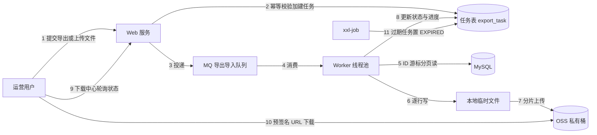
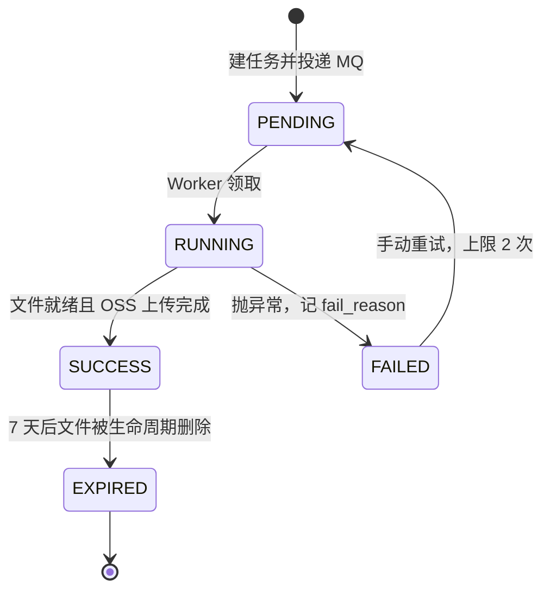

> [!NOTE] 提示
> 本方案把「百万行导出」和「百万行导入」收敛到同一套异步任务模型：导出走下载中心，ID 游标分页读库 + EasyExcel 分 sheet 写本地临时文件 + OSS 私有桶分片上传 + 预签名 URL 下载；导入走前端直传 + ReadListener 攒批 + 批量入库 + 错误行回执。评审重点：同步与异步的分界阈值、任务并发闸门参数、导入「部分成功」模式的默认选择。

## 核心摘要

- 核心思路：大文件一律离开同步请求链路。导出与导入统一为任务表驱动的异步模型，任务表是两个方向的唯一状态源，文件走 OSS 私有桶，下载用短时效预签名 URL。
- 内存结论：EasyExcel 的流式机制保证内存不随数据量线性增长，官方口径用约 20M 内存即可读取超大文件。会 OOM 的是「一次性查全量 + 一次性写库」的业务写法，框架本身在 4C8G 规格下不是瓶颈。
- 选型结论：EasyExcel 已官方宣布进入维护模式（只修 Bug 不加功能），所有读写调用收敛到一层 ExcelFacade，底层可一键切到原作者的 FastExcel（已进 Apache 孵化器，项目名 Fesod），迁移只改 Maven 坐标、包名、入口类三处。
- 评审重点：同步 / 异步分界值（初值 5 万行，待压测校准）；导入默认「部分成功」还是「全量校验」；错误回执文件的行数上限。

## 问题与目标

运营后台的订单、流水、明细导出是 B 端最高频的重操作。当前实现是同步 HTTP 导出：用户点导出，服务端查全量数据，EasyExcel 写完把字节流写回响应。百万行规模下这条链路同时踩四个坑：

1. 超时。网关超时按 30 s 配置，百万行从查询到写出远超该值，前端收到 504，后端仍在跑，白烧资源。
2. 内存。XSSF 全量驻留内存，POI SAX 解析一个 3M 的文件需要约 100M 内存（来源：EasyExcel 官网），百万行乘 20 列的同步导出足以打挂一个 4C8G 实例。
3. 重复提交。前端超时后用户再点一次，服务端并行跑两个全量查询。
4. 无回执。失败没有任何记录，用户重试靠猜，排查靠翻日志。

导入侧对称存在同类问题：上传 50M 的 Excel 后同步解析加逐条 insert，请求超时，MySQL 连接被长事务占满，错误行只能口头描述。

目标及衡量方法（均为压测验收口径，非实测值）：

| 目标 | 衡量方法 |
| --- | --- |
| 导出 100 万行 x 20 列 ≤ 5 min（4C8G Worker 独占） | 任务表 created_at 与文件就绪时间差 |
| 导出过程 JVM 堆增量 ≤ 256 MB | JFR 采样 + GC 日志 |
| 导入 100 万行 ≤ 15 min，入库吞吐 ≥ 10,000 行/s | 任务表批次时间戳 + MySQL general log 抽样 |
| 同一用户 5 min 内重复导出返回原任务 | 自动化用例 |
| 导入错误行 100% 有回执 | 随机注入错误行的自动化用例 |

本次不覆盖：在线预览 Excel 内容、跨库跨数据源导出、复杂报表模板（多层嵌套样式）、PDF 等其他格式。

## 选型：EasyExcel 与它的维护现状

三个候选的内存模型：

| 方案 | 写入内存模型 | 读取内存模型 | 结论 |
| --- | --- | --- | --- |
| POI XSSF | 全部驻留内存 | DOM 全量加载 | 百万行必 OOM，排除 |
| POI SXSSF | 滑动窗口（默认 100 行），窗口外刷临时文件 | SAX 流式 | 可用，但样式、临时文件生命周期全要自己管 |
| EasyExcel（FastExcel / Fesod 同源） | 沿用 SXSSF 思路逐行写，临时文件自动清理 | SAX + 共享字符串热数据缓存 | 本方案采用 |

EasyExcel 的三个关键机制（来源：EasyExcel 官网及官方 QA，2026-09 查证）：

1. 读取：07 版 xlsx 的共享字符串表若全量进内存，开销是文件大小的 3 到 10 倍。EasyExcel 自动判断，5M 以下驻内存（约 15-50M 开销），超过 5M 落盘，内存只保留少量批次热数据，官方称默认约 20M 内存即可读取超大文件。代价是效率降 30-50%（官方口径，视命中率浮动）。
2. 写入：超出窗口的行刷临时文件，写完合并输出，finish() 自动清理。磁盘换内存，写百万行的堆占用与写一千行同量级。
3. 极速模式：读取速度更快但内存回到 100M 以上，本方案不启用，Worker 内存余量优先。

维护现状必须写进设计：EasyExcel 官方已宣布逐步进入维护模式，继续修 Bug、不再新增功能（来源：官网公告）。原作者发起的 FastExcel（cn.idev.excel）完全兼容其 API，后被 Apache 接纳为孵化项目 Fesod。迁移动作收敛为三处：Maven 坐标、import 包名、入口类名。

**决策**：读写调用统一收敛到本工程封装的 ExcelFacade，业务代码不直接 import com.alibaba.excel。封装成本约 2 人日，换来底层一行配置切换。公式注入转义、长数字文本化两个横切关注点也放在这一层，业务方无感。

未选原生 SXSSF：样式与临时文件管理正是 EasyExcel 封装掉的部分，自己写等于重做一遍。未选 CSV：体积和写入速度都占优，但无样式无多 sheet，且业务对 xlsx 有既有预期；CSV 保留为超大数据量（500 万行以上）的降级出口。

## 总体架构



导入路径与导出共用前半段（任务表、MQ、Worker），差异在第 5 到 8 步：Worker 从 OSS 拉取用户上传的文件，解析校验后批量入库，错误行写回执文件再传 OSS。

任务状态机：



任务表是唯一状态源：

```sql
CREATE TABLE export_task (
    id            BIGINT UNSIGNED AUTO_INCREMENT PRIMARY KEY,
    task_no       VARCHAR(32)  NOT NULL COMMENT '对外任务号',
    biz_type      VARCHAR(16)  NOT NULL COMMENT 'IMPORT / EXPORT',
    biz_code      VARCHAR(32)  NOT NULL COMMENT '业务模块，如 order_flow',
    status        TINYINT      NOT NULL DEFAULT 0 COMMENT '0 PENDING 1 RUNNING 2 SUCCESS 3 FAILED 4 EXPIRED',
    query_params  JSON         NULL COMMENT '查询条件快照，重试依据',
    file_name     VARCHAR(128) NOT NULL,
    file_md5      CHAR(32)     NULL COMMENT '导入文件指纹，幂等用',
    file_url      VARCHAR(512) NULL COMMENT '结果文件 OSS 地址',
    error_url     VARCHAR(512) NULL COMMENT '导入错误行回执文件',
    total_rows    INT          NOT NULL DEFAULT 0,
    success_rows  INT          NOT NULL DEFAULT 0,
    fail_rows     INT          NOT NULL DEFAULT 0,
    fail_reason   VARCHAR(512) NULL,
    owner_id      BIGINT       NOT NULL COMMENT '任务归属人，下载鉴权依据',
    expire_at     DATETIME     NOT NULL,
    created_at    DATETIME     NOT NULL DEFAULT CURRENT_TIMESTAMP,
    updated_at    DATETIME     NOT NULL DEFAULT CURRENT_TIMESTAMP ON UPDATE CURRENT_TIMESTAMP,
    KEY idx_owner_created (owner_id, created_at),
    KEY idx_status (status),
    UNIQUE KEY uk_task_no (task_no)
) ENGINE = InnoDB COMMENT '导入导出任务表';
```

进度更新做节流：每 5 万行或每 5 s 更新一次，避免任务表成为热点行。监控指标固定六项：任务失败率、MQ 队列堆积、单任务 P95 时长、临时目录磁盘水位、OSS 上传失败次数、导入批次失败率，前两项接告警。

## 导出方案

### 同步与异步的分界

不超过 5 万行仍走同步响应流：建任务、投递 MQ、轮询这组固定开销，对 5 秒内能完成的导出不划算。超过 5 万行走下载中心。分界依据：EasyExcel 写出速度按保守 2 万行/s 估，5 万行写出约 2.5 s，加上查询和传输，落在网关 30 s 超时内有余量。**该分界值是初值，上线前用真实数据分布压测校准。**

### 数据读取：ID 游标分页优先，Cursor 兜底

offset 深分页先排除：LIMIT 900000, 5000 要扫描并丢弃前 90 万行，全程重复扫描量级为 O(n²)。

两个候选：

| 方案 | 机制 | 取舍 |
| --- | --- | --- |
| ID 游标分页 | WHERE id 大于 lastId ORDER BY id LIMIT 5000，循环推进 | 无长事务、单查询快、可断点重跑；要求排序键单调，多列排序需以主键作末位排序键 |
| MyBatis Cursor 流式 | fetchSize 设为 Integer.MIN_VALUE，逐行从服务端拉取 | 内存最优，实测 16 MB 堆上限可跑百万行（来源：mybatis.io 博客，2023-03）；独占一个连接，异常中断需整段重来 |

Cursor 方案的实测数据值得写进决策依据：同样 100 万行，List 全量接收占 885 MB，Cursor 加 fetchSize=Integer.MIN_VALUE 后堆压到 50 MB 上限时吞吐仍有 90%，压到 10 MB 时 GC 占 34 s、吞吐只剩 13%。内存换吞吐的平衡点在 20 MB 附近。

**决策**：默认 ID 游标分页，一批 5000 行，导出任务支持从 lastId 断点重跑；无自增主键或必须按业务字段排序时降级 Cursor，且必须同时满足 forward-only、read-only、try-with-resources 关闭三个条件。

```java
// 导出主循环（示意）
long lastId = 0L;
int sheetNo = 0;
try (ExcelWriter writer = EasyExcel.write(tmpFile)
        .registerConverter(new LongTextConverter())
        .build()) {
    WriteSheet sheet = EasyExcel.writerSheet(sheetNo, "sheet-" + sheetNo)
            .head(FlowVO.class).build();
    List<FlowVO> batch;
    while (!(batch = flowMapper.listByIdCursor(queryParams, lastId, PAGE_SIZE)).isEmpty()) {
        writer.write(batch, sheet);
        lastId = batch.get(batch.size() - 1).getId();
        rows += batch.size();
        if (rows % SHEET_CAPACITY == 0) {          // 每 50 万行换 sheet
            sheet = EasyExcel.writerSheet(++sheetNo, "sheet-" + sheetNo)
                    .head(FlowVO.class).build();
        }
        progressReporter.tick(rows);
    }
}   // 触发 finish()：合并临时文件并清理
```

### 写入：分 sheet 与临时文件

xlsx 单 sheet 硬上限 1,048,576 行乘 16,384 列（来源：Microsoft Excel specifications and limits），超限写出直接失败；社区反馈 Excel 实际打开 20 到 40 万行起就明显卡顿（来源：Numerous.ai 汇总）。**决策：单 sheet 封顶 50 万行**，百万行导出拆 2 个 sheet，行数上限和打开体验都留余量。

临时文件两条工程约束：写入目录指向独立数据盘，与系统盘隔离，水位 80% 告警；finally 中显式删文件，进程异常退出留下的残留文件由机器级定时清扫兜底。

### 上传、通知与下载

1. 文件落本地后 OSS 分片上传：50 MB 以上走 multipart，分片 10 MB、并发 3，按分片重试 2 次。
2. 桶设私有。任务 SUCCESS 后前端点击下载时实时换取 15 min 有效期的预签名 URL，不用公共读：导出文件常含全量业务数据。
3. 通知只做轮询：下载中心页 5 s 一次拉任务列表，列表只查当前 owner，走 idx_owner_created 索引。WebSocket 推送列为可选增强，不做短信。
4. 桶生命周期 7 天自动删文件，xxl-job 每小时把超期任务置 EXPIRED，任务记录保留 90 天。

### 并发控制与幂等

幂等：建任务前按 owner_id + biz_code + query_params 摘要算指纹，命中 5 min 内同指纹且状态非 FAILED / EXPIRED 的任务直接返回原任务号。

并发闸门三层：

| 层 | 手段 | 初值 |
| --- | --- | --- |
| 用户 | 同指纹幂等，单用户进行中任务 ≤ 3 | 硬限制 |
| 实例 | 独立导出线程池，与 Web 线程池物理隔离，队列有界 | 核心 2、最大 2、队列 20 |
| 全站 | Redis 信号量，导出与导入分别计数 | 导出 10、导入 5 |

超出全站闸门的任务留在 PENDING 排队，消费端按许可拉取，不丢弃。导入优先级低于导出：导出是读操作，积压只占磁盘；导入在写库，影响在线业务。

### 安全

1. 越权下载（P0）：下载接口校验 owner_id，预签名 URL 15 min 有效，任务表记审计字段。回归用例必含跨用户取他人 task_no 的负例。
2. 公式注入：单元格内容以等号、加号、减号、@ 开头（含前导 Tab 与回车）时前置单引号转义，防 DDE 类攻击（参考：公式注入公开分析）。转义收敛在 Facade。
3. 长数字精度：Excel 只存 15 位有效数字，第 16 位起截断为 0，超 11 位默认按科学计数法显示（来源：简道云汇总 + EasyExcel Issue #2204）。雪花 ID 是 18 到 19 位，导出后必然损坏且不可逆。统一规则：ID、订单号、第三方流水号一律 String 字段加文本单元格，Facade 默认注册 LongTextConverter。

## 导入方案

### 上传与任务创建

前端用预签名 PUT 直传 OSS，拿 file_key 后调创建导入任务接口，20 MB 以上走分片上传。服务端校验三道：扩展名白名单（xlsx / xls）、文件头魔数（PK 头，防改后缀伪装）、大小上限 100 MB。xlsx 本质是 zip，超压缩比文件在解析期触发 POI ZipSecureFile 的解压比率保护，这里把比率阈值前置到校验阶段拦截，不让恶意文件打到 Worker。

### 解析与攒批

```java
public class BatchImportListener<T> extends AnalysisEventListener<T> {
    private static final int BATCH_SIZE = 1000;
    private final List<T> buffer = new ArrayList<>(BATCH_SIZE);
    private final Consumer<List<T>> processor;
    private final ErrorCollector errorCollector;

    @Override
    public void invoke(T row, AnalysisContext context) {
        RowError err = validator.check(row, context.readRowHolder().getRowIndex() + 1);
        if (err != null) {
            errorCollector.add(err);            // 错误行不进 buffer
            return;
        }
        buffer.add(row);
        if (buffer.size() >= BATCH_SIZE) {
            flush();
        }
    }

    private void flush() {
        processor.accept(new ArrayList<>(buffer));   // 副本防中途篡改
        buffer.clear();
    }

    @Override
    public void doAfterAllAnalysed(AnalysisContext context) {
        flush();
    }
}
```

两条纪律：监听器每次导入 new 一个实例，Service 用构造器传入，绝不注册成 Spring 单例，成员 buffer 在单例并发下必然串数据；BATCH_SIZE 取 1000，依据见下节。

### 写库：批量与事务

JDBC URL 必须带 rewriteBatchedStatements=true。MySQL 驱动在该开关关闭时把 addBatch 的多条 INSERT 拆成逐条发送，打开后改写为单条多值 INSERT，社区实测为数量级差距（来源：阿里云开发者社区、dbaplus 实测文章）。上线检查单里必须有这一项，因为它不报错、只变慢。

批次 1000 的依据：按每行 20 列乘平均 50 字节估，合并后单条 SQL 约 1 到 2 MB，低于 MySQL 8.0 默认 max_allowed_packet（64 MB）两个数量级；再大收益递减，且单批失败的重试代价上升。

事务策略：每批独立事务提交，不做整文件单事务。百万行单事务意味着一个连接持锁十几分钟，主从延迟飙升，中途任何一行失败还要全部回滚重来。代价是部分成功语义，由任务报告与错误回执兜底。

### 校验策略与部分成功

两种模式并存，创建任务时按业务声明：

| 模式 | 流程 | 适用 |
| --- | --- | --- |
| 部分成功（默认） | 边解析边校验，错误行进回执文件，合法行攒批入库，报告成功与失败行数 | 日志、积分、标签类，行间独立 |
| 全量校验 | 第一遍只解析校验并生成错误文件，零错误才进入第二遍全量入库 | 订单、资金类，要求原子语义 |

默认部分成功的理由：百万行文件错 3 行却要求全部重传，运营要改文件再等一轮 15 min；错误回执加失败行清单已给出修复路径。资金类选全量校验，代价是解析两遍，总耗时约 1.7 倍。

幂等两道防线：表上建业务唯一键（如外部单号），写库用 INSERT ... ON DUPLICATE KEY UPDATE，重复行不产生脏数据；任务层用 file_md5 + biz_code 挡重复文件，命中 24 h 内 SUCCESS 任务直接拒绝并返回原任务号。

### 错误回执

错误行写独立 xlsx，三列：原行号、原始内容、错误原因，随任务上传 OSS 挂到 error_url。错误行超 10 万条时回执截断为前 10 万行加一行汇总，防止错误文件比原文件还大。

## 关键取舍汇总

| 决策 | 理由 | 放弃了什么 |
| --- | --- | --- |
| 导出默认 ID 游标分页 | 无长事务、可断点重跑、连接占用低 | 内存略高于 Cursor 流式（每批 5000 行驻留） |
| 文件先落本地再传 OSS | 分片上传需要确定的大小与重试语义 | 约 100 MB / 任务的本地磁盘空间 |
| 每批独立事务 | 避免长事务持锁十几分钟拖垮主从 | 原子性，由全量校验模式补 |
| 轮询不推送 | 下载中心本来就 5 s 刷列表，接口已存在 | 最大 5 s 实时性，换来零长连接维护 |
| EasyExcel 包一层 Facade | 停止维护是既成事实，迁移出口收敛到一处 | 约 2 人日封装工时 |

## 风险与应对

| 等级 | 风险 | 影响 | 应对 |
| --- | --- | --- | --- |
| P0 | 越权下载他人导出文件 | 全量业务数据泄露 | owner 校验加 15 min 预签名加下载审计，负例用例进回归 |
| P1 | 运营批量提交导出任务 | 磁盘、带宽、DB 读压力同时打满 | 三层闸门加同指纹幂等，闸门满自动排队不丢弃 |
| P1 | 本地临时文件打满磁盘 | 该实例全部导出失败 | tmp 指向独立数据盘，80% 水位告警，finally 清理加定时清扫残留 |
| P1 | 批量导入拖垮在线写 | 主从延迟升高，业务写超时 | 导入闸门独立计数，批次 1000 行，避开大促时段调度 |
| P2 | 错误回执文件膨胀 | OSS 成本上升，用户端打开卡死 | 10 万行截断加汇总摘要 |
| P2 | EasyExcel 停止维护致安全修复滞后 | 新 JDK 或 POI 漏洞无官方补丁 | Facade 收敛入口，预留 FastExcel / Fesod 一键切换 |

## 验证计划

| 用例 | 口径 | 通过标准 |
| --- | --- | --- |
| 导出 100 万行 x 20 列 | 4C8G Worker 独占，生产同规格数据分布 | ≤ 5 min，堆增量 ≤ 256 MB，0 OOM |
| 导出并发 5 任务 | 同实例 | 互不影响，排队按序执行 |
| 导入 100 万行（含 1% 错误行） | 批次 1000，rewriteBatchedStatements 开 | ≤ 15 min，错误行 100% 进回执 |
| 导入关闭 rewriteBatchedStatements 对照 | 同上 | 记录对照数据，写入上线检查单 |
| 越权负例 | 用户 A 取用户 B 的 task_no 换预签名 URL | 拒绝且记审计 |
| 幂等 | 5 min 内同参数重复提交、同 MD5 重复导入 | 返回原任务或直接拒绝 |

## 总结

百万级导入导出的难点集中在三处，方案围绕它们展开。内存交给 EasyExcel 的流式机制：读侧共享字符串超 5M 落盘，写侧临时文件，框架保证堆占用与数据量解耦，真正要防的是业务侧的一次性全量操作。时间交给异步任务模型：下载中心、MQ、轮询，把 30 s 网关超时的硬约束转化为 5 min 级的异步容忍。一致性交给显式取舍：默认部分成功加错误回执，资金类业务用全量校验换原子性。EasyExcel 停止维护是既成事实，Facade 封装让底层切换收敛到一行配置。上线后最先要盯的两个指标是导出任务失败率与临时目录磁盘水位，参数设错时它们最先暴露。

## 参考资料

- [EasyExcel 官网（含维护模式公告）](https://easyexcel.opensource.alibaba.com/docs/current/)
- [EasyExcel 官方 QA：读 Excel 的内存机制](https://easyexcel.opensource.alibaba.com/qa/read)
- [Apache Fesod（孵化中）：从 FastExcel 迁移指南](https://fesod.apache.org/zh-cn/docs/migration/from-fastexcel)
- [EasyExcel GitHub 仓库](https://github.com/alibaba/easyexcel)
- [从 OOM 到秒级导入：EasyExcel 百万级数据优化实战（博客园）](https://www.cnblogs.com/jajian/p/19604526)
- [异步导入导出 Excel 方案（博客园）](https://www.cnblogs.com/better-farther-world2099/p/16106579.html)
- [异步导出报表上传 OSS 实践（知乎）](https://zhuanlan.zhihu.com/p/685221910)
- [MyBatis 游标 Cursor 的正确用法和百万数据传输的内存测试（mybatis.io）](https://blog.mybatis.io/post/68c7d409)
- [MyBatis 批处理流式查询（博客园）](https://www.cnblogs.com/jingzh/p/17462496.html)
- [聊聊 Excel 解析：如何处理百万行 Excel 文件（京东云开发者社区）](https://developer.jdcloud.com/article/3032)
- [Excel specifications and limits（Microsoft Support）](https://support.microsoft.com/en-us/excel/excel-specifications-and-limits)
- [Long 字段导出精度丢失修复（EasyExcel Issue #2204）](https://github.com/alibaba/easyexcel/issues/2204)
- [公式注入（Formula Injection）攻击分析](https://www.shellcodes.org/Hacking/公式注入（Formula%20Injection）攻击.html)
- [Web 安全之 CSV 注入攻击详解（知乎）](https://zhuanlan.zhihu.com/p/683837527)
- [MyBatis-Plus 批量插入与 rewriteBatchedStatements 详解（阿里云开发者社区）](https://developer.aliyun.com/article/1676909)
