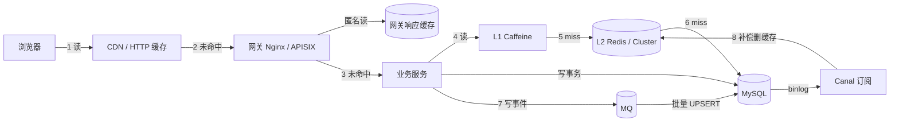
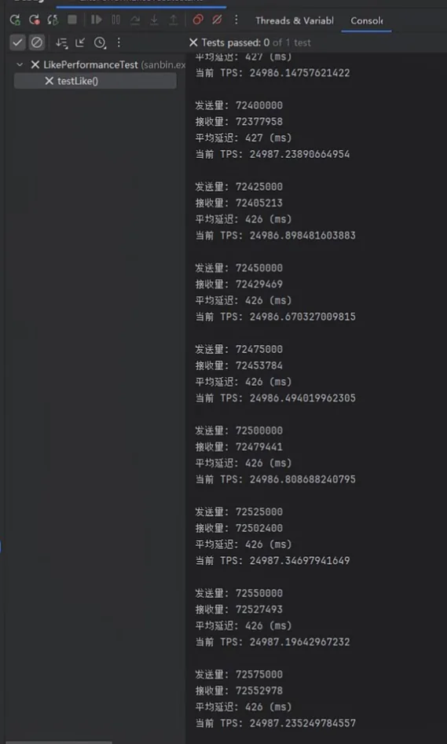
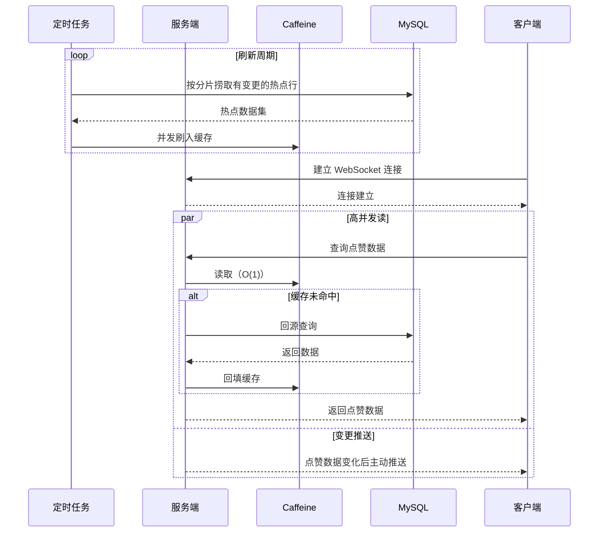
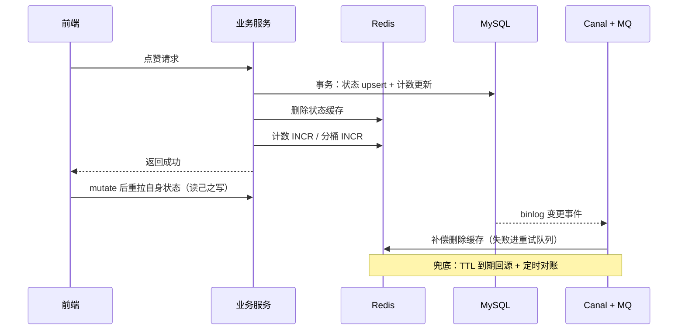

> [!NOTE] 提示
> 本方案把点赞 / 收藏 / 关注这类「状态 + 计数」型交互数据的缓存拆成前端、网关、后端三层设计，按写入 QPS 给出小、中、大三档技术栈组合，中流量额外提供不引入 Redis 的变体（Caffeine + 定时刷新 + WebSocket 推送）。一致性不依赖单点手段，由写路径 Cache-Aside、binlog 订阅补偿、TTL + 对账三道防线兜底。评审重点：私有数据在网关层的缓存边界，以及计数对账的收敛时间。

## 核心摘要

- 核心思路：三层各管一段。前端只缓存展示态并用 SWR 换首屏速度；网关用限流挡写攻击，用短 TTL 缓存挡匿名读洪峰；后端按流量分级决定是否引入 Redis 与多级缓存，中流量另有不引入 Redis 的 Caffeine 定时刷新变体，压测写入 TPS 达 2.5 万。
- 一致性结论：先更新数据库再删缓存是基线，Canal 订阅 binlog 删缓存做补偿，TTL 和定时对账做最后防线。三层都不承诺强一致，强一致数据不进缓存。
- 评审重点：网关层对带身份凭证响应的缓存边界（跨用户串读风险）、大流量分桶落库的延迟上限、对账任务的收敛时间。
- 目标：峰值读 5 万 QPS 下读接口 P99 < 80 ms；用户自身状态读己之写 ≤ 1 s；计数展示旧值窗口 ≤ 60 s；异步落库延迟 ≤ 5 min。

## 问题与目标

交互数据指点赞、收藏、关注这类「状态 + 计数」型数据。「状态」回答用户自己是否交互过，「计数」回答这条内容被交互了多少次。两类数据的读写比例和一致性要求不同，缓存设计必须分开对待。

当前规模（来源：业务埋点 + 预发环境压测，4C8G MySQL 主从，2026-04 采样）：

- 日交互 2 千万次，平均写入约 231 QPS，峰值写入约 5,000 QPS（峰谷比 20:1）。
- 读写比约 10:1，峰值读约 5 万 QPS。
- 热点集中：单条内容 1 分钟内收到 10 万次点赞，单 key 写入约 1,667 QPS。
- 该负载下纯数据库方案 P99 2.1 s，主从延迟 800 ms，连接池排队。

不同业务之间的差距远大于技术方案之间的差距。日交互 10 万次的系统引入 Redis Cluster、MQ、Canal，运维成本压垮收益。先分级，再按级选栈：

| 级别 | 写入 QPS | 典型业务 | 后端方案 |
|------|---------|---------|---------|
| 小流量 | < 2,000 | 个人博客、内部系统、B 端工具 | MySQL 直写 |
| 中流量（无 Redis） | 2,000 ~ 25,000（压测实测） | 单机或小集群部署、热点不极端集中 | Caffeine 定时刷新 + MySQL 分片计数 + WebSocket 推送 |
| 中流量（有 Redis） | 2,000 ~ 25,000 | 中型社区、垂直论坛 | Redis + Cache-Aside + 异步落库 |
| 大流量 | > 25,000 | 内容平台、短视频 | 多级缓存 + MQ 批量聚合落库 |

两条分级边界都来自实测：小流量上限 2,000 的依据是纯库压测在 5,000 写 + 5 万读时 P99 已达 2.1 s，留一倍余量；中流量上限 25,000 就是无 Redis 变体的压测写入上限，超过它，MySQL 同步写入与行锁排队成为硬顶，写路径必须经 MQ 削峰异步化，换任何缓存组件都扩不动写入。中流量两档全区间重叠，选择依据是延迟预算与组件成本：无 Redis 变体用写入延迟换组件成本（2.5 万 TPS 时平均延迟 427 ms），Redis + MQ 方案用组件成本换低延迟与削峰能力。

目标及衡量方法：

| 目标 | 衡量方法 |
|------|---------|
| 峰值读 5 万 QPS 下，读接口 P99 < 80 ms | 全链路压测报告 + 网关访问日志 P99 统计 |
| 用户自身状态读己之写 ≤ 1 s | 写后立即读的自动化用例 + 客户端埋点 |
| 计数展示旧值窗口 ≤ 60 s | 对账任务记录的缓存与库差异时长 |
| 异步落库延迟 ≤ 5 min | MQ 堆积监控 + 落库任务时间戳差值 |

本次不覆盖：评论、弹幕等带正文的交互；强一致场景（账务、风控计数）；Feed 流的推拉模式设计。

## 全链路架构



分层职责与缓存边界：

| 层 | 缓存什么 | 不缓存什么 | 一致性承诺 |
|---|---------|-----------|-----------|
| 前端 | 展示态（计数快照、状态标记） | 敏感数据、自身状态的长效副本 | SWR 秒级旧值可接受 |
| 网关 | 匿名只读接口响应 | 带身份凭证的响应 | 短 TTL，秒级旧值 |
| 后端 L1（本地） | 高频热点读 | 低频长尾数据 | 秒级 TTL 或广播失效 |
| 后端 L2（Redis） | 全量热点数据 | 账务类强一致数据 | 删缓存 + TTL |
| 数据库 | 持久层，唯一事实来源 | — | 强一致（单库事务） |

设计原则：越靠近用户的层，缓存的数据越「旧得无所谓」；越靠近数据库的层，承担的一致性责任越重。私有状态（我是否赞过）在前端和网关都不做共享缓存，只在后端有副本。

## 前端层：只缓存展示态

技术栈：

- HTTP 缓存：`Cache-Control` 指令 + ETag 协商缓存（304）。
- 数据层：SWR 模式（stale-while-revalidate），用 TanStack Query、swr 库或等价实现。
- 交互层：乐观更新、在飞请求去重、失败回滚。

三个手段各管一件事：

1. **HTTP 层（浏览器 + CDN）**：匿名计数类接口下发 `Cache-Control: max-age=10, stale-while-revalidate=60, stale-if-error=3600`。10 s 内直接命中，10~70 s 先回旧值再后台刷新，超过 70 s 走源站；源站故障时展示旧值而不是报错。私有状态接口下发 `private, no-store`，明确禁止任何共享缓存存储。
2. **数据层（SWR）**：组件挂载先渲染内存里的旧快照，同时后台发 revalidate 请求。这层解决的是页面切换的重复请求和首屏白屏。它与 HTTP 缓存指令叠加时有一个坑，见「踩坑点」。
3. **交互层（乐观更新）**：点赞点击先翻转 UI 再发请求，失败回滚并提示。交互数据的写操作用户预期就是「点了立刻变」，这一层对体感的贡献比任何缓存都大。

取舍：前端不把「我的状态」缓存到 localStorage。多端登录下本地副本必然失真，清理时机也无法保证；读己之写靠「写后 mutate 重新拉取」保证，见一致性章节。

## 网关层：限流优先，缓存只给匿名读

技术栈选型：

| 组件 | 选型 | 职责 |
|------|------|------|
| 接入网关 | Nginx（自建）或 APISIX / Kong（云原生） | 路由、TLS、可观测 |
| 响应缓存 | Nginx proxy_cache / APISIX proxy-cache | 匿名读接口短 TTL 缓存 |
| 限流 | Nginx limit_req / APISIX limit-req、limit-count | 写接口防刷、读接口保护 |
| 并发回源合并 | proxy_cache_lock / APISIX cache lock | 单 key 击穿保护 |

三条硬边界：

1. **带身份凭证（Authorization、Cookie）的响应一律不进网关缓存。** HTTP 缓存规范（RFC 9111）本就要求共享缓存对这类请求默认拒绝，本方案收紧为无条件不存。网关缓存 key 只有 method + path + query，没有用户维度，存了私有响应就是跨用户串读。
2. **网关只缓存容忍秒级旧值的匿名数据**：内容计数、热门列表、公开主页状态。TTL 10 s 起步，不提供主动 purge。purge 接口本身是一个需要鉴权和审计的攻击面，短 TTL 换掉它更便宜。
3. **限流先于缓存。** 写接口按用户维度限流（如单用户 30 次/min）。交互写接口是最容易被脚本刷的接口之一，这一层挡掉的请求，后面所有层都不用处理。

为什么不让网关缓存承担更多：网关离数据最远，失效传播链最长（purge 发起 → 所有网关节点 → 边缘节点），它适合做流量整形，不适合做一致性参与者。

## 后端层：按流量分级

### 小流量：MySQL 直写

技术栈：MySQL 8.0（InnoDB）+ HikariCP 连接池，无缓存组件。

状态表 upsert 与计数表 UPDATE 放同一个事务，行锁保证串行。写入 QPS 低于 2,000（读写比 10:1 时总 QPS 约 2 万，距纯库压测崩溃线还有一倍余量）时，4C8G 主从 MySQL 余量充足；此时引入 Redis，换来的是一个新故障域加一套一致性问题，属于负收益。

缓存能力由前两层提供：前端 HTTP 缓存和网关限流已经把重复流量挡在外面。这一级的一致性成本为零：数据库是唯一事实来源，没有第二份状态。

表结构设计（这两张表同时是中、大流量方案的落库目标表）：

```sql
CREATE TABLE interaction_record (
    id               BIGINT PRIMARY KEY AUTO_INCREMENT,
    user_id          BIGINT NOT NULL,
    target_type      INT NOT NULL,
    target_id        BIGINT NOT NULL,
    interaction_type INT NOT NULL,
    status           TINYINT NOT NULL DEFAULT 1 COMMENT '1=有效, 0=取消',
    create_time      DATETIME NOT NULL,
    update_time      DATETIME NOT NULL,
    UNIQUE KEY uk_user_target (user_id, target_type, target_id, interaction_type)
);

CREATE TABLE interaction_count (
    target_type      INT NOT NULL,
    target_id        BIGINT NOT NULL,
    interaction_type INT NOT NULL,
    count            BIGINT NOT NULL DEFAULT 0,
    update_time      DATETIME NOT NULL,
    PRIMARY KEY (target_type, target_id, interaction_type)
);
```

记录表用唯一索引（user_id + target_type + target_id + interaction_type）兜底防重复写入，upsert 的 affected rows 判断状态是否翻转；计数表独立于记录表，展示页读计数表，不执行 `COUNT(*)`。

### 中流量：Redis + Cache-Aside + 异步落库

技术栈：

| 用途 | 选型 | 说明 |
|------|------|------|
| 状态存储 | Redis 7，Hash（field = userId，value = 0/1） | value 翻转保留「赞过又取消」终态 |
| 计数存储 | Redis String INCR（排行场景加 ZSet） | 计数与排行 |
| 缓存框架 | JetCache 或 Spring Cache + Caffeine | 前者原生两级缓存与 TTL，后者更轻量 |
| Redis 高可用 | 哨兵（一主二从） | 自动故障转移 |
| 异步落库 | MQ（RocketMQ / Kafka）批量聚合，或 XXL-JOB 定时落库 | 有 MQ 用 MQ，没有用定时任务 |
| 持久层 | MySQL 主从 | 唯一事实来源 |

读路径：Caffeine（可选，命中率不足时再上）→ Redis → MySQL，miss 回填。写路径分两条：状态数据走「MySQL 事务落库 + 同步删 Redis」，因为它需要读己之写；计数数据走「Redis INCR 先行 + MQ 或定时任务批量回写 MySQL」，因为它容忍分钟级旧值。两类数据一致性要求不同，写路径必须分开，不要用一条链路服务两种 SLA。



Redis Key 设计：

| Key | 结构 | field | value | 用途 |
|-----|------|-------|-------|------|
| `like:{targetType}:{targetId}` | Hash | userId | 1 / 0 | 状态。写库事务提交后 HDEL 单 field，读 miss 按需回填；取消终态 0 保留在 value 里，不删 field |
| `cnt:{targetType}:{targetId}` | Hash | 交互类型（like / fav / follow） | 当前有效计数 | 计数读 Key，INCR 先行，展示页直读 |
| `dirty:{targetType}` | Set | targetId | — | 脏标记，定时落库路径的待落库集合；MQ 落库路径由消息携带变更，不需要 |
| `user_like:{userId}` | Hash | `targetType:targetId` | 1 / 0 | 用户维度冗余，信息流批量查询场景可选 |

Key 设计的四条规则：

1. 命名统一 `{对象}:{维度}:{id}` 三段式。计数用 Hash 把赞 / 藏 / 关注多个维度装进一个 Key，Key 数量比 String 少一个量级；此量级单内容参与量在百万级以下，单 Key 内存可控，不需要分桶。
2. 状态与计数的 TTL 策略不同。状态 Hash 以库为事实源，设长 TTL（24 h），过期回源无损；计数 Hash 承载已接收未落库的增量，TTL 过期等于丢弃这部分计数，不设 TTL，兜底靠落库进度监控与对账。
3. 判重以记录表唯一索引为准（upsert 的 affected rows 决定计数是否翻转），不依赖缓存判重，避免缓存与库两套判重口径。
4. 状态删除按 field 粒度（HDEL），不做整 Key 删除：整 Key 删除会把其他用户的缓存状态一并打掉，造成回源放大。

### 中流量变体：Caffeine + MySQL 定时刷新（无 Redis）

适用条件：不想承担 Redis 运维成本、部署规模为单机或小集群、热点内容集合能用任务周期内的增量捞取覆盖。读洪峰由本地缓存吸收，写仍由 MySQL 扛，但「MySQL 扛不住多少写」是经验误判，压测给出了实测边界。

写入能力实测（来源：自研压测客户端对点赞写接口施压，2026-09 采样）：发送量 7,240 万+ 请求，TPS 稳定在 2.5 万左右，平均延迟 427 ms。按 Little 定律，TPS × 平均延迟对应约 1.1 万在途请求，延迟主体是行锁排队与组提交等待。这组数字界定了方案的真实定位：吞吐上限覆盖多数中型业务的峰值写入绰绰有余，代价是写入延迟从 Redis 路径的毫秒级抬到数百毫秒级。

技术栈：

| 用途 | 选型 | 说明 |
|------|------|------|
| 本地缓存 | Caffeine | 读路径 O(1)，miss 回源 MySQL 并回填 |
| 预热刷新 | Spring @Scheduled 或 XXL-JOB | 周期捞取热点行，并发刷入缓存 |
| 变更推送 | WebSocket（或 SSE） | 计数变化后服务端推送，替代客户端轮询 |
| 持久层 | MySQL 计数分片表 | 唯一事实来源 |

表结构设计：

```sql
create table v_like
(
    v_id        varchar(64)      not null comment '视频id',
    service_id  varchar(64)      not null comment '服务ID',
    shard_key   tinyint unsigned default '0' not null comment '分片KEY',
    like_num    int unsigned     default '0' not null comment '点赞数',
    create_time datetime(3)      default CURRENT_TIMESTAMP(3) not null comment '创建时间',
    update_time datetime(3)      default CURRENT_TIMESTAMP(3) not null on update CURRENT_TIMESTAMP(3) comment '更新时间',
    primary key (v_id, service_id)
);

create index idx_top
    on v_like (shard_key asc, update_time desc);
```

主键（v_id, service_id）定位唯一计数行，`service_id` 隔离业务线，一张表服务多个业务。三个字段支撑刷新链路：`shard_key` 把全表行划成 N 个可并行扫描的分片，定时任务按分片捞取、并发刷缓存，避免全表扫描，多实例部署时也可按分片分工；`update_time` 随行更新，作为增量捞取的水位，只捞上次刷新以来有变更的行；`idx_top`（shard_key + update_time 倒序）为这个捞取模式提供索引路径。写入侧是对计数行的单行 UPDATE 自增，每个内容只落一行（主键约束），热点内容的行锁竞争由 MySQL 直接承受；like_num 用 int unsigned，单内容计数上限约 42.9 亿。



与 Redis 方案的取舍：省掉 Redis、缓存框架和 MQ 三个组件，代价是三件事。缓存只存在于单个 JVM 内，多实例各自回源，全局命中率低于共享缓存；刷新窗口内所有实例返回的是上一次任务快照，旧值窗口等于任务周期（分钟级）；写入延迟在高并发下抬到数百毫秒（压测均值 427 ms），且热点内容始终落在同一计数行，极端热点集中或延迟预算以十毫秒计时，仍需 Redis + MQ 方案削峰。写入延迟越过预算、热点集无法枚举，或多实例回源把 MySQL 读压力打回原值时，切到 Redis 方案。

一致性模型与 Redis 方案不同：写路径直写数据库，不存在缓存双写，第一道防线（Cache-Aside）被「定时刷新 + miss 回填」取代，binlog 补偿整条省略，TTL 与任务周期共同构成兜底。WebSocket 推送引入自身的一致性细节：推送有丢失和乱序的可能，客户端重连后必须全量拉取一次对齐，不能依赖增量推送收敛。

### 大流量：多级缓存 + MQ 批量聚合落库

在中流量基础上追加：

| 用途 | 选型 | 说明 |
|------|------|------|
| L1 本地缓存 | Caffeine（W-TinyLFU，容量上限 + 秒级 TTL） | 挡住大部分读流量 |
| L2 分布式缓存 | Redis Cluster（三主三从起步） | 横向扩容 |
| 热点探测 | JD-hotkey 或自研滑动窗口计数 | 毫秒级发现热点 key，推送至各实例本地内存 |
| 写缓冲 | RocketMQ / Kafka + Hash 分桶 | 削峰、批量聚合 |
| 落库 | 批量 UPSERT（攒批 100~1000 条） | 降低写放大 |
| 降级 | Sentinel 或网关限流熔断 | 缓存层故障时保护数据库 |

分层依据的数据：社区基准测试中 Redis 单机读约 11 万 QPS（来源：redis.com.cn 及社区压测汇总），Cluster 分片解决容量与吞吐，但单个热点 key 仍落在单分片。大流量的读洪峰主要靠 L1 吃掉：微博 Feed 缓存体系采用「多组 L1 前置集群 → 主缓存集群 → 数据库」结构，层内哈希保证 miss 穿透路径确定，支撑了百亿级日访问。本方案是其同构简化版：Caffeine 承担 90% 以上读命中，Redis Cluster 承担剩余部分，热点 key 由 JD-hotkey 毫秒级推送到全部实例内存，参考京东该框架支撑 618 大促的实践。

写路径把随机写聚合成批量写：点赞事件先写 Redis 和 MQ，消费端攒批后批量 UPSERT 到 interaction_record / interaction_count。热点内容的计数增量随机写入分桶，聚合 worker 周期取走增量累加进读 Key，前端永远只读读 Key，无读放大。

Redis Key 设计（在中流量基础上追加）：

| Key | 结构 | field | value | 用途 |
|-----|------|-------|-------|------|
| `like:{targetType}:{targetId}:{bucketIdx}` | Hash | userId | 1 / 0 | 状态桶，`bucketIdx = userId / 10000`，写入散列到不同分片 |
| `cnt:{targetType}:{targetId}` | Hash | 交互类型 | 当前有效计数 | 计数读 Key，前端永远只读它 |
| `cnt:{targetType}:{targetId}:b{0..15}` | String | — | 待聚合增量 | 热点计数增量桶，随机 INCR，聚合 worker 用 GETDEL 取走后累加进读 Key |
| `user_like:{userId}` | Hash | `targetType:targetId` | 1 / 0 | 用户维度冗余，可选 |

分桶动机：「一个内容一个 Key」在参与量到百万级时踩两个雷——大 Key（500 万成员约 200 MB，DEL 与 rehash 阻塞秒级）和热 Key（单 Key 落单分片，热点流量打满一台节点）。状态桶按 userId 整除 1 万计算桶号，Key 天然散列到不同节点，两个问题一次解决；计数增量桶随机写入，聚合 worker 每 500 ms 用 GETDEL 取走增量（取走即清零，原子完成，避免读与清之间丢计数），一次 HINCRBY 累加进读 Key，读侧无放大。

知乎 Redis 平台 1.6 万实例支撑 2,000 万 QPS 的演进路径是「单机 / 主从 → Cluster → 客户端多级缓存」，与本方案方向一致，本方案没有引入该路径之外的组件。

## 一致性兜底：三道防线

先明确目标分级，不同数据对「旧」的容忍度不同：

| 数据 | 一致性目标 | 手段 |
|------|-----------|------|
| 用户自身交互状态 | 读己之写 ≤ 1 s | 写后删缓存 + 前端写后刷新 |
| 内容计数展示 | 最终一致，旧值 ≤ 60 s | 异步链路 + 对账 |
| 排行榜、精选 | 分钟级 | 定时任务重建 |

### 第一道防线：写路径 Cache-Aside

写操作统一「先更新数据库，再删除缓存」。两个被否决的替代方案：

- 先删缓存再更新库：删除到库提交之间存在窗口，并发读会把旧值重新填回缓存，旧值暴露概率高于先更库方案。
- 更新缓存而非删除：并发写到达时缓存更新的到达顺序不受控，后提交的值可能被先提交的值覆盖；删除是幂等的，天然免疫乱序。

Cache-Aside 本身不保证强一致（Azure 架构文档明确指出这一点），它把不一致窗口压到毫秒级。窗口来自两个真实场景：删除缓存失败，以及数据库被绕过缓存的方式改掉。这两个场景由第二道防线接管。

### 第二道防线：binlog 订阅补偿

技术栈：Canal 订阅 MySQL binlog → RocketMQ / Kafka → 消费端删除缓存，失败进重试队列，超阈值告警并落重试表。

这一层覆盖两类场景：业务代码删缓存失败（网络抖动、Redis 故障），以及 DBA 或其他服务直改数据库。后一类变更业务代码感知不到，binlog 是唯一的全量变更视图。

选 binlog 订阅而非延迟双删做补偿的理由：

- 零代码入侵：业务代码只删一次，补偿链路独立演进。
- 延迟双删的「延迟」没有可靠依据，500 ms 还是 1 s 取决于主从延迟和业务耗时；且它只降低不一致概率、不消除（DTM 对该方案的结论），还要在业务代码里引入一个 sleep。
- binlog 链路有明确的失败路径：MQ 重试、死信告警、重试表，故障可观测。

代价：多两个组件（Canal、MQ），运维复杂度上升，binlog 延迟本身成为监控对象。大流量级别这条链路必备；中流量可选，TTL 足够短时可以只依赖第一道和第三道防线。

### 第三道防线：TTL + 对账

- TTL 是所有缓存副本的最终兜底：L1 上限 60 s，L2 上限 24 h。任何失效机制失效时，数据最迟在 TTL 内回源修正。计数先行 Key 是例外：它承载未落库增量，TTL 过期等于丢数据，兜底靠落库进度监控与对账（见 Key 设计的 TTL 策略）。
- 对账任务：定时比对 Redis 计数与 MySQL 计数，差异超过 1% 时以库为准修正缓存并告警。增量对账 5 min 一次，全量对账每日一次。
- 监控四项进 Grafana：缓存命中率、binlog 延迟、MQ 堆积、对账差异数，各项设独立告警阈值。

### 读己之写的实现

用户自己的状态不走任何共享缓存路径。写接口同步更新数据库和 Redis 后返回成功；前端收到响应后 mutate 本地 SWR 缓存并重新拉取状态接口；状态接口带 `private` 标记，网关不缓存。读己之写的延迟等于一次 RPC 加一次 Redis 读，1 s 目标内可达。



### 强一致场景不缓存

账务计数、风控标记这类错误代价高的数据不进本方案的任何缓存层，直接读写数据库。本方案的一致性手段都是概率性的：Cache-Aside 压缩窗口、binlog 补偿有延迟、对账有周期。用概率手段服务强一致需求是错误分类。

## 三大经典故障的防护

| 故障 | 触发条件 | 防护手段（本方案采用） |
|------|---------|----------------------|
| 穿透 | 查询不存在的数据，缓存和库都无 | 空值缓存（TTL 60 s）+ 布隆过滤器（Guava / RedisBloom，误判率约 1%）+ 网关参数校验 |
| 击穿 | 单热点 key 失效瞬间，并发集中回源 | 热点 key 逻辑过期（物理不过期、异步重建）+ JD-hotkey 本地预热；非热点用互斥锁重建 |
| 雪崩 | 大量 key 同时失效或 Redis 整体故障 | TTL 加 ±10% 随机抖动 + 多级缓存兜底 + Cluster 高可用 + 限流熔断 |

击穿的两种手段是明确的取舍：互斥锁保证回源不重复（一致性优先，代价是请求等待），逻辑过期保证请求不等待（可用性优先，代价是短时间旧值）。热点内容选逻辑过期，因为热点场景下等待本身造成的伤害大于旧值。

## 流量分级决策总表

| 层 | 小流量（< 2,000） | 中流量变体（2,000 ~ 25,000，无 Redis） | 中流量（2,000 ~ 25,000） | 大流量（> 25,000） |
|----|----------------|----------------------------------|----------------------|-------------------|
| 前端 | HTTP 协商缓存 | + SWR 数据层、WebSocket 订阅 | + SWR 数据层 | + 乐观更新、请求合并 |
| 网关 | Nginx 限流 | + proxy-cache 匿名读短 TTL | + proxy-cache 匿名读短 TTL | + 用户维度 limit-count、cache lock |
| 后端读 | MySQL 直查 | Caffeine + 定时预热刷新 | Redis（哨兵）+ Cache-Aside | Caffeine + Redis Cluster + JD-hotkey |
| 后端写 | MySQL 事务 | MySQL 计数分片表直写 | Redis 先行 + MQ / 定时落库 | Hash 分桶 + MQ 批量聚合 UPSERT |
| 一致性 | 无缓存一致性负担 | 刷新窗口 + TTL，无双写问题 | Cache-Aside + TTL + 对账 | + Canal binlog 补偿 + 重试队列 |
| 引入组件数 | 1（MySQL） | 3（+Caffeine、定时任务、WebSocket 推送） | 4（+Redis、缓存框架、MQ 或 XXL-JOB、Grafana） | 8（+Caffeine、Cluster、JD-hotkey、Canal、Sentinel） |

升级按需触发，三条信号分别对应三个切换点：写 QPS 逼近 2,000 / 25,000、读命中率跌破 90%、出现单热点 key。无 Redis 变体的切换信号不同：写入延迟越过预算（实测 2.5 万 TPS 时平均 427 ms）、热点集无法枚举、多实例回源把 MySQL 读压力打回原值。不要凭流量预期提前升级。

## 踩坑点

### SWR 与 HTTP 缓存叠加后 revalidate 失效

数据层发起的 revalidate 请求会被浏览器 HTTP 缓存直接命中（响应还在 max-age 内），返回旧值，SWR 误以为校验完成。vercel/swr#558 记录了该冲突。解法：revalidate 请求显式带 `Cache-Control: no-cache`，或在数据层关闭对 HTTP 缓存的依赖。

### 网关缓存串读私有数据

缓存 key 未包含身份维度时，A 用户的请求命中 B 用户的缓存。这类事故在带 Cookie 的响应上反复出现过。解法：网关层维护「可缓存接口清单」，清单外的响应一律不存；自动化测试覆盖每个清单接口的多用户隔离。

### 本地缓存多实例不一致

实例 A 更新数据后，实例 B 的 Caffeine 仍是旧值，直到 TTL 过期。解法：写路径经 Redis Pub/Sub 广播失效消息，各实例收到后驱逐本地 key；同时保留 TTL 上限，作为广播丢失时的兜底。

### 分桶计数的 hash tag 热分片

为聚合方便把同一内容的桶 key 写成 `count:{contentId}:n`，花括号会被 Redis Cluster 解析为 hash tag，N 个桶全部落进同一分片，热点没有消除。解法：桶 key 不用 hash tag，读聚合时接受跨 slot 的多 key 请求（客户端或代理聚合）。

### 延迟双删的 sleep 参数靠拍

延迟时长没有公式，定 500 ms 的依据往往是「感觉主从延迟差不多」，主从延迟一变参数即失效。本方案用 binlog 补偿取代它；若必须使用，sleep 时长应跟随监控到的主从延迟动态计算，而不是常量。

## 风险

| 风险 | 等级 | 影响 | 应对 |
|------|------|------|------|
| 网关误缓存私有接口，跨用户串读 | P0 | 用户数据泄露，构成合规事故 | 可缓存接口清单制 + 多用户隔离自动化测试 + 上线前逐条审查 |
| Canal 链路故障，脏缓存长期存活 | P1 | 计数错误窗口从 60 s 拉长至 TTL 上限 | binlog 延迟监控告警 + MQ 死信队列 + 对账任务修正 |
| 大流量 MQ 堆积，落库延迟超 5 min | P1 | 库中计数长期落后，宕机丢数据窗口变大 | 堆积水位告警 + 消费端扩容 + 极限情况降级为定时全量落库 |
| 计数分钟级旧值引发产品投诉 | P2 | 体验问题 | 与产品确认口径；交互成功后前端本地计数 +1 掩盖 |
| Caffeine 内存挤占服务堆内存 | P2 | GC 压力上升，极端时 OOM | 容量与权重上限 + 命中率与内存占用监控 |

## 总结

这套方案的成本分布是有意设计的：前端和网关承担大部分流量整形，后端的复杂度（多级缓存、binlog、对账）只在大流量级别出现，小流量业务一行缓存代码都不用写，中流量还准备了完全不引入 Redis 的定时刷新变体，压测写入 2.5 万 TPS 说明它的上限靠数据说话而不是靠组件堆叠。一致性上没有选「一种万能机制」，三道防线叠加后，任何一道独立失效仍有下一道兜住。最大的工程风险不在缓存本身，而在网关缓存与私有数据的边界，这条边界需要清单化和自动化测试保护。方案升级的唯一依据是命中率、堆积水位这类监控信号，凭流量预期提前升级只会交付用不上的复杂度。

## 参考资料

- [Three Ways to Maintain Cache Consistency — Redis 官方博客](https://redis.io/blog/three-ways-to-maintain-cache-consistency/)
- [Cache-Aside Pattern — Azure Architecture Center](https://learn.microsoft.com/en-us/azure/architecture/patterns/cache-aside)
- [缓存与数据库一致性 — 小林 coding](https://www.xiaolincoding.com/redis/architecture/mysql_redis_consistency.html)
- [Cache Consistency Tutorial — DTM](https://dtm.pub/app/cache.html)
- [Redis & MySQL 双写一致性方案对比 — 阿里云开发者社区](https://developer.aliyun.com/article/1270662)
- [京东毫秒级热 key 探测框架设计与实践](https://developer.jdcloud.com/article/2855)
- [支撑百亿级访问微博 Feed 平台的缓存架构及演进之路（QCon 演讲）](https://pic.huodongjia.com/ganhuodocs/2017-08-11/1502416969.19.pdf)
- [从单机到 2000 万 QPS：知乎 Redis 平台发展与演进](https://zhuanlan.zhihu.com/p/48694169)
- [Redis 生产架构选型全攻略：从单机到集群 — 百度智能云](https://cloud.baidu.com/article/4117948)
- [API 响应缓存 — Apache APISIX 官方教程](https://apisix.apache.org/zh/docs/apisix/tutorials/cache-api-responses/)
- [Keeping things fresh with stale-while-revalidate — web.dev](https://web.dev/articles/stale-while-revalidate)
- [Understanding Stale-While-Revalidate — DebugBear](https://www.debugbear.com/docs/stale-while-revalidate)
- [vercel/swr#558：revalidate 与浏览器 HTTP 缓存的冲突](https://github.com/vercel/swr/discussions/558)
- [RFC 9111：HTTP Caching](https://httpwg.org/specs/rfc9111.html)
- [什么是缓存雪崩、击穿、穿透 — 小林 coding](https://www.xiaolincoding.com/redis/cluster/cache_problem.html)
