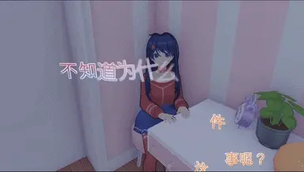
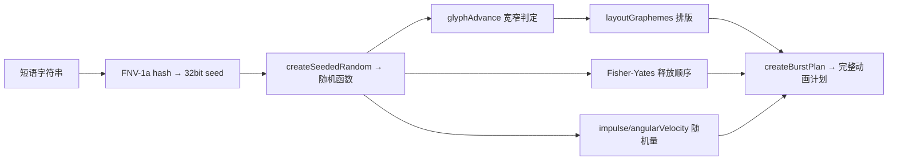

> [!NOTE] 提示
> 本文在 React Three Fiber 场景中将每个字形拆分为独立的物理刚体，实现“逐字显现—保持—释放—坠落—消失”的动画。实现重点是字形分割、SDF 文本渲染、刚体生命周期和移动端性能控制。




> [!NOTE] 提示
> 可在[个人主站](https://www.mmzhiku.xyz/)查看效果。文章中的动画速度受设备性能和浏览器调度影响，不能作为性能基准。
> 
> 部分参考效果包含“先上抬再坠落”的阶段，本文未实现该阶段；需要时可以在释放状态机中增加对应过渡。

## 技术栈

| 类别 | 技术 | 用途 |
|---|---|---|
| 框架 | React 19 + TypeScript | 组件化 UI 与类型安全 |
| 构建 | Vite | 开发服务器与打包 |
| 3D 渲染 | Three.js + @react-three/fiber | 场景、相机、字形渲染 |
| 物理引擎 | @react-three/rapier (Rapier) | 刚体、碰撞检测、重力模拟 |
| SDF 字体 | @react-three/drei Text | 高质量 3D 文本渲染 |
| 状态管理 | Zustand room-store | 短语触发、清除、计数 |
| 测试 | Vitest | 纯函数层单元测试 |

## 架构总览

```
┌─────────────────────────────────────────────────────┐
│                   layer.tsx                          │
│   懒加载门面 · 动态导入 physics · ErrorBoundary      │
└──────────────────────┬──────────────────────────────┘
                       │ 导入
┌──────────────────────▼──────────────────────────────┐
│                  physics.tsx                         │
│  Three.js 渲染 · Rapier 物理 · 时序驱动 · 碰撞体     │
└──────────────────────┬──────────────────────────────┘
                       │ 调用
┌──────────────────────▼──────────────────────────────┐
│                    core.ts                           │
│  字形分割 · 排版 · 确定性随机 · 时序状态机 · 纯函数   │
└─────────────────────────────────────────────────────┘
```

## 核心实现原理

### 1. 字形分割 — Intl.Segmenter

使用浏览器原生 `Intl.Segmenter` 按书写单位分割文本，确保中文单字、拉丁字母、emoji 序列（如 👨‍👩‍👧‍👦）不被拆散。

```typescript
const segmenter = new Intl.Segmenter('zh-CN', { granularity: 'grapheme' });
function segmentGraphemes(value: string) {
  return Array.from(segmenter.segment(value), (part) => part.segment);
}
```

### 2. 确定性随机 — 种子哈希 + Fisher-Yates

同一短语每次生成完全一致的动画序列，保证可复现。使用 FNV-1a 哈希将短语转为种子，再用线性同余生成器产生伪随机数。



### 3. 排版 — 锚点居中 + 自动换行

每个短语以一个 3D 空间锚点为中心，字形按行向左右均匀展开，上下居中。支持宽窄字符（如 `i` 与 `W` 宽度不同）和自动换行。

```typescript
// 核心：每行从 -width/2 开始排列，确保整行居中
const width = line.reduce((sum, glyph) => sum + glyph.width, 0);
let cursor = -width / 2;
return line.map((glyph) => {
  const x = cursor + glyph.width / 2;
  cursor += glyph.width;
  return { ...glyph, x, y: totalHeight / 2 - lineIndex * lineHeight };
});
```

### 4. 时序状态机 — 四阶段生命周期

每个字形经历四个阶段，由 `advanceTimelineGlyph` 纯函数驱动：

```
hidden ──(showAt)──→ held ──(releaseAt)──→ dynamic ──(clear)──→ clearing ──(320ms)──→ 移除
                        │                      │
                    打字机逐字出现            Rapier 物理接管
                    保持位置不变              impulse + 角速度
                    无物理碰撞                碰撞 + 坠落
```

- **hidden → held**：`showAfterMs` 递增实现打字机效果（每字 65-96ms）
- **held → dynamic**：Fisher-Yates 打乱释放顺序，实现凌乱飘散效果
- **dynamic → clearing**：触发条件：超出边界（y < -2.2）、物理休眠（settle）、短语数量超限、手动 clear

### 5. 物理模拟 — Rapier 集成

使用 `@react-three/rapier` 将每个字形作为独立刚体，释放时施加冲量和角速度。

```typescript
// 物理参数
gravity: [0, -200, 0]  // 重力加速度
angularDamping: 2.8      // 角阻尼
linearDamping: 0.05      // 线阻尼
restitution: 0.16        // 弹性
friction: 0.72           // 摩擦力

// 房间碰撞体（6 面墙壁 + 3 件家具顶面 + 书架层板）
<CuboidCollider args={[10, 0.06, 8.5]} position={[0, -0.91, 0]} />  // 地板
```

### 6. 相机朝向

字形始终面向相机（通过 `Quaternion` 继承相机旋转），但保持自身在锚点周围的局部偏移量，随相机旋转产生视差效果。

```typescript
const cameraQuaternion = camera.quaternion.clone();
const phraseQuaternion = cameraQuaternion.clone()
  .multiply(new Quaternion().setFromEuler(new Euler(...plan.tilt)));

// 字形位置 = 锚点 + 右向量×x + 上向量×y + 前向量×z
const position = new Vector3(...anchor)
  .addScaledVector(right, plan.x)
  .addScaledVector(up, plan.y);
```

### 7. 响应式与可访问性

| 场景 | 限制 | 行为 |
|---|---|---|
| 桌面端 | 3 条短语 / 72 字形 | 完整物理动画 |
| 移动端 (<720px) | 2 条短语 / 42 字形 | 缩小字号范围 |
| prefers-reduced-motion | 无限制 | 跳过物理，直接 held 后 clearing |

### 8. 懒加载与错误边界

`layer.tsx` 使用动态 `import()` 延迟加载 physics 模块，ErrorBoundary 捕获字体/WebGL 加载失败，优雅降级。

```typescript
// 动态导入
let physicsModule: Promise<{ default: ComponentType<PhysicsLayerProps> }> | null = null;
function loadPhysicsModule() {
  physicsModule ??= import('./physics');
  return physicsModule;
}
```

## 完整代码

### core.ts — 纯函数层

```typescript
// 移动端断点：小于此宽度启用移动端限制
export const DOLL_WORD_MOBILE_BREAKPOINT = 720;

// 并发限制：最多同时活跃的短语数和字形数
export interface DollWordLimits {
  activePhrases: number;
  glyphs: number;
}

// 字形排版布局：每个字形在锚点周围的偏移位置
export interface GlyphLayout {
  grapheme: string;   // 字形文本
  height: number;     // 字形高度
  isWhitespace: boolean;
  line: number;       // 所在行索引
  sourceIndex: number; // 在原字符串中的位置
  width: number;
  x: number;          // 相对于锚点的水平偏移
  y: number;          // 相对于锚点的垂直偏移
}

// 字形动画计划：继承布局信息，追加物理和时序参数
export interface GlyphPlan extends GlyphLayout {
  angularVelocity: [number, number, number]; // 释放时的角速度 (x, y, z)
  impulse: [number, number, number];         // 释放时的冲量 (x, y, z)
  releaseAfterMs: number | null;             // 释放延迟（毫秒），null 表示不释放
  showAfterMs: number;                       // 显示延迟（毫秒），实现打字机效果
}

// 完整的爆发动画计划：包含所有字形的时序和物理参数
export interface BurstPlan {
  anchorIndex: number;                           // 锚点索引
  fontIndex: number;                             // 字体索引
  fontSize: number;                              // 3D 场景中的字号
  glyphs: GlyphPlan[];                           // 每个字形的动画计划
  holdMs: number;                                // 保持阶段持续时间
  mode: 'motion' | 'reduced';                   // 完整动画 / 简化模式
  releaseIntervalMs: number;                     // 释放间隔时间
  releaseOrder: number[];                        // 释放顺序（打乱后的索引）
  seed: number;                                  // 随机种子
  spawn: [number, number, number];               // 生成位置随机因子
  tilt: [number, number, number];                // 短语整体倾斜角度
  typingIntervalMs: number;                      // 打字机间隔时间
}

// 爆发计划配置选项
export interface BurstPlanOptions {
  anchorCount: number;   // 可用锚点数量
  fontCount: number;     // 可用字体数量
  mobile: boolean;       // 是否移动端
  reducedMotion?: boolean; // 是否减少动画
}

// 时间线字形状态：驱动每个字形在四阶段状态机中流转
export interface TimelineGlyph {
  clearingStartedAt: number | null;  // 清除开始时间戳
  id: string;
  releaseAt: number | null;          // 计划释放时间
  showAt: number;                    // 显示时间
  stage: 'hidden' | 'held' | 'dynamic' | 'clearing'; // 四阶段状态
}

// 使用 Intl.Segmenter 按书写单位分割文本，Firefox 旧版 fallback 到 Array.from
const segmenter =
  typeof Intl.Segmenter === 'undefined'
    ? null
    : new Intl.Segmenter('zh-CN', { granularity: 'grapheme' });

const emojiPattern = /\p{Extended_Pictographic}/u;
const narrowPattern = /[\u0021-\u007e]/u;

/** 将字符串分割为独立字形，支持中文单字、拉丁字母、emoji 序列 */
export function segmentGraphemes(value: string) {
  if (segmenter === null) return Array.from(value);
  return Array.from(segmenter.segment(value), (part) => part.segment);
}

/** FNV-1a 哈希：将短语内容转为 32bit 种子，保证同一短语每次生成一致动画 */
export function hashDollWordSeed(id: number, phrase: string) {
  let hash = 0x811c9dc5;
  const input = `${String(id)}:${phrase}`;
  for (let index = 0; index < input.length; index += 1) {
    hash ^= input.charCodeAt(index);
    hash = Math.imul(hash, 0x01000193);
  }
  return hash >>> 0;
}

/** 线性同余伪随机数生成器：基于种子产生确定性随机序列 */
export function createSeededRandom(seed: number) {
  let state = seed >>> 0;
  return () => {
    state = (state + 0x6d2b79f5) >>> 0;
    let value = state;
    value = Math.imul(value ^ (value >>> 15), value | 1);
    value ^= value + Math.imul(value ^ (value >>> 7), value | 61);
    return ((value ^ (value >>> 14)) >>> 0) / 4_294_967_296;
  };
}

/** Fisher-Yates 洗牌：生成打乱的释放顺序索引数组 */
export function shuffledIndices(length: number, random: () => number) {
  const indices = Array.from({ length }, (_, index) => index);
  for (let index = indices.length - 1; index > 0; index -= 1) {
    const swapIndex = Math.floor(random() * (index + 1));
    const current = indices[index];
    const swap = indices[swapIndex];
    if (current === undefined || swap === undefined) continue;
    indices[index] = swap;
    indices[swapIndex] = current;
  }
  return indices;
}

/** 根据字形类型预估宽度：空格、emoji、窄字符、全角字符各有不同 */
function glyphAdvance(grapheme: string, fontSize: number) {
  if (/^\s+$/u.test(grapheme)) return fontSize * 0.38;
  if (emojiPattern.test(grapheme)) return fontSize * 1.12;
  if (narrowPattern.test(grapheme)) {
    if (/[ilI1.,'`:;|!]/u.test(grapheme)) return fontSize * 0.34;
    if (/[mwMW@#%&]/u.test(grapheme)) return fontSize * 0.82;
    return fontSize * 0.62;
  }
  return fontSize;
}

/** 排版：将字形数组按行排列，锚点居中，支持自动换行 */
export function layoutGraphemes(
  graphemes: string[],
  {
    fontSize,
    lineHeight = fontSize * 1.2,
    maxWidth,
  }: {
    fontSize: number;
    lineHeight?: number;
    maxWidth: number;
  },
) {
  const lines: Omit<GlyphLayout, 'line' | 'x' | 'y'>[][] = [[]];
  let lineWidth = 0;

  graphemes.forEach((grapheme, sourceIndex) => {
    // 遇到换行符则另起一行
    if (grapheme === '\n' || grapheme === '\r\n') {
      lines.push([]);
      lineWidth = 0;
      return;
    }

    const width = glyphAdvance(grapheme, fontSize);
    let line = lines.at(-1);
    if (line === undefined) return;
    // 超过最大宽度自动换行
    if (line.length > 0 && lineWidth + width > maxWidth) {
      line = [];
      lines.push(line);
      lineWidth = 0;
    }
    line.push({
      grapheme,
      height: fontSize,
      isWhitespace: /^\s+$/u.test(grapheme),
      sourceIndex,
      width,
    });
    lineWidth += width;
  });

  // 计算每行位置，整行居中
  const totalHeight = Math.max(0, lines.length - 1) * lineHeight;
  return lines.flatMap((line, lineIndex) => {
    const width = line.reduce((sum, glyph) => sum + glyph.width, 0);
    let cursor = -width / 2;
    return line.map((glyph) => {
      const x = cursor + glyph.width / 2;
      cursor += glyph.width;
      return {
        ...glyph,
        line: lineIndex,
        x,
        y: totalHeight / 2 - lineIndex * lineHeight,
      };
    });
  });
}

/** 生成一次完整爆发动画计划：包含打字机时序、物理参数、释放顺序等 */
export function createBurstPlan(
  id: number,
  phrase: string,
  { anchorCount, fontCount, mobile, reducedMotion = false }: BurstPlanOptions,
): BurstPlan {
  const seed = hashDollWordSeed(id, phrase);
  const random = createSeededRandom(seed);
  const fontSize = (mobile ? 0.68 : 0.86) + random() * (mobile ? 0.18 : 0.26);
  const typingIntervalMs = 65 + Math.floor(random() * 31);
  const holdMs = 470 + Math.floor(random() * 61);
  const releaseIntervalMs = 72 + Math.floor(random() * 48);
  const layout = layoutGraphemes(segmentGraphemes(phrase), {
    fontSize,
    maxWidth: mobile ? 3.35 : 5.1,
  });
  const physicalLayoutIndices = layout
    .map((glyph, index) => (glyph.isWhitespace ? -1 : index))
    .filter((index) => index >= 0);
  const releaseOrder = shuffledIndices(physicalLayoutIndices.length, random).map(
    (physicalIndex) => physicalLayoutIndices[physicalIndex] ?? 0,
  );
  const releaseRank = new Map(releaseOrder.map((layoutIndex, rank) => [layoutIndex, rank]));
  const typingEnd = segmentGraphemes(phrase).length * typingIntervalMs;

  return {
    anchorIndex: Math.floor(random() * Math.max(1, anchorCount)),
    fontIndex: Math.floor(random() * Math.max(1, fontCount)),
    fontSize,
    glyphs: layout.map((glyph, layoutIndex) => {
      const rank = releaseRank.get(layoutIndex);
      return {
        ...glyph,
        angularVelocity: [(random() - 0.5) * 30, (random() - 0.5) * 24, (random() - 0.5) * 28],
        impulse: [(random() - 0.5) * 0.035, -4 - random() * 3, (random() - 0.5) * 0.024],
        releaseAfterMs:
          reducedMotion || rank === undefined
            ? null
            : typingEnd + holdMs + rank * releaseIntervalMs,
        showAfterMs: reducedMotion ? 0 : glyph.sourceIndex * typingIntervalMs,
      };
    }),
    holdMs,
    mode: reducedMotion ? 'reduced' : 'motion',
    releaseIntervalMs,
    releaseOrder,
    seed,
    spawn: [random(), random(), random()],
    tilt: [(random() - 0.5) * 0.12, (random() - 0.5) * 0.16, (random() - 0.5) * 0.16],
    typingIntervalMs,
  };
}

/** 根据移动端状态返回并发限制 */
export function getDollWordLimits(mobile: boolean): DollWordLimits {
  return mobile ? { activePhrases: 2, glyphs: 42 } : { activePhrases: 3, glyphs: 72 };
}

/** 推进单个字形的时间线状态：hidden → held → dynamic */
export function advanceTimelineGlyph(glyph: TimelineGlyph, now: number): TimelineGlyph {
  // hidden → held（到达显示时间）
  if (glyph.stage === 'hidden' && now >= glyph.showAt) {
    // 如果显示时间和释放时间同时到达，直接跳到 dynamic
    if (glyph.releaseAt !== null && now >= glyph.releaseAt) return { ...glyph, stage: 'dynamic' };
    return { ...glyph, stage: 'held' };
  }
  // held → dynamic（到达释放时间）
  if (glyph.stage === 'held' && glyph.releaseAt !== null && now >= glyph.releaseAt) {
    return { ...glyph, stage: 'dynamic' };
  }
  return glyph;
}

/** 将所有可见字形标记为 clearing 状态，开始清除动画 */
export function markTimelineClearing<T extends TimelineGlyph>(glyphs: T[], now: number) {
  return glyphs.map((glyph) =>
    glyph.stage === 'hidden'
      ? null
      : { ...glyph, clearingStartedAt: now, releaseAt: null, stage: 'clearing' as const },
  );
}

/** 找出超出限制的最旧字形 ID，用于溢出淘汰 */
export function oldestOverflowIds(
  glyphs: { createdAt: number; id: string; stage: TimelineGlyph['stage'] }[],
  limit: number,
) {
  const visible = glyphs
    .filter((glyph) => glyph.stage === 'held' || glyph.stage === 'dynamic')
    .sort((left, right) => left.createdAt - right.createdAt);
  return visible.slice(0, Math.max(0, visible.length - limit)).map((glyph) => glyph.id);
}
```

### layer.tsx — 懒加载门面

```typescript
import {
  Component,
  Suspense,
  useCallback,
  useEffect,
  useRef,
  useState,
  type ComponentType,
  type ReactNode,
} from 'react';

import { useRoomStore } from '@/stores/room-store';

// 物理渲染层 Props：onReady 回调在字体预热完成后触发
interface PhysicsLayerProps {
  onReady: () => void;
}

// 模块级缓存：避免重复动态导入
let physicsModule: Promise<{ default: ComponentType<PhysicsLayerProps> }> | null = null;

/** 懒加载 physics 模块，仅在首次调用时执行实际 import */
function loadPhysicsModule() {
  physicsModule ??= import('./physics');
  return physicsModule;
}

/** 错误边界：捕获字体 / WebGL 加载失败，优雅降级，不阻塞页面 */
class DollWordErrorBoundary extends Component<
  { children: ReactNode; onFailure: () => void },
  { failed: boolean }
> {
  state = { failed: false };

  static getDerivedStateFromError() {
    return { failed: true };
  }

  componentDidCatch(error: unknown) {
    console.warn('3D doll words were disabled because their assets failed to load.', error);
    // 通知 store 字形计数归零，清除所有引用
    useRoomStore.getState().setDollWordCount(0);
    this.props.onFailure();
  }

  render() {
    return this.state.failed ? null : this.props.children;
  }
}

/** 懒加载门面组件：动态导入 PhysicsLayer，加载失败时静默降级 */
export function DollWordLayer({ onReady }: { onReady: () => void }) {
  const [PhysicsLayer, setPhysicsLayer] = useState<ComponentType<PhysicsLayerProps> | null>(null);
  const readyReported = useRef(false);
  const reportReady = useCallback(() => {
    if (readyReported.current) return;
    readyReported.current = true;
    onReady();
  }, [onReady]);

  useEffect(() => {
    if (PhysicsLayer !== null) return;
    let cancelled = false;
    void loadPhysicsModule()
      .then((module) => {
        if (!cancelled) setPhysicsLayer(() => module.default);
      })
      .catch((error: unknown) => {
        console.warn('3D doll words could not be preloaded.', error);
        reportReady();
      });
    return () => {
      cancelled = true; // 组件卸载时取消未完成的加载
    };
  }, [PhysicsLayer, reportReady]);

  if (PhysicsLayer === null) return null;
  return (
    <DollWordErrorBoundary onFailure={reportReady}>
      <Suspense fallback={null}>
        <PhysicsLayer onReady={reportReady} />
      </Suspense>
    </DollWordErrorBoundary>
  );
}
```

### physics.tsx — 物理渲染层

```typescript
import { Text } from '@react-three/drei';
import { useFrame, useThree } from '@react-three/fiber';
import { CuboidCollider, Physics, RigidBody, type RapierRigidBody } from '@react-three/rapier';
import { useCallback, useEffect, useMemo, useRef, useState } from 'react';
import { Euler, MathUtils, Quaternion, Vector3, type Group } from 'three';

import { profileConfig } from '@/config';
import { useReducedMotion } from '@/hooks/use-reduced-motion';
import {
  advanceTimelineGlyph,
  createBurstPlan,
  getDollWordLimits,
  oldestOverflowIds,
  segmentGraphemes,
  type GlyphPlan,
  type TimelineGlyph,
} from '@/scene/doll-words/core';
import { useRoomStore } from '@/stores/room-store';
import type { CameraZone } from '@/types/room';

type VectorTuple = [number, number, number];
type QuaternionTuple = [number, number, number, number];

// 场景字形：继承 TimelineGlyph，追加渲染和物理所需的所有字段
interface SceneGlyph extends TimelineGlyph {
  angularVelocity: VectorTuple;
  burstId: number;
  character: string;
  createdAt: number;
  expiresAt: number | null;    // 过期时间，到期后自动清除
  fontSize: number;
  fontSource: string;          // 字体文件路径
  hadPhysics: boolean;
  height: number;
  impulse: VectorTuple;
  mode: 'motion' | 'reduced';
  position: VectorTuple;
  quaternion: QuaternionTuple;
  width: number;
}

// 各阶段持续时间常量（毫秒）
const clearDurationMs = 320;      // 清除动画时长
const reducedVisibleMs = 820;     // 简化模式下可见时长
const fallingVisibleMs = 2_100;   // 物理坠落后可停留时间
const settledVisibleMs = 700;     // 休眠后额外停留时间
const sdfGlyphSize = 64;          // SDF 纹理尺寸

// 预加载所有短语用到的字形，避免首次渲染卡顿
const preloadCharacters = Array.from(
  new Set(profileConfig.intro.audioPhrases.flatMap(({ phrase }) => segmentGraphemes(phrase))),
).join('');

// 不同相机视角下的字形生成范围
const spawnBounds: Record<
  CameraZone,
  { x: [number, number]; y: [number, number]; z: [number, number] }
> = {
  lounge: { x: [-8.1, 7.2], y: [2.15, 3.8], z: [-1.4, 6.4] },
  overview: { x: [-7.8, 7.3], y: [2.2, 4.05], z: [-6.3, 6.1] },
  workspace: { x: [-8.1, 5.4], y: [2.3, 4.1], z: [-7.2, -1.15] },
};

/** 在指定相机视角内随机生成锚点位置 */
function randomSpawnPosition(zone: CameraZone, random: [number, number, number]): VectorTuple {
  const bounds = spawnBounds[zone];
  return [
    MathUtils.lerp(bounds.x[0], bounds.x[1], random[0]),
    MathUtils.lerp(bounds.y[0], bounds.y[1], random[1]),
    MathUtils.lerp(bounds.z[0], bounds.z[1], random[2]),
  ];
}

/** 房间静态碰撞体：地板、墙壁、家具顶面、书架层板 */
function StaticRoomColliders() {
  return (
    <RigidBody type="fixed" colliders={false} name="doll-word-room-colliders">
      {/* 地板 */}
      <CuboidCollider args={[10, 0.06, 8.5]} position={[0, -0.91, 0]} />
      {/* 四面墙壁 */}
      <CuboidCollider args={[0.08, 4.6, 8.6]} position={[-10.04, 3.35, 0]} />
      <CuboidCollider args={[0.08, 4.6, 8.6]} position={[10.04, 3.35, 0]} />
      <CuboidCollider args={[10.1, 4.6, 0.08]} position={[0, 3.35, -8.54]} />
      <CuboidCollider args={[10.1, 4.6, 0.08]} position={[0, 3.35, 8.54]} />
      {/* 家具顶面 */}
      <CuboidCollider args={[3.9, 0.1, 1.125]} position={[-0.9, 1.23, -6.55]} />
      <CuboidCollider args={[2.825, 0.065, 2.225]} position={[6.76, 0.37, 5.05]} />
      <CuboidCollider args={[0.91, 0.12, 3.75]} position={[-8.48, 0.17, 0.22]} />
      <CuboidCollider args={[0.93, 0.11, 2.3]} position={[-5.52, 0.17, 0.22]} />
      {/* 书架层板 */}
      {[-0.77, 0.46, 1.71, 2.96].map((y) => (
        <CuboidCollider key={y} args={[0.52, 0.08, 1.725]} position={[-9.34, y, -6.55]} />
      ))}
      <CuboidCollider args={[0.52, 2.025, 0.085]} position={[-9.34, 1.09, -8.19]} />
      <CuboidCollider args={[0.52, 2.025, 0.085]} position={[-9.34, 1.09, -4.91]} />
      <CuboidCollider args={[0.05, 1.85, 1.725]} position={[-9.83, 1.09, -6.55]} />
    </RigidBody>
  );
}

/** 预热完成信号：触发 onReady 回调 */
function WarmupReady({ onReady }: { onReady: () => void }) {
  useEffect(() => onReady(), [onReady]);
  return null;
}

/** 字体预热：在不可见组中提前渲染所有字形，生成 SDF 纹理缓存 */
function FontWarmup({ onReady }: { onReady: () => void }) {
  return (
    <>
      <group visible={false}>
        {profileConfig.intro.dollFonts.map((font) => (
          <Text
            key={font.src}
            characters={preloadCharacters}
            font={font.src}
            fontSize={0.1}
            sdfGlyphSize={sdfGlyphSize}
          >
            {preloadCharacters}
          </Text>
        ))}
      </group>
      <WarmupReady onReady={onReady} />
    </>
  );
}

/** 单个字形文本渲染：根据主题切换颜色，带轮廓描边 */
function GlyphText({
  character,
  fontSize,
  fontSource,
}: Pick<SceneGlyph, 'character' | 'fontSize' | 'fontSource'>) {
  const theme = useRoomStore((state) => state.theme);
  const face = theme === 'light' ? '#fffefd' : '#090a0e';
  const outline = theme === 'light' ? '#111217' : '#fffaff';

  return (
    <Text
      anchorX="center"
      anchorY="middle"
      color={face}
      fillOpacity={1}
      font={fontSource}
      fontSize={fontSize}
      outlineColor={outline}
      outlineOpacity={1}
      outlineWidth={fontSize * 0.025}
      sdfGlyphSize={sdfGlyphSize}
    >
      {character}
    </Text>
  );
}

/** 字形视觉容器：在 clearing 阶段执行缩放消失动画 */
function GlyphVisual({ glyph }: { glyph: SceneGlyph }) {
  const animated = useRef<Group>(null);

  useFrame(() => {
    const group = animated.current;
    if (group === null) return;
    const now = performance.now();
    // clearing 阶段：从 1 缩放到 0.08 后消失
    if (glyph.clearingStartedAt !== null) {
      const progress = MathUtils.clamp((now - glyph.clearingStartedAt) / clearDurationMs, 0, 1);
      const scale = MathUtils.lerp(1, 0.08, progress);
      group.scale.setScalar(scale);
    }
  });

  return (
    <group ref={animated}>
      <GlyphText
        character={glyph.character}
        fontSize={glyph.fontSize}
        fontSource={glyph.fontSource}
      />
    </group>
  );
}

/** held 阶段：固定位置和朝向，无物理 */
function HeldGlyph({ glyph }: { glyph: SceneGlyph }) {
  return (
    <group position={glyph.position} quaternion={glyph.quaternion}>
      <GlyphVisual glyph={glyph} />
    </group>
  );
}

/** 物理字形：dynamic 阶段由 Rapier 驱动刚体碰撞和坠落 */
function PhysicsGlyph({
  glyph,
  onRemove,
  onSleep,
}: {
  glyph: SceneGlyph;
  onRemove: (id: string) => void;
  onSleep: (id: string) => void;
}) {
  const body = useRef<RapierRigidBody>(null);
  const frame = useRef(0);
  const dynamic = glyph.stage === 'dynamic';

  // 进入 dynamic 时施加冲量和角速度
  useEffect(() => {
    if (!dynamic) return;
    const rigidBody = body.current;
    if (rigidBody === null) return;
    rigidBody.applyImpulse({ x: glyph.impulse[0], y: glyph.impulse[1], z: glyph.impulse[2] }, true);
    rigidBody.setAngvel(
      {
        x: glyph.angularVelocity[0],
        y: glyph.angularVelocity[1],
        z: glyph.angularVelocity[2],
      },
      true,
    );
  }, [dynamic, glyph.angularVelocity, glyph.impulse]);

  // clearing 阶段禁用刚体
  useEffect(() => {
    if (glyph.clearingStartedAt === null) return;
    body.current?.setEnabled(false);
  }, [glyph.clearingStartedAt]);

  // 每帧检测是否超出边界，超出则移除
  useFrame(() => {
    if (!dynamic) return;
    frame.current += 1;
    if (frame.current % 8 !== 0 || body.current === null) return;
    const position = body.current.translation();
    if (position.y < -2.2 || Math.abs(position.x) > 11.2 || Math.abs(position.z) > 9.7) {
      onRemove(glyph.id);
    }
  });

  return (
    <RigidBody
      ref={body}
      canSleep                  // 允许休眠以节约性能
      colliders={false}
      angularDamping={2.8}      // 角阻尼，让旋转逐渐停止
      linearDamping={0.05}      // 线阻尼
      name={`doll-word-${glyph.id}`}
      onSleep={() => {
        if (dynamic) onSleep(glyph.id); // 物理休眠后触发过期计时
      }}
      position={glyph.position}
      quaternion={glyph.quaternion}
      softCcdPrediction={0.55}  // 连续碰撞检测，防止高速穿透
      type={dynamic ? 'dynamic' : 'fixed'}
    >
      <CuboidCollider
        args={[Math.max(0.08, glyph.width * 0.43), Math.max(0.12, glyph.height * 0.44), 0.065]}
        friction={0.72}
        mass={0.24}
        restitution={0.16}      // 弹性系数
      />
      <GlyphVisual glyph={glyph} />
    </RigidBody>
  );
}

/** 计算字形在 3D 世界中的位置和朝向：锚点偏移 + 相机对齐 */
function glyphWorldTransform(
  plan: GlyphPlan,
  anchor: VectorTuple,
  cameraQuaternion: Quaternion,
  phraseQuaternion: Quaternion,
) {
  // 以相机朝向为基准计算右、上、前向量
  const right = new Vector3(1, 0, 0).applyQuaternion(cameraQuaternion);
  const up = new Vector3(0, 1, 0).applyQuaternion(cameraQuaternion);
  const forward = new Vector3(0, 0, -1).applyQuaternion(cameraQuaternion);
  const position = new Vector3(...anchor)
    .addScaledVector(right, plan.x)
    .addScaledVector(up, plan.y)
    .addScaledVector(forward, (plan.sourceIndex % 3) * 0.008);
  return {
    position: position.toArray(),
    quaternion: phraseQuaternion.toArray(),
  };
}

/** 核心字形管理组件：处理爆发、清除、时间线驱动、溢出淘汰 */
function DollWordBodies() {
  const burst = useRoomStore((state) => state.dollWordBurst);
  const cameraZone = useRoomStore((state) => state.cameraZone);
  const clearRevision = useRoomStore((state) => state.dollWordClearRevision);
  const setCount = useRoomStore((state) => state.setDollWordCount);
  const reducedMotion = useReducedMotion();
  const { camera, size } = useThree();
  const mobile = size.width < 720;
  const limits = getDollWordLimits(mobile);
  const [glyphs, setGlyphs] = useState<SceneGlyph[]>([]);
  const lastBurstId = useRef(0);
  const lastClearRevision = useRef(clearRevision);

  // 监听爆发事件：生成新字形并淘汰旧短语
  useEffect(() => {
    if (burst === null || burst.id === lastBurstId.current) return;
    lastBurstId.current = burst.id;
    const now = performance.now();
    const fonts = profileConfig.intro.dollFonts;
    const plan = createBurstPlan(burst.id, burst.phrase, {
      anchorCount: 1,
      fontCount: fonts.length,
      mobile,
      reducedMotion,
    });
    const anchor = randomSpawnPosition(cameraZone, plan.spawn);
    camera.updateMatrixWorld();
    const cameraQuaternion = camera.quaternion.clone();
    const phraseQuaternion = cameraQuaternion
      .clone()
      .multiply(new Quaternion().setFromEuler(new Euler(...plan.tilt)));
    const font = fonts[plan.fontIndex] ?? fonts[0];
    if (font === undefined) return;

    const additions = plan.glyphs
      .filter((glyph) => !glyph.isWhitespace)
      .map<SceneGlyph>((glyph, index) => {
        const transform = glyphWorldTransform(glyph, anchor, cameraQuaternion, phraseQuaternion);
        return {
          angularVelocity: glyph.angularVelocity,
          burstId: burst.id,
          character: glyph.grapheme,
          clearingStartedAt: null,
          createdAt: now + index * 0.001,
          expiresAt: reducedMotion ? now + reducedVisibleMs : null,
          fontSize: plan.fontSize,
          fontSource: font.src,
          hadPhysics: false,
          height: glyph.height,
          id: `${String(burst.id)}-${String(glyph.sourceIndex)}`,
          impulse: glyph.impulse,
          mode: plan.mode,
          position: transform.position,
          quaternion: transform.quaternion,
          releaseAt: glyph.releaseAfterMs === null ? null : now + Math.max(0, glyph.releaseAfterMs),
          showAt: now + glyph.showAfterMs,
          stage: reducedMotion ? 'held' : 'hidden',
          width: glyph.width,
        };
      });

    let cancelled = false;
    queueMicrotask(() => {
      if (cancelled) return;
      setGlyphs((current) => {
        // 淘汰超出短语数量限制的最旧短语
        const activeBurstIds = Array.from(
          new Set(
            current
              .filter((glyph) => glyph.stage === 'hidden' || glyph.stage === 'held')
              .map((glyph) => glyph.burstId),
          ),
        );
        const evictedBurstIds = new Set(
          activeBurstIds.slice(0, Math.max(0, activeBurstIds.length - limits.activePhrases + 1)),
        );
        const retained = current.flatMap((glyph) => {
          if (!evictedBurstIds.has(glyph.burstId)) return [glyph];
          if (glyph.stage === 'hidden') return [];
          if (glyph.stage === 'held') {
            return [
              { ...glyph, clearingStartedAt: now, releaseAt: null, stage: 'clearing' as const },
            ];
          }
          return [glyph];
        });
        return [...retained, ...additions];
      });
    });
    return () => {
      cancelled = true;
    };
  }, [burst, camera, cameraZone, limits.activePhrases, mobile, reducedMotion]);

  // 监听清除事件：将所有可见字形标记为 clearing
  useEffect(() => {
    if (clearRevision === lastClearRevision.current) return;
    lastClearRevision.current = clearRevision;
    const now = performance.now();
    let cancelled = false;
    queueMicrotask(() => {
      if (cancelled) return;
      setGlyphs((current) =>
        current.flatMap((glyph) =>
          glyph.stage === 'hidden'
            ? []
            : [
                {
                  ...glyph,
                  clearingStartedAt: now,
                  releaseAt: null,
                  stage: 'clearing' as const,
                },
              ],
        ),
      );
    });
    return () => {
      cancelled = true;
    };
  }, [clearRevision]);

  // 监听 reducedMotion 变化：切换到简化模式时清除所有物理字形
  useEffect(() => {
    if (!reducedMotion) return;
    const now = performance.now();
    let cancelled = false;
    queueMicrotask(() => {
      if (cancelled) return;
      setGlyphs((current) =>
        current.flatMap((glyph) => {
          if (glyph.mode === 'reduced') return [glyph];
          if (glyph.stage === 'hidden') return [];
          return [
            { ...glyph, clearingStartedAt: now, releaseAt: null, stage: 'clearing' as const },
          ];
        }),
      );
    });
    return () => {
      cancelled = true;
    };
  }, [reducedMotion]);

  // 判断是否需要运行时间线驱动循环
  const timelineActive = glyphs.some(
    (glyph) =>
      glyph.stage === 'hidden' ||
      glyph.stage === 'held' ||
      glyph.stage === 'clearing' ||
      glyph.clearingStartedAt !== null ||
      glyph.expiresAt !== null,
  );

  // 核心时间线驱动循环：每帧推进字形状态，处理过期和溢出
  useEffect(() => {
    if (!timelineActive) return;
    let frame = 0;
    const tick = () => {
      const now = performance.now();
      setGlyphs((current) => {
        let changed = false;
        let next = current.flatMap((glyph) => {
          // clearing 完成 → 移除
          if (
            glyph.clearingStartedAt !== null &&
            now - glyph.clearingStartedAt >= clearDurationMs
          ) {
            changed = true;
            return [];
          }
          // 过期 → 进入 clearing
          if (
            glyph.expiresAt !== null &&
            now >= glyph.expiresAt &&
            glyph.clearingStartedAt === null
          ) {
            changed = true;
            return [{ ...glyph, clearingStartedAt: now, stage: 'clearing' as const }];
          }
          // 推进时间线状态（hidden → held → dynamic）
          const advanced = advanceTimelineGlyph(glyph, now) as SceneGlyph;
          if (advanced !== glyph) {
            changed = true;
            const justReleased = glyph.stage !== 'dynamic' && advanced.stage === 'dynamic';
            return [
              {
                ...advanced,
                expiresAt: justReleased ? now + fallingVisibleMs : advanced.expiresAt,
                hadPhysics: advanced.stage === 'dynamic' || glyph.hadPhysics,
              },
            ];
          }
          return [glyph];
        });

        // 字形数量溢出淘汰：移除最旧的字形
        const overflowIds = new Set(oldestOverflowIds(next, limits.glyphs));
        if (overflowIds.size > 0) {
          changed = true;
          next = next.map((glyph) =>
            overflowIds.has(glyph.id)
              ? { ...glyph, clearingStartedAt: now, releaseAt: null, stage: 'clearing' as const }
              : glyph,
          );
        }
        return changed ? next : current;
      });
      frame = window.requestAnimationFrame(tick);
    };
    frame = window.requestAnimationFrame(tick);
    return () => window.cancelAnimationFrame(frame);
  }, [limits.glyphs, timelineActive]);

  // 统计当前可见字形数量，同步到 store
  const visibleCount = useMemo(
    () =>
      glyphs.filter(
        (glyph) =>
          glyph.clearingStartedAt === null && (glyph.stage === 'held' || glyph.stage === 'dynamic'),
      ).length,
    [glyphs],
  );

  useEffect(() => setCount(visibleCount), [setCount, visibleCount]);
  useEffect(() => () => setCount(0), [setCount]);

  const removeGlyph = useCallback((id: string) => {
    setGlyphs((current) => current.filter((glyph) => glyph.id !== id));
  }, []);

  const settleGlyph = useCallback((id: string) => {
    const expiresAt = performance.now() + settledVisibleMs;
    setGlyphs((current) =>
      current.map((glyph) =>
        glyph.id === id && (glyph.expiresAt === null || expiresAt < glyph.expiresAt)
          ? { ...glyph, expiresAt }
          : glyph,
      ),
    );
  }, []);

  // 渲染所有字形：held 阶段用 HeldGlyph，dynamic 阶段用 PhysicsGlyph
  return glyphs.map((glyph) => {
    if (glyph.stage === 'hidden') return null;
    if (glyph.mode === 'motion') {
      return (
        <PhysicsGlyph key={glyph.id} glyph={glyph} onRemove={removeGlyph} onSleep={settleGlyph} />
      );
    }
    return <HeldGlyph key={glyph.id} glyph={glyph} />;
  });
}

/** 物理场景入口：Rapier 物理世界 + 字体预热 + 房间碰撞体 + 字形管理 */
export default function DollWordPhysics({ onReady }: { onReady: () => void }) {
  return (
    <Physics colliders={false} gravity={[0, -200, 0]} timeStep={1 / 60} updateLoop="independent">
      <FontWarmup onReady={onReady} />
      <StaticRoomColliders />
      <DollWordBodies />
    </Physics>
  );
}
```

### 集成方式

在对应的 3D 房间场景中引入 `Layer` 组件，并传入 `onReady` 回调：

```typescript
import { DollWordLayer } from '@/scene/doll-words/layer';

export function RoomScene({ onDollWordsReady }: { onDollWordsReady: () => void }) {
  return (
    <>
      {/* 房间物体 */}
      <DollWordLayer onReady={onDollWordsReady} />
    </>
  );
}
```

同时需要在状态管理中定义房间 store 的相关状态：

```typescript
interface RoomState {
  dollWordBurst: { id: number; phrase: string } | null;
  dollWordClearRevision: number;
  dollWordCount: number;
  setDollWordCount: (count: number) => void;
  clearDollWords: () => void;
  spawnDollWords: (phrase: string) => void;
}
```

## 踩坑点 & 注意事项

### 1. Intl.Segmenter 兼容性

Firefox 和 Safari 较旧版本不支持 `Intl.Segmenter`。代码中做了 fallback，回退到 `Array.from(value)`，但 emoji 序列（如 👨‍👩‍👧‍👦）在回退模式下会被拆散。

### 2. Rapier 物理性能

- 每个字形是一个独立 `RigidBody`，同时存在过多时（>72）可能影响性能
- 使用 `canSleep` 让静止的刚体自动休眠
- 超出边界的字形直接移除，不等待清除动画
- 使用 `softCcdPrediction` 避免高速穿透

### 3. 字体预热

`<Text>` 组件首次渲染时会加载字体并生成 SDF 纹理，这会导致卡顿。使用不可见 `<group visible={false}>` 在加载阶段即预热所有用到的字形。

### 4. Camera 与布局

字形位置是相对于锚点的局部偏移，但朝向跟随相机。这导致旋转相机时字形产生视差，需要确保 `camera.updateMatrixWorld()` 在计算前被调用。

### 5. 状态更新的竞态

`setGlyphs` 在多个 `useEffect` 中同时触发，使用 `queueMicrotask` 延迟到微任务队列执行，避免 React 的批量更新问题。同时用 `cancelled` flag 防止组件卸载后更新。

## 性能对比

| 指标 | 旧版 CSS 实现 | 新版 3D 物理实现 |
|---|---|---|
| 渲染方式 | CSS 2D transform | Three.js SDF Text |
| 动画驱动 | CSS animation | requestAnimationFrame + Rapier |
| 碰撞检测 | 无 | 房间墙壁 + 家具碰撞体 |
| 字体支持 | 系统字体 | 4 种自定义 woff/ttf 字体 |
| 单次性能 | 轻量 | 约 0.3-0.8ms 每帧（72 字形） |
| 最大并发 | 无限（CSS） | 72 字形（硬限制） |

## 总结

- 核心在于将**排版布局**、**时序控制**、**物理模拟**三层解耦，纯函数层（core.ts）不含任何 Three.js 或 React 依赖，可独立测试
- 确定性随机保证同一短语每次播放效果一致，Seed 基于短语内容哈希，适合需要回放或录制的场景
- 四阶段状态机（hidden → held → dynamic → clearing）配合 requestAnimationFrame 驱动，避免使用 setInterval 的不精确性
- 相机朝向 + 锚点偏移的方案兼顾了"面向用户"和"空间位置感"两个需求
