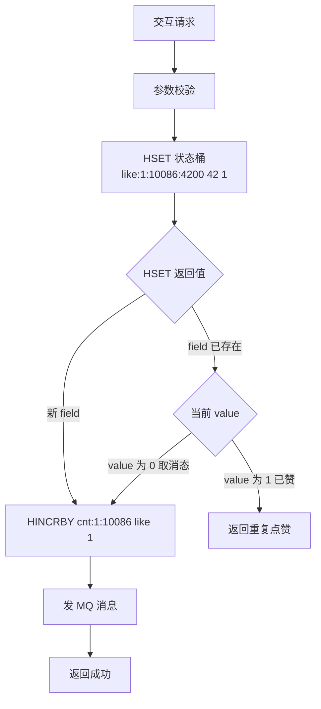

> [!NOTE] 提示
> 点赞 / 收藏 / 关注等「状态 + 计数」型交互，按流量分级给出三套方案：小流量直写数据库即可，中等流量上 Redis + 定时落库，大流量才需要 Hash 分桶 + MQ 批量聚合。先判断自己的量级，再选方案。

## 问题与目标

日交互 2 千万次，热点单内容 1 分钟 10 万点赞，纯数据库方案 P99 2.1s、主从延迟 800ms。（来源：预发环境压测，4C8G MySQL 主从，2026-04 采样）

但不是所有业务都需要这套架构。交互量 1 万 QPS 以下的系统，数据库直写完全扛得住，引入 Redis + MQ 反而增加运维成本和数据一致性问题。先分级，再选方案：

| 级别 | 交互量级（写入 QPS） | 典型业务 | 方案 |
|------|-------------------|---------|------|
| 小流量 | < 500 | 个人博客、内部系统、B 端工具 | 方案一：DB 直写 |
| 中流量，无 MQ | 500 ~ 5000 | 中型社区、垂直论坛 | 方案二：Redis 单 Key + 定时落库 |
| 中流量，有 MQ | 500 ~ 5000 | 有 MQ 基础设施的社区 | 方案三：Redis 单 Key + MQ 批量聚合 |
| 大流量，热点集中 | > 5000 | 内容平台、短视频 | 方案四：Hash 分桶 + MQ 批量聚合 |

不覆盖评论、弹幕等带正文的交互。

## 状态结构选型：Set / ZSet / Hash

三个方案存「用户是否点过赞」，结构对比（适用于所有级别）：

| 对比项 | Set | ZSet | Hash |
|-------|-----|------|------|
| 写入 | `SADD key userId` | `ZADD key ts userId` | `HSET key userId 1` |
| 取消点赞 | `SREM`（成员消失） | `ZREM`（成员消失） | value 翻转 1→0 |
| 「赞过又取消」与「从未赞」可区分 | 否，都不存在 | 否，都不存在 | **是，field 在且 value=0** |
| 判重与写入合一 | 否，两次往返 | 否，两次往返 | **是，HSET 返回值即判重** |
| 有效计数 | `SCARD` O(1) | `ZCARD` O(1) | HSCAN 数 value=1 |
| 额外能力 | 交并集（共同好友） | 按 score 排序（时间列表） | value 可扩展多状态 |
| 单成员开销 | 最小 | 最大（dict + 跳表双结构） | 与 Set 同量级 |

判定逻辑：点赞核心语义是「状态可翻转」（赞 ↔ 取消），Set / ZSet 取消即删，终态丢失，落库幂等与对账拿不到数据；ZSet 的排序能力多数场景用不上，却多付双结构开销。**统一选 Hash**，value 存 0/1。

## 方案一：DB 直写（小流量）

### 使用场景

写入 QPS < 500，无热点集中。数据库行锁、连接池都够用，引入缓存层是负收益。

### 使用方案

全部逻辑落在 MySQL，两步一个事务：记录表 upsert + 计数表 UPDATE。无 Redis、无 MQ、无定时任务，部署成本一个数据库。

### Key 设计

无缓存 Key。表结构即全部存储：

```sql
CREATE TABLE interaction_record (
    id               BIGINT PRIMARY KEY AUTO_INCREMENT,
    user_id          BIGINT NOT NULL,
    target_type      INT NOT NULL,
    target_id        BIGINT NOT NULL,
    interaction_type INT NOT NULL,
    status           TINYINT NOT NULL DEFAULT 1 COMMENT '1=有效, 0=取消',
    create_time      DATETIME NOT NULL,
    update_time      DATETIME NOT NULL,
    UNIQUE KEY uk_user_target (user_id, target_type, target_id, interaction_type)
);

CREATE TABLE interaction_count (
    target_type      INT NOT NULL,
    target_id        BIGINT NOT NULL,
    interaction_type INT NOT NULL,
    count            BIGINT NOT NULL DEFAULT 0,
    update_time      DATETIME NOT NULL,
    PRIMARY KEY (target_type, target_id, interaction_type)
);
```

计数表独立于记录表，展示页读计数表，不执行 `COUNT(*)`。

### 写入流程

```sql
-- 一个事务内：
-- 1. 记录 upsert（唯一索引兜底防重复点赞）
INSERT INTO interaction_record (user_id, target_type, target_id, interaction_type, status, create_time, update_time)
VALUES (42, 1, 10086, 1, 1, NOW(), NOW())
ON DUPLICATE KEY UPDATE status = 1, update_time = NOW();

-- 2. 计数（仅当 status 确实翻转时执行，由应用层判断 affected rows）
UPDATE interaction_count SET count = count + 1, update_time = NOW()
WHERE target_type = 1 AND target_id = 10086 AND interaction_type = 1;
```

强一致，无对账需求。瓶颈出现（行锁排队、P99 劣化）时升级方案二。

## 方案二：Redis 单 Key + 定时落库（中流量）

### 使用场景

写入 QPS 500 ~ 5000，数据库开始吃紧，但没有 MQ 基础设施或不想引入。可接受分钟级落库延迟。

### 使用方案

Redis 扛实时读写，定时任务批量扫描变更落库。依赖：Redis + 调度器（XXL-Job / crontab），无 MQ。

### Key 设计

| Key | Redis 结构 | field / 内容 | value | 用途 |
|-----|-----------|-------------|-------|------|
| `like:{targetType}:{targetId}` | **Hash** | userId | 1 / 0 | 状态，判重 + 终态 |
| `cnt:{targetType}:{targetId}` | **Hash** | 交互类型 | 当前有效计数 | 计数，展示页直读 |
| `dirty:{targetType}` | **Set** | targetId | — | 脏标记，记录哪些内容有变更待落库 |

此量级单 Key 内存可控（单内容参与 < 百万级），不需要分桶。`cnt` 用 Hash 一个 Key 装多维度计数（赞 / 藏 / 关注），比 String 少 3/4 的 Key 数。

### 写入流程

```text
点赞:
    HSET like:1:10086 42 1        # 返回 1 = 新 field，继续；0 = 已存在，查 value 分支
    HINCRBY cnt:1:10086 like 1
    SADD dirty:1 10086            # 标记待落库

取消:
    HSET like:1:10086 42 0
    HINCRBY cnt:1:10086 like -1
    SADD dirty:1 10086
```

定时任务（每 5 分钟）：

1. `SMEMBERS dirty:1` 取变更内容列表（避免 `KEYS` 全库扫描）；
2. 对每个 targetId：`HSCAN like:1:10086` 取全部 field 终态，批量 upsert 记录表；
3. `HGET cnt:1:10086` 与记录表核对后更新计数表；
4. `SREM dirty:1 10086` 清除脏标记。

状态 Hash 不删除（保留终态供下次增量扫描），脏标记是唯一需要清理的 Key。

### 一致性

落库延迟 = 扫描周期（分钟级）。Redis 与 DB 间的偏差由每日对账收敛：抽样比对 `cnt` 与计数表，不一致时以 Redis 状态桶 HSCAN 重算为准（此方案 DB 是定期镜像，Redis 是活跃数据源）。

## 方案三：Redis 单 Key + MQ 批量聚合（中流量，有 MQ）

### 使用场景

写入 QPS 500 ~ 5000，已有 MQ 基础设施，要求秒级落库延迟。单内容参与量可控（未达大 Key 阈值），无热点集中——不需要分桶，但不接受方案二的分钟级延迟。

### 使用方案

Redis 单 Key 扛读写，MQ 异步批量落库。依赖：Redis + MQ（RocketMQ / Kafka）+ 消费集群。与方案二共用单 Key 状态设计，落库路径从定时扫描换成事件驱动：变更即发消息，消费端攒批写库，无需等扫描周期。

### Key 设计

| Key | Redis 结构 | field / 内容 | value | 用途 |
|-----|-----------|-------------|-------|------|
| `like:{targetType}:{targetId}` | **Hash** | userId | 1 / 0 | 状态，判重 + 终态 |
| `cnt:{targetType}:{targetId}` | **Hash** | 交互类型 | 当前有效计数 | 计数，展示页直读 |
| `user_like:{userId}` | **Hash** | `targetType:targetId` | 1 / 0 | 用户维度冗余（信息流场景可选） |

与方案二相比去掉脏标记：MQ 消息本身携带变更信息，替代扫描发现变更。

### 写入流程

```text
点赞:
    HSET like:1:10086 42 1        # 返回 1 = 新 field，继续；0 = 已存在，查 value 分支
    HINCRBY cnt:1:10086 like 1
    发 MQ 消息 {userId: 42, targetId: 10086, type: like, delta: +1}

取消:
    HSET like:1:10086 42 0
    HINCRBY cnt:1:10086 like -1
    发 MQ 消息 {userId: 42, targetId: 10086, type: like, delta: -1}
```

**落库：MQ 批量聚合消费**，消费端攒 500 条或 1s 触发一次批量提交：

- 记录表：内存按 `(userId, targetId)` 去重（同用户秒内赞了又取消，取时间靠后一条）后批量 upsert；
- 计数表：按 targetId 聚合净增量（+1/-1 相消），每内容一次 `UPDATE count = count + delta`。

交互 QPS 5000 时 DB 写入降至 10 QPS 以内。消费失败重试 3 次进死信队列告警。

### 一致性

秒级最终一致（消费延迟 + 攒批窗口）。以 DB 为最终数据源，每日对账抽样比对 `cnt` 与计数表，不一致时以 Redis 状态 Hash 重算为准修复。MQ 堆积超 10 万条自动暂停对账防误报。

## 方案四：Hash 分桶 + MQ 批量聚合（大流量，热点集中）

### 使用场景

写入 QPS > 5000 且热点集中（单内容 1 分钟 10 万级参与），或参与量达百万级、Cluster 下出现热 Key。方案三的两个前提被打破：单 Key 内存失控（大 Key），单节点写吞吐不足。

### 使用方案

Redis 分桶扛读写，MQ 异步批量落库。依赖：Redis Cluster + MQ + 消费集群。与方案三共用「MQ 批量聚合」落库设计，状态侧从单 Key 换成分桶。

分桶动机：「一个内容一个 Key」必然踩两个雷——**大 Key**（500 万参与约 200MB，DEL / rehash 阻塞秒级）与**热 Key**（单 Key 落单节点，热点流量打满一台机器）。桶号由 userId 计算，Key 天然散列到不同节点，两个问题一次解决。

### Key 设计

| Key | Redis 结构 | field / 内容 | value | 用途 |
|-----|-----------|-------------|-------|------|
| `like:{targetType}:{targetId}:{bucketIdx}` | **Hash** | userId | 1 / 0 | 状态桶，`bucketIdx = userId / 10000` |
| `cnt:{targetType}:{targetId}` | **Hash** | 交互类型 | 当前有效计数 | 计数读 Key |
| `cnt:{targetType}:{targetId}:b{0..15}` | **String** | — | 增量 | 热点计数分桶，随机 INCR |
| `user_like:{userId}` | **Hash** | `targetType:targetId` | 1 / 0 | 用户维度冗余（信息流场景可选） |

状态桶在方案三单 Key 基础上分桶。差异是两点：状态从单 Key 变多桶（写入侧），计数增加热点分桶（`b{0..15}`）；落库路径与方案三完全一致（MQ 批量聚合）。

### 写入流程



1. `HSET` 单命令完成判重 + 写入，无「先查后写」的并发缺口；
2. 状态与计数跨 Key 非原子是刻意取舍：Lua 合并两命令要求同 slot，与分桶分散互斥，偏差交给对账收敛；
3. 计数失败同步重试一次，仍失败记日志留给对账。

**热点计数两档**：单内容 QPS ≤ 5000 直接 `HINCRBY` 读 Key；超过后随机 `INCR cnt:{targetId}:b{0..15}`，worker 每 500ms 用 `GETDEL` 原子取走各桶增量（取走 = 读出 + 清零一步完成，避免读清间隙丢计数），一次 `HINCRBY` 累加进读 Key。前端永远只读读 Key，无读放大。

**落库：MQ 批量聚合消费**，同方案三：攒 500 条或 1s 触发批量提交，记录去重 upsert + 计数聚合净增量。交互 QPS 10 万时 DB 写入降至 200 QPS 以内。消费失败重试 3 次进死信队列告警。

### 一致性

以 DB 为最终数据源。每小时抽样 1% 内容比对 DB 与 Redis 计数，偏差超阈值的内容用 `HSCAN` 全量校验状态桶，以 DB 为准修复，修复加分布式锁防写入踩踏。MQ 堆积超 10 万条自动暂停对账防误报。

### 降级

Redis 超时率超 10% 熔断：直写 DB + 限流 1000 QPS（退化为方案一）；降级标记进本地缓存，5s 探测恢复；恢复后预热热点 TOP 1000，其余懒加载回源。

## 方案对比

| 维度 | 方案一：DB 直写 | 方案二：单 Key + 定时 | 方案三：单 Key + MQ | 方案四：分桶 + MQ |
|------|---------------|---------------------|--------------------|------------------|
| 写入 QPS 上限 | ~500 | ~5000 | ~5000 | 10 万+ |
| 基础设施 | MySQL | MySQL + Redis | MySQL + Redis + MQ | MySQL + Redis Cluster + MQ |
| 落库延迟 | 无（同步） | 分钟级（扫描周期） | 秒级（消费聚合） | 秒级（消费聚合） |
| 一致性 | 强一致 | 分钟级最终一致 | 秒级最终一致 | 秒级最终一致 + 对账 |
| 大 Key / 热 Key | 无此问题 | 单内容百万级参与时出现 | 单内容百万级参与时出现 | 分桶解决 |
| DB 写入模式 | 逐条同步 | 批量 upsert（扫描） | 批量聚合（消息） | 批量聚合（消息） |
| 实现复杂度 | 最低 | 低 | 中 | 高（分桶 + 聚合 + 对账 + 降级） |
| 运维成本 | 一个 DB | +Redis + 调度器 | +MQ + 死信 | +Cluster + 熔断 |
| 点赞 P99 | ~50ms | < 10ms | < 10ms | < 10ms（1000 万参与稳定） |

选型原则：**就低不就高**。方案一是强一致零运维，能用就用；行锁排队出现再上 Redis；落库延迟等不起或有 MQ 就走方案三；热点打爆单 Key、参与量上百万再上方案四。方案四的降级路径退回方案一，说明四套方案本身就是同一业务的四个压力档位，不是四个平行选项。

## 兜底降级

| 故障 | 检测 | 动作 |
|------|------|------|
| Redis 超时率 > 10% | 滑动窗口统计 | 熔断缓存层，直写 DB + 限流 1000 QPS（退化为方案一），降级标记进本地缓存 |
| Redis 恢复 | 5s 探测 | 预热热点 TOP 1000 内容，其余懒加载回源，逐步切回缓存路径 |
| MQ 堆积 > 10 万条 | 消费位点监控 | 暂停对账防误报；消费端临时提高批量阈值（500 → 2000）加速消化 |
| 消费失败 | 重试计数 | 重试 3 次进死信队列，告警人工介入；死信支持重放 |
| 对账修复冲突 | 分布式锁 | 修复期间锁该 targetId 的写入，修完释放；锁内以 DB 为准回写 Redis |
| 定时任务崩溃（方案二） | 脏标记残留 | 脏标记不清理即下轮重扫，天然可重入 |

降级总原则：**写路径可降级到 DB 直写（方案一），读路径可回源 DB**，任何一层组件故障都不能阻断点赞动作本身；计数展示允许短暂旧值，状态判断宁可通过（重复点赞由 DB 唯一索引兜底）。

## 为什么不用 Bitmap

Bitmap（`SETBIT like:1:10086 {userId} 1`）理论内存最优，500 万用户仅需 500MB / 8 ≈ 600KB，被否决的原因：

| 对比项 | Bitmap | Hash 分桶 |
|-------|--------|----------|
| 取消点赞 | `SETBIT` 置 0，**与「从未赞过」同为 0，终态丢失** | value 翻转 1→0，可区分 |
| 判重与写入合一 | 否，GETBIT 查 + SETBIT 写两次往返 | HSET 返回值一次完成 |
| userId 要求 | **必须连续整数**或可无碰撞映射 | 任意整数 |
| 大 Key | 500 万用户单 Key ~600KB，勉强可控但 DEL 仍阻塞 | 分桶，无此问题 |
| 热点计数 | `BITCOUNT` O(N) 全位扫描，热点下 CPU 杀手 | HGET O(1) |

三个决定性缺陷：

1. **雪花 ID 无法直接映射**：userId 是 64 位雪花 ID，取模映射到 bitmap 偏移量必然碰撞——两个不同用户映射到同一位，A 赞过则 B 的 GETBIT 恒为 1，**误判无法根除**。除非维护「userId → 连续自增序号」的映射表（又引入一个存储层和一致性维护成本），得不偿失；
2. **取消态丢失**：置 0 后与从未赞过无法区分，落库幂等与对账拿不到终态（与 Set 同病）；
3. **BITCOUNT 是 O(N)**：每次计数要扫描整个 bitmap 的所有位，热点内容 500 万位扫一遍，单命令毫秒级阻塞——计数这个高频路径扛不住。

适用边界：userId 本身连续（如自增主键、外部保证连续的 OpenID 序号）且无取消语义的场景（签到、UV 去重）Bitmap 才是正解。点赞系统两个条件都不满足。

## 实施坑点

| 坑 | 现象 | 根因与规避 |
|----|------|-----------|
| 桶 Key 加了 hash tag | 分桶后热 Key 复发，CPU 还是打满一台 | `{like:10086}:4200` 会被强制路由到同 slot，分桶失效；桶 Key 不加 `{}` |
| value 存时间戳再判 0/1 | 无法表达取消态，HSET 判重逻辑混乱 | value 就存 0/1；时间戳等信息留给 DB / MQ 消息体 |
| 批量 upsert 前没去重 | 同用户秒内赞了又取消，两条消息都落库，status 抖动 | 消费端内存按 `(userId, targetId)` 去重，取时间靠后一条 |
| GET 桶 + DEL 桶两步走 | 读清间隙的 INCR 被 DEL 连带清掉，计数丢失 | 用 `GETDEL`（或 Lua）原子取走；Redis 6.2 前用 Lua 兜底 |
| 对账不加锁直接修复 | 修复回写与用户写入踩踏，越修越偏 | 修复前分布式锁 targetId 粒度，锁内以 DB 为准回写 |
| MQ 消息只发 delta 没发终态 | 消费乱序 / 重试后 delta 丢失，计数漂移 | 消息体带 `{userId, targetId, status}`，delta 只是优化；落库以 upsert 终态为准 |
| 状态 Hash 常驻不清理 | 冷内容状态桶永久占用内存 | 冷内容（30 天无写入）状态桶 DEL，参与数据以 DB 为准回源重建 |

## 风险

| 风险 | 影响方案 | 应对 |
|------|---------|------|
| userId 区间聚集，单桶 field 超限 | 四 | `HLEN` 抽样监控超 5000 告警；粒度可调 5000 |
| 状态与计数跨 Key 非原子 | 二 / 三 / 四 | 计数失败重试一次；对账收敛 |
| MQ 堆积放大落库延迟，对账误报 | 三 / 四 | 堆积超 10 万条自动暂停对账 |
| 热点档切换丢增量 | 四 | 先 GETDEL 汇总清零再切路由，同一把锁内完成 |
| 定时任务执行期崩溃，脏数据滞留 | 二 | 脏标记不清理即下轮重扫，天然可重入 |

## 参考资料

- [Redis Hash 官方文档](https://redis.io/docs/data-types/hashes/)
- [Redis Scalability: Clustering, Sharding, and Hash Slots](https://redis.io/tutorials/operate/redis-at-scale/scalability/)
- [图解架构：如何设计高并发的点赞系统](https://www.51cto.com/article/835387.html)
- [千万级高并发点赞系统的架构演进与落地实践](https://blog.csdn.net/2401_87395400/article/details/163523873)
- [Scalable Likes System – Event-Driven Architecture](https://github.com/JoelKong/scalable-likes-system)

---

> [!NOTE] 提示
> 如果这篇文章对你有帮助，欢迎点赞收藏。有问题欢迎评论区交流。
