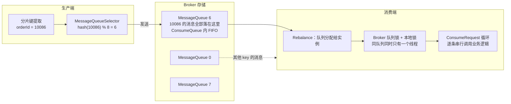
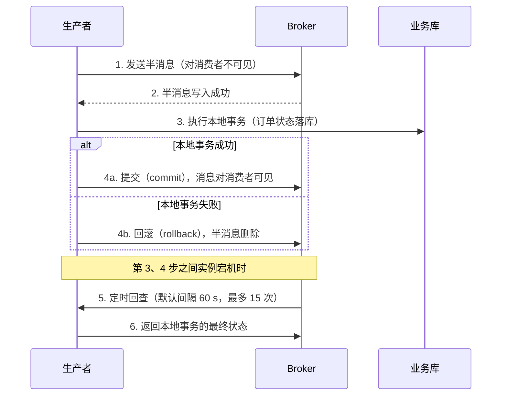

> [!NOTE] 提示
> 顺序消费以队列为单位：同一条队列同一时刻只被一个消费线程串行处理，因此多线程分片的并行度上限就是队列总数。本文拆解生产端分片键路由、Broker 队列 FIFO、消费端三把锁的完整链路，回答三个问题：怎么在保证顺序的前提下提高并行度、顺序的代价是什么、一致性为什么必须落在业务幂等上。

## 核心摘要

- 核心思路：顺序保证 = 生产端按分片键（ShardingKey）把同一业务实体的消息路由到同一队列 + Broker 队列内 FIFO + 消费端对队列加锁后串行消费，三层缺一不可。多线程分片发生在两个维度：队列之间天然并行，队列内部只能靠业务侧二次拆分。
- 一致性结论：RocketMQ 只提供 at-least-once 投递，不提供 exactly-once，官方立场是「允许重复 + 业务幂等」。幂等去重必须与业务操作放同一事务，否则去重记录本身就是新的不一致源。
- 阅读重点：消费端三把锁的分工、并行度 = 队列数的模型、位点提交时机、乱序窗口的三个来源。
- 明确不覆盖：全局顺序（单队列）方案、RocketMQ 事务消息的源码实现、RocketMQ 5.x Proxy 部署架构。

## 引子：状态机消费乱序

订单服务通过 RocketMQ 广播订单状态变更（`创建 → 已支付 → 已发货 → 已完成`），下游履约服务并发消费。某天客服反馈：订单 A 显示「已完成」，履约系统里还是「已支付」。查日志，「已发货」那条消息的数据库更新慢了 300 ms，被「已完成」反超。

保序需要三个假设同时成立，而默认配置下三个都不成立：生产端假设「发送顺序 = 业务顺序」，但多线程业务代码组装顺序不可控；存储假设「消息按业务顺序落盘」，但发送顺序本身已乱；消费端假设「到达顺序 = 处理顺序」，但默认并发消费是线程池抢任务。本文按这三个环节依次给出解法。

## 先定义顺序的边界

| 范围 | 保证 | 实现代价 |
|------|------|----------|
| 全局顺序 | 整个 Topic 严格 FIFO | 只允许 1 个队列、1 个生产者实例、串行发送、1 个消费者实例。吞吐等于单队列上限，绝大多数业务不可接受 |
| 分区顺序 | 同一分片键内 FIFO，键之间无序 | 多队列并行，是标准方案 |
| 无序 | 不保证 | 默认并发消费 |

分区顺序的正确性前提是分片键选对：键必须是「需要有序的那个实体」的标识，订单状态流转用订单号。用操作流水号做键是常见错误：每次操作的流水号都不同，等于没有分片，顺序保证完全落空。键的哈希还要足够离散，避免集中到少量队列形成热点（官方 5.x 对消息组的建议同样适用于 4.x 的分片键）。

## 全链路机制



## 生产端：分片键路由与串行发送

### MessageQueueSelector

生产端通过 `MessageQueueSelector` 按业务键选队列，同一键的所有消息命中同一队列，这是顺序的起点：

```java
SendResult send(MultiOrder order) {
    Message msg = new Message("ORDER_STATUS_TOPIC", "TagA",
            order.getOrderId(), JSON.toJSONBytes(order));
    return producer.send(msg, (mqs, message, arg) -> {
        long orderId = (long) arg;
        // & Integer.MAX_VALUE 而非 Math.abs：防止 Integer.MIN_VALUE 取 abs 仍为负
        int index = (int) ((Long.hashCode(orderId) & Integer.MAX_VALUE) % mqs.size());
        return mqs.get(index);
    }, order.getOrderId());
}
```

两个细节：`Math.abs(Integer.MIN_VALUE)` 仍返回负数，取模得到 -1 直接数组越界，用 `& Integer.MAX_VALUE` 抹掉符号位是标准写法；取模基数是队列总数，扩缩容时同一个键会命中新队列，这是扩容乱序的根源（见「方案一」）。Spring 环境下 `RocketMQTemplate.syncSendOrderly(destination, msg, hashKey)` 内置了同样语义的哈希路由，能接受固定哈希时可直接用。

### 串行发送：单一生产者 + 同键串行

`MessageQueueSelector` 只保证「落点相同」，不保证「落点内先后」。官方把生产顺序性拆成两个条件：同一分片键的消息由同一个生产者实例发出；同键消息串行发送，多线程并行发送时到达顺序取决于线程调度，无法判定。工程上要么在实体维度串行化（同一订单的处理被分布式锁串行化时，发送天然有序，推荐先检查业务是否已有这个串行点），要么把消息交给按分片键分组的单线程发送器。

### 发送失败：重试仍发同一队列，但要业务兜底

顺序消息的发送路径（`sendSelectImpl`）里 selector 只调用一次，重试复用同一个队列。这不会因换队列破坏顺序，代价是队列所在 Broker 宕机时重试只会反复失败。因此：同步发送，拿到 `SendResult` 才算成功（`sendMsgTimeout` 默认 3000 ms）；重试耗尽后落待发送表，由定时任务补偿重发。

补偿重发必须保留原始分片键（仍走 selector）与原始幂等键。发送超时不等于发送失败，原消息可能已投递成功；恢复任务若重新生成新消息 ID，幂等键就对不上，重复消息会绕过去重直接执行。保留原幂等键（订单号 + 目标状态），重复投递才会被幂等表挡住。

### 本地事务与发送的原子性：事务消息

「先提交本地事务，再发消息」在两步之间崩溃时，下游永远不知道这笔变更。事务消息（半消息机制）把两步绑成原子操作：



回查依赖业务实现 `checkLocalTransaction`，用事务 ID 反查本地事务状态，查不到返回 `UNKNOW` 等下一轮，不要乱返回 `ROLLBACK`。回查有上限（`transactionCheckMax` 默认 15 次，超限后半消息被丢弃），所以回查查询必须可靠。事务消息只保证「本地事务 + 发消息」的原子性，下游消费成功靠消费端幂等。

## Broker 端：队列内 FIFO 与可配置的可靠性

存储端行为简单：单个队列内严格按写入顺序排列（ConsumeQueue 按序索引 CommitLog），消费按存储顺序投递。不同分片键的消息可以混在同一队列且不保证连续：队列内部是「各自有序的消息流交织」，消费端按序读、按键各自保序，两者不冲突。

Broker 不给两样东西：**跨队列无序**，同键消息落进两个队列后不做任何合并，扩容、路由错误都会造成跨队列乱序；**不感知业务语义**，物理顺序与状态机推进是两回事，这层语义必须业务自己维护（消息体带状态版本号）。

「不丢」则是配置出来的，默认配置有丢失窗口：`flushDiskType` 默认 `ASYNC_FLUSH`，消息写入 PageCache 即返回成功，断电丢失未刷盘的秒级数据，改 `SYNC_FLUSH` 落盘完成才返回 ACK，吞吐相应下降；`brokerRole` 默认 `ASYNC_MASTER` 主从异步复制，主节点宕机丢未同步的消息，改 `SYNC_MASTER` 同步双写（5.x 可用 DLedger / Controller 模式做多副本）。对状态流消息，丢一条就是下游的永久版本缺口，这类 Topic 至少配置同步复制，残余风险靠对账兜底。

## 消费端：三把锁与并行度模型

### 顺序消费的三把锁

`DefaultMQPushConsumer` 默认注册 `MessageListenerConcurrently`，拉到的消息丢进消费线程池（默认 20 线程），同队列的两条消息被两个线程同时拿走，谁先执行完取决于线程调度（引子里 300 ms 反超的来源）。把监听器换成 `MessageListenerOrderly` 后，`ConsumeMessageOrderlyService`（基于 4.9.x 源码）用三层锁把队列变成串行单元：

| 锁 | 位置 | 解决的问题 |
|----|------|-----------|
| Broker 端队列分布式锁 | 消费实例定时（默认 20 s）向 Broker 发 `LockBatchMQ` 请求，锁默认 60 s 过期 | 集群模式下保证一个队列同一时刻只分配给消费组内一个实例 |
| `MessageQueue` 本地锁 | `ConsumeRequest.run()` 中对队列对象 `synchronized` | 消费线程池有 20 个线程，可能多个线程被派到同一队列；此锁保证实例内同队列只有一个线程在消费 |
| `ProcessQueue.consumeLock` | 调用业务监听器前 `ReentrantLock` 加锁 | 防止消费过程中 Rebalance 移除队列导致在游离对象上消费 |

锁是刻意拆细的：队列本地锁覆盖「判断 + 取消息 + 消费」整个循环，消费锁只覆盖业务监听器执行期间，Rebalance 移除队列只需等当前这条消息消费完。串行的核心在 `ConsumeRequest.run()` 的 while 循环：锁内反复「取一批消息 → 加消费锁 → 调用业务监听器 → 按返回值决定继续或延迟重试」，单线程逐条推进；连续消费超过 60 s 会主动让出线程，避免饿死线程池。

由此得出关键推论：**顺序消费的正确性依赖锁与路由信息的持续一致，乱序窗口有三个来源：锁过期（网络抖动、GC 停顿超过 60 s）、锁切换（Rebalance）、Broker 主从切换后的路由刷新**。这是官方文档「极端情况下可能乱序」的出处，也是消费幂等必须存在的第二个理由（第一个是重复投递）。

### 并行度模型：队列数就是天花板

```text
整个消费组的有效并行消费单元数 ≤ Topic 队列总数

单个队列吞吐 ≈ 1000 ms / 单条业务处理耗时
消费组总吞吐 ≈ 队列数 × 单队列吞吐

例：单条消息处理 40 ms → 单队列约 25 TPS
    8 个队列 → 约 200 TPS
    32 个队列 → 约 800 TPS
```

两条纪律：调大 `consumeThreadMax` 不提升单队列吞吐，线程数只用于让多个队列同时被消费，超过实例分到的队列数就是空转；队列数少于实例数时多余实例分不到队列（同组内队列不共享），扩实例前核对队列数 ≥ 实例数。队列数是创建 Topic 时的容量决策，改动会引发分片重分布。

## 提升吞吐：四个方案与各自的代价

单队列 25 TPS 的估算意味着日订单 200 万（峰值 500 TPS）需要 32 个队列。怎么扩、或者不扩队列怎么提速：

### 方案一：扩队列，处理扩容窗口的跨队列乱序

扩队列是唯一能线性提升吞吐的手段，但取模基数变化会让同键消息跨队列：旧队列还压着「已支付」，「已发货」已进新队列，两个队列并行消费，顺序被打穿。严格做法是停写、等旧队列存量排空再切流；业务上往往退而求其次：接受窗口内乱序，靠状态版本号挡住过期状态（见「状态机校验」），扩容完成后窗口自动关闭。

### 方案二：消费端内存队列二次分发

同键串行不必绑死在 MQ 队列上。监听器拿到一批消息后按键二次分发到固定槽位的内存队列，每个槽位单线程：同键仍在同一槽位内串行，不同键并行。把 `consumeMessageBatchMaxSize` 调大（如 16），监听器同步等待整批完成后返回 `SUCCESS`，单队列吞吐从 25 TPS 升到约 25 × 16（受槽位数与键离散度限制），队列数不动。

两个纪律：**必须同步等待整批完成再返回 `SUCCESS`**：Push 模式下返回即提交位点，异步投递后宕机，未落库的消息真丢，只能靠对账找回；慢键是队列下限，批内一条 5 s 的消息拖住整批，要单独优化或拆分。

### 方案三：把 IO 拆出顺序链路

顺序链路里真正需要串行的往往只有「按版本落库」一步。消费端只做轻量校验 + 事件按序写入事件表（单条 2～5 ms），重活（外部调用、算账、通知）由异步 worker 按版本推进，不依赖 MQ 顺序。单队列吞吐升到 200～500 TPS，热点键（大商家占满队列）也得到缓解。代价是多一张事件表和一个 worker，重活的失败重试要自己设计。

### 方案四：升级 5.x 消息组 + Pop 消费

生产端给消息设置 `MessageGroup`（语义等价于分片键），Topic 声明为 FIFO 类型；消费端 Pop 模式不要求实例绑定队列，同一消息组的消息处理期间锁定在一个消费者上。收益是乱序窗口比队列锁切换更小，消费者可水平扩、不受队列数约束；代价是一次性迁移成本，且 `SimpleConsumer` 一次拉多条时顺序性要业务自己保证。

### 选型对比

| 方案 | 单队列吞吐提升 | 乱序风险 | 改动面 | 适用场景 |
|------|---------------|----------|--------|----------|
| 扩队列 | 随队列数线性 | 扩容窗口跨队列乱序 | 只改 Topic 配置 | 键离散、允许窗口期 |
| 内存队列二次分发 | 约 × 批内不同键数 | 无新增 | 消费端改代码 | 队列数改不动、键离散 |
| 拆 IO 出顺序链路 | 约 ×10 | 无新增；重活重试自担 | 架构改造 | 业务处理慢、有热点键 |
| 5.x 消息组 + Pop | 与队列数同阶 | 窗口比 4.x 小 | 升级迁移 | 计划升级 5.x 的新系统 |

四个方案不互斥，常见组合：先拆 IO（收益最大且不动分片），再扩队列，消费端叠内存队列兜峰值。

## 消费失败与重试：顺序的代价

| 维度 | 顺序消费（Orderly） | 并发消费（Concurrently） |
|------|---------------------|--------------------------|
| 重试位置 | 客户端本地：消息放回 `ProcessQueue` 重新消费 | 发回 Broker 重试主题 `%RETRY%+消费组` |
| 重试间隔 | 挂起当前队列，`suspendCurrentQueueTimeMillis` 默认 1000 ms | 延迟级别递增（10 s 起，最长 2 h） |
| 默认最大重试次数 | `maxReconsumeTimes` 未设置时为 `Integer.MAX_VALUE`（无限重试） | 16 次，超过进入死信队列 `%DLQ%+消费组` |
| 对后续消息的影响 | 阻塞：同队列后续消息全部等待 | 不阻塞 |

顺序消费必须阻塞：第 N 条没成功，第 N+1 条不能动。两个决策必须显式做：设置 `maxReconsumeTimes`（如 8），默认的无限重试会让一条毒消息永久卡死整个队列，超限进死信后队列才能推进，死信的人工/补偿闭环不建，乱序就从短暂变成永久；`suspendCurrentQueueTimeMillis` 默认 1000 ms，瞬时故障下合理，持续故障下队列吞吐跌到 1 TPS，靠告警及时发现。

### 失败要先分类，再决定重不重试

重试的价值取决于失败是否瞬时。瞬时失败（网络超时、数据库抖动）抛给 MQ 走本地重试；确定性失败（业务校验不通过、非法状态转换、消息体损坏）重试结果必然还是失败，直接落死信表并告警后返回 `SUCCESS` 跳过（让这类消息走完重试只是白停摆队列）。跳过即乱序，这个决定依赖两个配套：死信表有「人工或定时任务介入」的闭环；后续消息的合法性由状态机校验把守，一条消息进死信后其依赖消息会被级联拦下。这是预期行为：宁可级联进死信，不可错误执行。

并发消费的重试还会带来另一种重复：批量消费 2、3 两条，3 失败重试期间 2 可能被再次处理。无论哪种模式，重试和重复投递是常态，幂等不是优化项。

## 一致性设计：at-least-once 之上的业务幂等

### 幂等键：业务唯一键，不是 msgId

RocketMQ 的投递语义是 at-least-once：失败或超时就重投。exactly-once 需要 Broker 端去重，实现代价极高，官方不做。所有一致性设计收敛为一个问题：**同一条消息被消费 1 次和 N 次，业务结果是否相同**。

`msgId` 不能做幂等键：生产端重试、Broker 端写入都可能让不同 msgId 指向同一业务消息。幂等键取自业务语义：状态变更用 `orderId + 目标状态`，事件用事件源生成的 `eventId`。它同时覆盖两类重复：同一条消息被投两次，以及发送端补偿任务重发产生的「不同消息、同一操作」。

### 去重表与业务操作同事务

去重记录与业务操作必须在同一事务：先记去重后执行业务，中间失败则这条消息永远不会再被处理；先执行业务后记去重，中间宕机则重投后重复执行。

```java
@Transactional
public ConsumeOrderlyStatus handle(OrderStatusMsg m) {
    try {
        // bizKey = orderId + targetState，唯一键冲突即重复投递
        consumeRecordMapper.insert(m.getBizKey(), CONSUMED);
        orderMapper.updateState(m.getOrderId(), m.getTargetState(), m.getVersion());
        return ConsumeOrderlyStatus.SUCCESS;
    } catch (DuplicateKeyException e) {
        return ConsumeOrderlyStatus.SUCCESS;   // 幂等：重复消息视为成功
    }
}
```

三个坑：不要引入「消费中」中间态，业务执行期间重复消息到达会把它误判，处理慢的消息反复重试后进死信，要么加超时判定要么干脆用上图的原子写；去重表必须跟着业务键分库路由，与业务操作同库同事务，全局去重库破坏同事务前提；重试粒度是整条消息，业务 A 已执行、业务 B 失败重投后 A 会被再次执行，子操作（尤其不可事务化的外部调用）要么并入同一事务，要么各自幂等。

### 状态机校验：乱序发生时的止损

幂等挡重复，挡不住乱序：位点重放、Rebalance 窗口、扩容迁移产生的乱序消息对幂等表是没消费过的新消息。第二道防线是消息携带目标状态与版本号，用带前置条件的原子更新拒绝非法转换。不要「先查状态、内存判断、再更新」三步走，查询与更新之间有并发窗口，先查后改挡不住并发重复：

```sql
UPDATE order_state
SET state = 3, version = version + 1
WHERE order_id = #{orderId} AND state = 2;   -- 仅当前状态是前置状态时才生效
```

影响行数为 0 即乱序、重复或上游状态已推进，按确定性失败落死信。这道防线把前面所有机制失效的后果收敛为「该消息与其后续依赖消息进死信」，错误状态永远写不进业务库。

### 版本缺口缓冲：让乱序自愈

拒绝式的代价是瞬态乱序也要人工捞死信。缓冲式换一种思路：发现前置版本缺失（版本号不连续）时，消息落暂存表后返回 `SUCCESS` 放行队列；定时补偿任务扫描暂存表，前置版本补齐后重新按序处理。乱序被限制在单个键内，同队列其他单号不受影响。

| 维度 | 拒绝式（状态机校验 + 死信） | 缓冲式（缺口暂存 + 补偿重放） |
|------|------------------------------|--------------------------------|
| 瞬态乱序（扩容、Rebalance 窗口） | 进死信，需人工捞回 | 前置版本补齐后自动重放 |
| 永久缺口（消息真丢了） | 快速暴露，人工兜底 | 暂存表静默膨胀，需超时转死信 |
| 实现复杂度 | 低：一条 CAS UPDATE | 高：暂存表、版本检查、补偿扫描、处理中状态防并发 |

默认拒绝式，缓冲式留给已知存在瞬态乱序窗口的场景（如扩容迁移期），并必须配暂存超时与暂存量告警两个上限，否则消息真丢时问题会被暂存表藏住。

### 位点提交与对账

位点由客户端周期性提交 Broker，返回 `SUCCESS` 后消息移出 `ProcessQueue`、位点推进：时序上「处理完成」先于「位点提交」，所以返回 `SUCCESS` 前必须确保业务已持久化（方案二同步等待的原因）。位点按队列连续推进，宕机恢复从位点重放，已落库部分靠幂等表挡住，整条链路成立的前提仍是幂等写入与业务操作同事务。

以上机制把不一致概率压到很低但不是零（锁过期窗口、跳过的毒消息、回查超限丢弃的半消息），定时对账收尾：比对源与目的的不一致记录，以源为准修复（修复动作带幂等键），并监控不一致数的趋势，突变通常意味着上游某个机制失效了。

## 可观测性：顺序消费特有的监控盲区

顺序消费的典型故障（毒消息卡队列、锁丢失、热点键堆积）只影响单个队列：32 个队列里 1 个停摆，组级总积压只上升约 3%，组级告警不会响。监控必须下钻到队列维度，做三件事：**队列级积压**，分钟级通过 `DefaultMQAdminExt.examineConsumeStats` 拿到按队列拆分的 `offsetTable`，逐队列算 `brokerOffset - consumerOffset`，超阈值单独告警；**端到端延迟**，消费完成时间减 `msg.getStoreTimestamp()` 看 P99，处理环节排队时它先于积压恶化；**重试水位**，`msg.getReconsumeTimes()` 接近 `maxReconsumeTimes` 即告警，等进死信再发现，队列阻塞时间已白付。

监控回答「坏了没有」，防线是否真的生效要靠故障注入验证：测试环境注入网络抖动、`kill -9` 消费者实例触发 Rebalance、发送端制造重复投递，统计乱序率与重复率。机制链上任何一环的回归都只表现为极端场景的乱序，功能测试测不出来。

## 实战演示：订单状态变更的消费端

生产端：`TransactionMQProducer` + 事务监听器（上文时序图），发送走上文 selector 代码，失败落待发送表补偿。消费端是全链路纪律的浓缩：

```java
public class OrderStatusConsumer {
    private static final int BUCKET_COUNT = 64;
    // 固定槽位，每个槽位单线程串行执行
    private final List<ExecutorService> buckets = new ArrayList<>(BUCKET_COUNT);

    public OrderStatusConsumer() throws MQClientException {
        for (int i = 0; i < BUCKET_COUNT; i++) {
            buckets.add(Executors.newSingleThreadExecutor());
        }
        DefaultMQPushConsumer consumer = new DefaultMQPushConsumer("order_status_consumer_group");
        consumer.setNamesrvAddr("mq-namesrv:9876");
        consumer.subscribe("ORDER_STATUS_TOPIC", "*");
        consumer.setConsumeThreadMin(20);
        consumer.setConsumeThreadMax(20);
        consumer.setConsumeMessageBatchMaxSize(16);   // 批内不同 key 并行
        consumer.setMaxReconsumeTimes(8);             // 毒消息有限重试，防队列永久卡死
        consumer.registerMessageListener((MessageListenerOrderly) (msgs, context) -> {
            List<Future<?>> futures = new ArrayList<>(msgs.size());
            for (MessageExt raw : msgs) {
                OrderStatusMsg m = JSON.parseObject(raw.getBody(), OrderStatusMsg.class);
                futures.add(buckets.get(bucketOf(m.getOrderId())).submit(() -> handle(m)));
            }
            try {
                for (Future<?> f : futures) {
                    f.get(30, TimeUnit.SECONDS);      // 同步等待整批：SUCCESS 即提交位点
                }
                return ConsumeOrderlyStatus.SUCCESS;
            } catch (Exception e) {
                // 瞬时失败：整批放回，队列挂起后重试
                return ConsumeOrderlyStatus.SUSPEND_CURRENT_QUEUE_A_MOMENT;
            }
        });
        consumer.start();
    }

    private int bucketOf(long orderId) {
        return (int) ((Long.hashCode(orderId) & Integer.MAX_VALUE) % BUCKET_COUNT);
    }

    @Transactional
    protected void handle(OrderStatusMsg m) {
        try {
            consumeRecordMapper.insert(m.getBizKey(), CONSUMED);  // 去重与业务同事务
            orderMapper.updateState(m.getOrderId(), m.getTargetState(), m.getVersion());
        } catch (DuplicateKeyException e) {
            // 幂等：重复投递视为成功
        }
    }
}
```

生产化前还需要补：确定性失败的死信分流（见「失败要先分类」）、死信告警与人工闭环、对账任务。

## 踩坑点

1. **`Math.abs` 取模为负**：`Integer.MIN_VALUE` 取 abs 仍为负，selector 返回下标 -1，发送时数组越界。用 `hash & Integer.MAX_VALUE`。
2. **顺序消费默认无限重试**：默认 `maxReconsumeTimes = Integer.MAX_VALUE`，一条毒消息永久卡死队列。必须显式设置并建死信闭环。
3. **异步分发后立刻返回 SUCCESS**：位点已提交，宕机时未落库的消息永久丢失。要么同步等待，要么接受丢失靠对账，不能默认。
4. **把消息轨迹当幂等**：消息轨迹只是记录，没有任何去重效果，两者是完全不同的东西。
5. **重放要求消息体向后兼容**：位点重放和死信重处理意味着几个月前的消息被当前代码消费，消息体要带 schema 版本号。

## 总结

顺序消费的并行度模型是整个方案的骨架：队列内 FIFO + 三把锁把并行单元锁死在队列粒度，「多线程分片」的第一性问题是队列数的规划，而不是消费线程数的调参。吞吐扩展按优先级：先拆 IO 缩短顺序链路，再扩队列（处理扩容窗口），消费端内存队列二次分发兜峰值，5.x 消息组与 Pop 消费留给有升级窗口的系统。一致性上，传输层只承诺 at-least-once：不丢靠事务消息、同步复制与「持久化后再返回 SUCCESS」，不乱靠分片路由与状态机校验，不重只能靠业务幂等；幂等表、状态机、对账三件套缺一不可。评估任何「保证顺序」的方案，先看它怎么处理失败：重试、宕机、扩缩容三个场景的答案，比正常路径的描述更能说明方案是否成立。

## 参考资料

- [顺序消息 | Apache RocketMQ 官方文档（5.x，消息组机制、生产顺序性条件、消费失败重试行为）](https://rocketmq.apache.org/zh/docs/featureBehavior/03fifomessage/)
- [顺序消息的原理架构 | 阿里云文档（RocketMQ 5.x 系列）](https://help.aliyun.com/zh/apsaramq-for-rocketmq/cloud-message-queue-rocketmq-5-x-series/developer-reference/ordered-messages-1)
- [RocketMQ 顺序消息实现原理（4.9.x 源码：三把锁、ConsumeRequest 循环、Rebalance 加锁） | 博客园](https://www.cnblogs.com/shanml/p/16909874.html)
- [RocketMQ 顺序消息的「4 把锁」机制 | 博客园](https://www.cnblogs.com/crazymakercircle/p/17948000)
- [RocketMQ 4.x 顺序消息发送 | Apache RocketMQ 官方文档](https://rocketmq.apache.org/zh/docs/4.x/producer/03message2/)
- [消费重试 | Apache RocketMQ 官方文档](https://rocketmq.apache.org/zh/docs/featureBehavior/10consumerretrypolicy/)
- [TCP 协议消息重试策略 | 阿里云文档（顺序消费 Integer.MAX_VALUE 默认值、挂起间隔）](https://help.aliyun.com/zh/apsaramq-for-rocketmq/cloud-message-queue-rocketmq-4-x-series/developer-reference/message-retry)
- [消息幂等（去重）通用解决方案 | jaskey](https://jaskey.github.io/blog/2020/06/08/rocketmq-message-dedup/)
- [RocketMQ 消息顺序性：从原理到实战的完整解决方案 | 掘金（失败分类、队列级监控、状态机校验思路的参考来源）](https://juejin.cn/post/7511725503435669542)

> [!NOTE] 提示
> 如果这篇文章对你有帮助，欢迎点赞收藏。有问题欢迎评论区交流。
